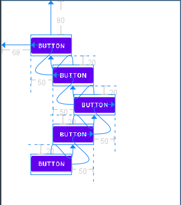

# 목차
- [목차](#목차)
- [안드로이드](#안드로이드)
  - [Version 정보](#version-정보)
  - [프로젝트 구조](#프로젝트-구조)
  - [AndroidMainfest.xml](#androidmainfestxml)
  - [성능 모니터링](#성능-모니터링)
  - [로그](#로그)
  - [Toast](#toast)
  - [런처 아이콘](#런처-아이콘)
  - [라이브러리](#라이브러리)
- [Design Pattern](#design-pattern)
  - [MVVM](#mvvm)
  - [코드 작성양을 줄이는 라이브러리](#코드-작성양을-줄이는-라이브러리)
    - [Anko](#anko)
    - [splitties-toast](#splitties-toast)
- [화면 구성](#화면-구성)
  - [Design(res 폴더)](#designres-폴더)
      - [Constraint Layout](#constraint-layout)
      - [LinearLayout](#linearlayout)
      - [FrameLayout](#framelayout)
    - [Text](#text)
      - [EditText](#edittext)
    - [Buttons](#buttons)
      - [Button](#button)
      - [ImageButton](#imagebutton)
      - [ToggleButton](#togglebutton)
      - [RadioButton](#radiobutton)
      - [CheckBox](#checkbox)
      - [Switch](#switch)
    - [Widgets](#widgets)
      - [ProgressBar](#progressbar)
      - [SeekBar](#seekbar)
      - [RatingBar](#ratingbar)
      - [VideoView](#videoview)
      - [CalendarView](#calendarview)
      - [SearchView](#searchview)
    - [Containers](#containers)
      - [ScrollView](#scrollview)
      - [RecyclerView](#recyclerview)
  - [values](#values)
  - [drawable 과 mipmap](#drawable-과-mipmap)
  - [Activity](#activity)
    - [Activity LifeCycle](#activity-lifecycle)
    - [상태 저장/복구 call back method](#상태-저장복구-call-back-method)
    - [Intent](#intent)
      - [Task 관리](#task-관리)
      - [ViewBinding](#viewbinding)
- [데이터 저장](#데이터-저장)
  - [SharedPreferences](#sharedpreferences)
    - [객체를 생성하는 방법](#객체를-생성하는-방법)
    - [Editor 클래스](#editor-클래스)
  - [SQLite 와 ROOM](#sqlite-와-room)
- [API 통신](#api-통신)
- [코루틴](#코루틴)
- [Service](#service)
- [Content Provider 와 Content Resolver](#content-provider-와-content-resolver)
- [카메라](#카메라)
- [구글지도](#구글지도)

# 안드로이드 
- 리눅스 커널 + 안드로이드런타임(ART) + Java API Framework

- 소스 코드 -(빌드)-> 앱 설치 파일(APK파일) -(업로드)-> 앱스토어 -(다운로드)-> 스마트폰 -(실행)-> 앱

- 젯팻 Jetpack

## Version 정보

|플랫폼 버전|API Level|별명|
|---|---|---|
|10.0|29|Android 10|
|9.0|28|Pie|
|8.0-8.1|26-27|Oreo|
|7.0-7.12|24-25|Nougat|
|6.0-6.0.1|23|Marshmallow|

## 프로젝트 구조
- 안드로이드뷰: 개발 편의성을 위해 안드로이드 스튜디오가 만들어낸 가상에 폴더 구조
```
|-app
  |-manifests
    |-AndroidMainfest.xml
  |-java
  |-res
    |-layout
  |-Gradle Scripts
    |-build.gradle(Project)
    |-build.gradle(Module)
```

- 페키지 이름에 example이 들어가면 앱스토어 등록 불가

## AndroidMainfest.xml

```xml
<manifest package="">
  <use-feature android:name=""
    android:required="true"/>
  <use-permission android:name="">
  <application
    android:allowBackup="false"
    andriod:label="">
    <activity android:name=""></android>
    <activity android:name="">
      <intent-filter>
        <action android:name=""></action>
        <category antroid:name=""></category>
      </intent-filter>
    </android>
  </application>
</maifest>

```

- 다음으로 이루어져 있다
  - 패키지 이름
    - 이를 기반으로 빌드시 R 클래스가 생성된다
  - application
    - allowBackup: 앱 내부 데이터를 구글 계정과 연동된 구글 드라이브에 백업할지 여부를 결정
    - label: 앱 이름
  - 앱의 구성 요소(컴포넌트)
    - 컴포넌트: 액티비티(acitivty), 서비스(service), 브로드캐스트 리시버(receiver), 콘텐츠 프로바이더(provider)
    - intent-filter: 컴포넌트가 어떻게 시작되는지 설정
      - 액티비티, 서비스, 브로드캐스트 리시버는 인텐트가 실행시킨다 
      - action: 수행할 작업
        - android.intent.action.MAIN: 앱 첫 실행 작업시 실행되는 액티비티
      - category: 
        - android:intent.category.LAUNCHER: 런처 화면을 통해 앱 접근시 시작할 액티비티임을 명시
      - data: 
  - use-permission: 권한 설정
  - use-feature: 필요한 하드웨어, 소프트웨어 기능 설정

## 성능 모니터링
- Profiler 탭에서 실생중인 앱에 CPU, 메모리 사용량 모니터링 가능

## 로그
- logcat 탭에서 로그 확인 가능, 태그 기반으로 로그 검색 가능
- android.util.Log

|함수|의미|내용|
|---|---|---|
|Log.v(태그, 내용)|verbose|상세 내용|
|Log.d(태그, 내용)|debug|개발시 필요 사항|
|Log.i(태그, 내용)|information|정보 제공용 메세지|
|Log.w(태그, 내용)|warning|경고성 메세지|
|Log.e(태그, 내용)|error|오류 메세지

## Toast
```kotlin
val toast : Toast = Toast.makeText(this, "", Toast.LENGTH_SHORT)
toast.setGravity(Gravitity.CENTER, 0, 0)
toast.show()
```
- Toast.makeText(토스트를 사용할 객체, 메세지, 출력 시간)
  - 출력시간
    - Toast.LENGTH_SHORT: 2초 출력
    - Toast.LENGTH_LONG: 3초 출력
- toast.setGravity(출력 위치, 지정 위치로부터 x 오프셋, 지정 위치로부터 y오프셋)
  - 출력 위치
    - 출력위치는 or 연산 사용가능
    - Gravitiy.CENTER
    - Gravitiy.LIGHT
    - Gravity.LEFT


## 런처 아이콘
- File > New > Image Asset
- 런처 아이콘 기준은 가로 세로 512px 다

## 라이브러리

```build.gradle(Module)

android{
  compileSdk 32 //

  defaultConfig{
    applicationId "" //앱스토에서 앱들을 구분하는 식별자
    minSdk 21
    targetSdk 32
    versionCode 1
    versionName "1.0"

    testInstrumentationRunner ""
  }

  buildFeatures{
    viewBinding true
  }
}


dependencies{
  //basic
    implementation 'androidx.core:core-ktx:1.7.0'
    implementation 'androidx.appcompat:appcompat:1.4.0'
    implementation 'com.google.android.material:material:1.4.0'
    implementation 'androidx.constraintlayout:constraintlayout:2.1.2'
    testImplementation 'junit:junit:4.+'
    androidTestImplementation 'androidx.test.ext:junit:1.1.3'
    androidTestImplementation 'androidx.test.espresso:espresso-core:3.4.0'
    //API
    implementation "com.squareup.retrofit2:retrofit:$retrofit_version"
    implementation "com.squareup.retrofit2:converter-gson:$retrofit_Version"
    implementation "com.squareup.okhttp3:logging-interceptor:$okhttp_version"
    //lifecycle

    //recyclerview

    //cardView
    implementation "androidx.cardview:cardview:1.0.0"
}
```


# Design Pattern
## MVVM
- Model: API 호출, local DB 데이터 처리
- ViewModel: 데이터 관리
- View: 데이터 보여주기, 행동 받기, Model과 의존관계가 없으며 ViewModel만을 observe
- obseve
  - DataBinding
  - LiveData
  - Koin

## 코드 작성양을 줄이는 라이브러리
- 버전지원이 끝나는 경우가 생길 수 있으니 가급적 사용하지 않기, 다른 사람 코드 읽기 용으로 공부
### Anko
  
### splitties-toast
- splitties-activities
```kotlin
//기본
val intent = Intent(this, SomActivity::class.java)
startActivity(intent)

//라이브러리 사용시
start<SomeActivity>
```

- splitties-toast
```kotlin
//기본
Toast.makeText(this, "Message", Toast.LENGTH_SHORT).show()

//라이브러리 사용시
toast("Message")

```

------

# 화면 구성
## Design(res 폴더)
- R.java는 id가 붙은 모든 리소스에 대해 id에 대응하는 정수들을 저장하고 있는 클래스다. 
- 안드로이드 스튜디오는 코드를 통해서가 아니라 상호작용형태로 레이아웃 디자인을 꾸밀 수 있다
- 화면을 가로로 전환해도 그대로인지 살펴봄으로서 제대로 레이아웃 배치가 되었는지 확인해 볼 수 있다.
- dp:
- sp: 
- 이벤트
  - event: 프로그램에서 일어나는 사건
    - 터치: 특정 위치를 건드릴시 이벤트 발생
    - 클릭: 특정 위치를 건드렸다가 손가락을 땔때 이벤트 발생
    - 스크롤
    - 체크박스 설정/해제
  - event source: 이벤트가 발생하는 뷰 객체
  - event listener: 이벤트 발생시 대응하는 추상 메서드를 정의한 인터페이스

#### Constraint Layout
- 위젯 사이 상대적인 제약 조건을 이용해 화면을 구성하는 기본 레이아웃
- Constraint: 
- Anchor Point
- Size Handler
  - wrap_content
  - Fixed
  - Match Constraintt
    - Aspect Ratio
- Bias
- Chaining

- ex: 복수의 위젯들에 상대적 위치 설정 방법
  



#### LinearLayout
- 가로, 세로 한줄로 위젯을 배치하는 레이아웃
- orientation: horizontal or vertical
- gravity
- space

#### FrameLayout
- 위젯 중첩 레이아웃
 
### Text
- 밑줄이 처진 Ab 아이콘이 있는 위젯은 텍스트 내용을 편집 가능한 위젯이다.
- res/values/strings.xml에 텍스트위젯에 들어갈 내용을 관리한다
- Attributes/text 속성에 값으로 @string/name을 입력해 strings.xml에서 설정한 string name에 해당하는 값을 텍스트위젯에 할당한다.
- 텍스트 크기는 주로 sp 단위를 사용한다. res/values/dimens.xml 파일을 생성해 관리한다

#### EditText


### Buttons
- 이벤트 리스너
  - 버튼 위젯들은 클릭 처리 가능한 위젯이다.
  - setOnClickListenr{}


#### Button
#### ImageButton
#### ToggleButton
#### RadioButton
#### CheckBox
#### Switch

### Widgets
#### ProgressBar
#### SeekBar
#### RatingBar
#### VideoView
#### CalendarView
#### SearchView

### Containers
#### ScrollView
- 스크롤 기능을 사용할 수 있는 View, 위에 LinearLayout를 올려 사용한다
- root element를 Scrollview로 설정하면 사용할 수 있다

#### RecyclerView


## values
- strings.xml:
- colors: xml: 
- array.xml: Spinner 같은 목록 위젯에 사용하는 데이터 관리 파일

## drawable 과 mipmap
- 스마트폰마다 해상도가 달라 이미지 파일의 경우 해상도에 맞춰 res/drawable/drawable-* 형태의 폴더에 넣어두어야 한다
  - drawable-mdpi : 1인치안에 160 화소
  - drawable-hdpi : 1인치안에 240 화소
  - drawable-xhdpi : 1인치안에 320 화소
  - drawable-xxhdpi : 1인치안에 480 화소
  - drawable-xxxhdpi : 1인치안에 640 화소

- 아이콘 이미지에 경우도 일반 이미지처럼 화소 단위로 분류해 mipmap 폴더에 넣어둔다.


## Activity
- 사용자 혹은 다른 앱과 상호작용하는 진입점
- 사용자 혹은 다른 앱이 앱을 호출하는 건 사실 하나에 Activity를 호출하는 것이다.
- AppCompatAcitivty 클래스: 하위 버전 API Level에도 호환 가능하게끔 구성된 Activity 클래스를 상속받은 클래스

### Activity LifeCycle
- callback method: event 발생시 os에 의해 호출되는 메서드

|callback method|상태|
|---|---|
|onCreate()|액티비티 생성(XML기반 레이아웃 구성, 화면에서 사용할 데이터 초기화, 이벤트 리스너 등록), 메모리에 로드|
|onStart()|화면에 나타나기 시작|
|onResume()|화면에 보여지는 중|
|onRestart()|재시작|
|onPause()|다른 액티비티에 의해 일부분이 가려짐|
|onStop()|다른 액티비티가 실행되어 화면에서 사라짐|
|onDestroy()|액티비티 종료, 메모리에서 제거|

- 메서드 안에서 super를 호출하지 않으면 정상 작동하지 않는다

- 첫 실행
1) onCreate()
2) onStart()
3) onResume()

- 화면에서 제거, 뒤로가기, finish() 호출
1) onPause()
2) onStop()
3) onDestory()

- 종료는 아니고 빠져나가기
1) onPause()
2) onStop()

- 빠져나온 액티비티 재 실행
1) onRestart()
2) onStart()
3) onResume()

### 상태 저장/복구 call back method
- onSaveInstanceState(outState: Bundle): onStop() 호출 후 호출 된다
- onRestoreInstanceState(savedInstanceState: Bundle): onStart() 후출 후 호출 된다


### Intent
- bundle
  - 인텐트 내부에 있는 데이터 저장 공간, 액티비티들은 번들을 활용해 데이터를 주고 받는다 
  - put
  - get

1) val intent = Intent(packageContext: this, class: TargetACtivity::class.java) 객체 생성
2) startActivity(intent) 호출, ActivityManager에 intent가 전달된다
3) ActivityManager가 TargetActivity를 실행, intent 전달
4) TargetActivity가 intent에서 data를 꺼내 사용

- Some -> Other data 전달 예제
```kotlin
class SomeActivity: AppCompatActivity(){
  val binding by lazy{ActivitySomeBinding.inflate(layoutInflater)}

  override fun onCreate(savedInstanceState: Bundle?){
    super.onCreate(savedInstanceState)
    setContentView(binding.root)
    val intent = Intent(this, SubActivity::class.java)
    intent.putExtra("from1", "Hello Bundle")
    intent.putExtra("from2", 2021)
  }
}


class OtherActivity: AppCompatActivity(){
  val binding by lazy{ActivityOtherBinding.inflate(layoutInflater)}

  override fun onCreate(savedInstanceState: Bundle?){
    super.onCreate(savedInstanceState)
    setContentView(binding.root)
    binding.to1.text = intent.getStringExtra("from1") //사용하는 intent 객체는 SomeAcitivty에서 생성한 객체
  }
}

```


#### Task 관리

```kotlin
val intent = Intent(this, SomeActivity::class.java)
intent.addFlags(Intent.FLAG)

```

|플래그|설명|
|---|---|
|FLAG_ACTIVITY_CLEAR_TOP||
|FLAG_ACTIVITY_NEW_TASK|새 테스크 생성, 


#### ViewBinding
- viewBinding
  - build.gradle(Module) 설정
```
android{
    buildFeatures {
        viewBinding true
    }
}

```

  - *Activity.kt에 프로퍼티 추가
```kotlin
class SomeActivity: AppCompatActivity(){
  val binding by lazy {ActivitySomeBinding.inflate(layoutInflater)}

  override fun onCreate(savedInstanceState: Bundle?){
    super.onCreate(savedInstanceState)
    setContentView(binding.root)

    binding.id //위젯 id를 이용해 접근 가능
  }
}

```


-------
# 데이터 저장
- 앱 설치시, 앱 마다 리눅스 파일시스템에 저장 공간(폴더)을 할당 받는다. 해당 폴더는 연동된 앱만 쓰기/읽기 권한이 있다

## SharedPreferences
- 데이터 저장/불러오기 기능이 있는 클래스
- 데이터는 XML파일로 관리되지만 코드상에선 Map 클래스처럼 이용 가능하다
### 객체를 생성하는 방법
```kotlin
val sharedPref = getPreferences(int mode)
val sharedPref = getSharedPreferences(String fileName, int mode)
val sharedPref = PreferenceManager.getDefaultSharedPreferences(this) //androidx.preference:preference-ktx:1.1.0 라이브러리 추가 필요
```
- mode
  - MODE_PRIVATE:
  - MODE_WORLD_READABLE //해당 모드는 API-Level17부터 지원 중단 상태라 사용하지 않는다.
  - MODE_WORLD_WRITEABLE //해당 모드는 API-Level17부터 지원 중단 상태라 사용하지 않는다.

### Editor 클래스
```kotlin
val editor: SharedPreferences.Editor = sharedPref.edit()

//저장
editor.puString(String key, String value)
editor.putInt(String key, int value)
editor.putLong(String key, long value)
editor.putFloat(String key, float value)
editor.putBoolean(String key, boolean value)

//반영
editor.commit()
editor.apply()

//불러오기
val data: String = editor.getString(String key, String defaultValue)
val data: Int = editor.getInt(String key, int defaultValue)
val data: Long = editor.getLong(String key, long defaultValue)
val data: Float = editor.getString(String key, float defaultValue)
val data: Boolean = editor.getBoolean(String key, Boolean defaultValue)

```


## SQLite 와 ROOM

------

# API 통신

# 코루틴

# Service

# Content Provider 와 Content Resolver


------

# 카메라

# 구글지도