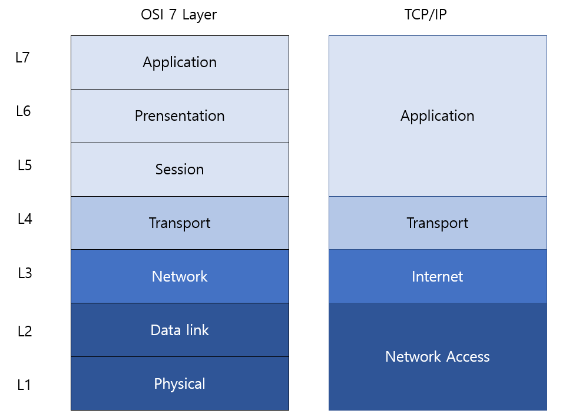
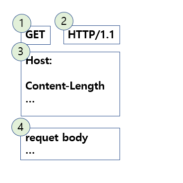
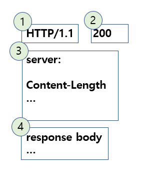
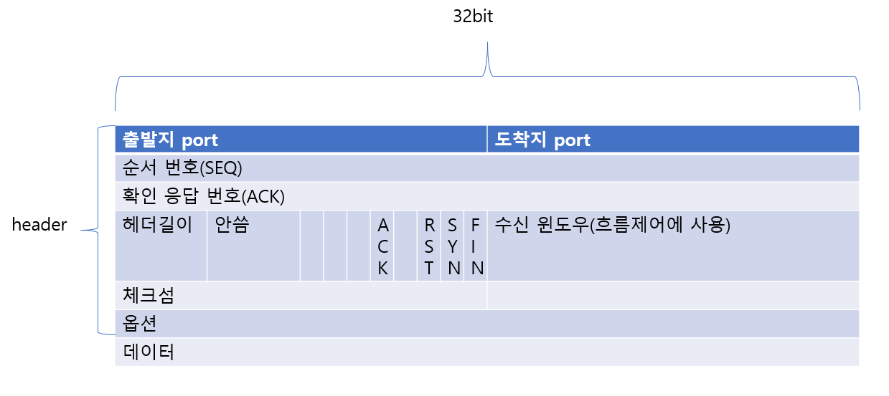

# 목차
- [목차](#목차)
- [Computer Network](#computer-network)
- [OSI 7 Layer 와 TCP/IP 4 Layer](#osi-7-layer-와-tcpip-4-layer)
- [응용 계층 Application Layer](#응용-계층-application-layer)
  - [web과 client-server 구조](#web과-client-server-구조)
  - [DNS](#dns)
  - [HTTP](#http)
  - [HTTPS](#https)
  - [REST API](#rest-api)
  - [Cookie와 Seesion](#cookie와-seesion)
  - [Proxy Server와 Reverse Proxy Server](#proxy-server와-reverse-proxy-server)
  - [CDN](#cdn)
- [전송 계층 Transport Layer](#전송-계층-transport-layer)
  - [Socket](#socket)
  - [TCP](#tcp)
  - [UDP](#udp)
  - [QUIC(Quick UDP Internet Connection)](#quicquick-udp-internet-connection)
    - [네이글 알고리즘 nagle algorithm](#네이글-알고리즘-nagle-algorithm)
- [인터넷 계층 Internet Layer](#인터넷-계층-internet-layer)
  - [LAN과 WAN](#lan과-wan)
  - [라우터 Router](#라우터-router)
  - [스위치 Switch](#스위치-switch)
  - [IP](#ip)
    - [IP class와 subnet](#ip-class와-subnet)
    - [DHCP](#dhcp)
  - [ARP와 RAPR](#arp와-rapr)
  - [ICMP](#icmp)
- [네트워크 접근 계층 Network Access Layer](#네트워크-접근-계층-network-access-layer)
  - [MAC address](#mac-address)


-------------------------------

# Computer Network

- 인터넷 internet
  - inter network에 줄인말
  - 전세계 computer가 연결되어 data를 주고 받는 system

- 프로토콜 protocol
  - internet에서 data를 주고 받을 때 지키는 약속
    - 어떻게 보낼까
    - 어떻게 응답할까
    - 응답이 없을때 어떻게 대응할까

- 노드 node
  - internet에서 data를 주고 받는 주체인 하드웨어를 부르는 말
    - 서버 server
    - 라우터 router
    - 스위치 switch

- 호스트 host
  - application 기능이 있는 node

- 네트워크 성능 지표
  - 처리량 throughput: 단위시간당 전송/수신 데이터양 bps, bit per second  
  - 지연시간 latency: 요청 전송부터 응답이 오기까지 걸린 시간 ms
    - RTT, Round Trip Time: 네트워크 시작지점에서 목표지점까지후 다시 시작지점으로 돌아오기까지 걸린시간 


# OSI 7 Layer 와 TCP/IP 4 Layer

- Computer Network를 구성하는 요소들을 구분하는 방식
- 한 계층 layer 에서 변경은 다른 계층에 영향을 주지 않는다 



<ul>
  <li>Application Layer: 사용자와 직접 상호작용하는 응용프로그램</li>
  <li>Presentation Layer: data form을 결정하는 계층</li>
  <li>Session Layer: computer간 통신용 세션을 만드는 계층</li>
  <li>Transport Layer: process에서 패킷을 송신, 수신하는 계층 </li>
  <li>Network Layer: 패킷을 목적지까지 전달하는 계층</li>
  <li>DataLink Layer: 인접 노드간 데이터 전달, 신호가 전달되는 동안 오류감지를 담당하는 계층</li>
  <li>Physical Layer: 데이터를 전기신호로 바꾸는 계층</li>
</ul>

-----------------------------------

# 응용 계층 Application Layer
- OSI에 Application, Presentation, Session Layer에 해당

- 응용 계층은 인터넷에서 다른 컴퓨터와 통신하는 기능을 갖춘 프로그램을 지칭한다
- 줄여서 애플리케이션이라고도 부른다
  
- 대표 프로토콜
  - http
    - hyper text transper protocol
    - web server와 web client(browser)사이에 통신 프로토콜
  -  ftp
     - file transper potocol
     - 파일 통신 프로토콜
  - stmp
    - simple mail transfer protocol
    - 문자 통신 프로토콜

## web과 client-server 구조
- 클라이언트 client
  - 다른 프로세스와 접속을 시도하는 프로세스
- 서버 server
  - 다른 프로세스의 접속을 기다리는 프로세스

</br>

- 웹 Web
  - world wide web을 줄여서 www 혹은 web이라 부른다
  - 수 많은 웹 페이지(web page)와 웹 서버(web server)가 연결된 연결망
  - 인터넷에 부분집합

</br>

- 웹 페이지 web page
  - 웹상에 존재하는 문서
  - 웹 서버에 저장되며, 브라우저에서 검색(요청)시 서버 응답받아 화면에 띄운다  
  - 하이퍼링크(hypter link)를 이용해 다른 웹 페이지로 이동 가능하다
- 웹 사이트 web site
  - 여러 웹 페이지 묶음

</br>

- HTML
  - hypter text markup language
  - 웹 페이지를 만들 때 사용하는 기본 언어
  - 좀더 복잡한 웹 페이지를 만들기 위해 css, js 언어를 사용한다

</br>

- 웹 브라우저 web browser
  - web client
  - 브라우저라고도 부른다
  - html를 이용해 만든 웹 페이지가 돌어가는 프로그램

</br>

- URL과 URI 
  - uniform resource locator
    - web상에 resource 위치를 가리키는 형식
  - uniform resource indentifier
    - web상에 resource를 식별하는 형식
  - uri는 url 보다 큰 개념
  - protocol://domain:port/path?query#fragment 로 구성된다
    - query는 key=value 형식이다
  - 웹 페이지는 url로 지정할 수 있는 파일들(html, jpeg, 등)로 구성된다

</br>
<details>
<summary>브라우저가 웹페이지를 그리는 과정
</summary>
<ol>
  <li>주소창에 입력된 url이 브라우저에 의해 파싱되어 http request를 만들어 dns 처리 과정과 웹 서버와 연결과정(3 handshake)을 거친끝에 서버로부터 html 파일을 받아온다</li>
  <li> html 파싱 과정중 css 파일을 다운받는 태그를 만나면 다운로드 진행한다,</br> header에 link 태그로 있는 편이다</li>
  <li> html 파싱 과정중 script 태그를 만나면 브라우저는 자바스크립트 엔진을 실행해 해당 과정이 끝날때까지 파싱을 잠시 중단한다. </br>script 태그를 body 끝에 두면, 사용자에게 빠른 렌더링 경험을 제공할 수 있다</li>
  <li>DOM Tree가 완성되면 css파일을 바탕으로 CSSOM Tree 생성</li>
  <li>DOM Tree와 CSSOM Tree를 합쳐 Render Tree 완성</li>
  <li>Render Tree를 바탕으로 레이아웃 잡기</li>
  <li>브라우저에 페인팅</li>
</ol>
</details>
</br>

## DNS
- domain name system
- ip주소를 사람이 읽을 수 있는 이름(domain name)으로 등록해 둔 계층형 데이터 베이스 시스템
- 인터넷에 모든 domain은 root부터 시작해 . 으로 구분되는 계층 형태로 저장된다

</br>
<details>
  <summary>브라우저에 웹 사이트 주소로 접속할때 dns가 처리하는 과정</summary>
  <ol>
  <li>브라우저가 url을 파싱해 http request messgae 생성, os에게 request를 보내달라한다</li>
  <li> os는 local dns(내 컴퓨터에 저장되어있는 폴더)에게 domain name에 맞는 ip주소를 찾는 쿼리를 보낸다</li>
  <li>local dns에서 해당 domain name에 맞는 ip 주소가 있으면 반환, 없으면 root dns로 해당 domain name을 관리하는 dns를 찾기 위한 쿼리를 보낸다</li>
  <li> 해당 domain name을 관리하는 dns가 나올때까지 쿼리를 주고받는다</li>
  <li>해당 domain name을 관리하는 dns로 부터 ip주소 응답</li>
  <li>local dns에 해당 ip주소와 domain name을 캐싱하고 브라우저에게 ip주소 응답</li>
  <li>브라우저는 찾은 ip주소를 갖는 웹 서버와 연결을 시도한다, 해당 ip주소까지 찾아가는 법은 참조</li>
  </ol>
</details>
</br>

------------------------------------

## HTTP
- hyper text trasport protocol
- server와 client(browser)사이에 통신 프로토콜
  - client는 request를 server에게 보내 response를 받는다
- stateless
  - server는 client에 상태를 저장하지 않는다
  - request에 client에 상태를 담아 보낸다
- connectionless
  - response를 보낸후 server는 client와 연결을 끊는다



</br>
<details>
<summary>HTTP request method
</summary>
<ul>
  <li>GET: server에 resource 가져오기 요청</li>
  <li>POST: server에 resource 생성 요청</li>
  <li>PUT: server에 resource 변경 요청, 변경없는 값을 안 넣을 경우 null로 변경된다</li>
  <li>PATCH: server에 resource 변경 요청, 변경없는 값을 안 넣을 경우 수정없이 유지된다</li>
  <li>DELETE: server에 resource 삭제 요청</li>
  <li>OPTIONS: </li>
  <li>HEAD: </li>
  <li>CONNECT: </li>
  <li>TRACE: </li>
</ul>
</details>
</br>



</br>
<details>
<summary>HTTP response status
</summary>
<ul>
  <li>200: 정상 응답</li>
  <li>400: bad request, 잘 못된 요청</li>
  <li>401: unauthorized, 단어 뜻은 권한 없음이지만 실제론 인증되지 않은 사용자에 요청</li>
  <li>403: forbidden, 권한 없는 사용자에 요청</li>
  <li>405: method not allowed, 요청한 resource를 찾을 수 없습니다</li>
  <li>500: server error</li>
</ul>
</details>
</br>

</br>
<details>
<summary>CORS란 무엇인가
</summary>
<p>
cross origin resource sharing
</p>
</br>
<p>
브라우저는 보안 정책상 같은 출처(현재 접속중인 사이트에 "도메인:포트"와 같은 곳)에 resource만 접근할 수 있게 만들어졌다. </br>
CORS는 http header를 이용해 브라우저가 다른 출처에 자원에 접근 할 수 있게 하는 체제
</p>
<ol>
<li>client는 POST request를 보내기 전, OPTIONS method로 preflight request를 먼저 보낸다</li>
<li>server가 POST request를 보내도 괜찮다는 허락 response를 보낸다</li>
<li>client는 원래 보내고 싶은 POST reqeust를 보내고 server는 이를 처리해 response를 보낸다</li>
</ol>
</details>
</br>

</br>
<details>
<summary>HTTP version 별 차이점</summary>
<ol>
  <li>
    <ul>
      <li>1991년 발표</li>
      <li>get method만 존재</li>
      <li>header가 없다</li>
      <li>response status가 없다</li>
    </ul>
  </li>
  <li>version 1.0
    <ul>
      <li>1996년 발표</li>
      <li>다양한 method 기능 추가</li>
      <li>header 기능 추가</li>
      <li>header에 content-type field를 넣어 html외에 파일도 주고받을 수 있다</li>
      <li>response status 기능 추가</li>
    </ul>
  </li>
    <li>version 1.1
    <ul>
      <li>1997년 발표</li>
      <li>TCP 기반 연결</li>
      <li>한번 요청을 응답하더라도 header 부분에 keep alive 필드값을 이용해 연결(hand shake)를 해제하지 않고 재사용한다</li>
      <li>요청에 응답이 오지 않더라도 다음 요청을 보내는 pipelining 기능 추가</li>
    </ul>
  </li>
  <li>version 2.0
    <ul>
      <li>2015년 발표</li> 
      <li> 1.1 성능 개선에 주력 </li>
      <li>TCP 기반 연결</li>
      <li> Multiplexed Streams: 하나에 연결에 여러 메세지 동시 주고 받을 수 있음 </li>
      <li>header 압축 기술 추가</li>
      <li>client에 요청없이 server에서 messgage push하는 기능 추가</li>
    </ul>
  </li>
</ol>
</details>
</br>

## HTTPS
- 보안기능을 더한 HTTP
- 대칭키와 비대칭키 암호화 방식 둘 다 사용
  - 대칭키
    - 암호화/복호화에 사용하는 키가 동일
    - 암호를 주고받는 이들끼리 안전하게 키를 공유하는 시스템 필요 
  - 비대칭키(개인키와 공개키)
    - 암호를 사용하는 개인별로 (개인키, 공개키) 쌍을 갖는다.</br> 
      모든 사용자에 공개키는 공개해 누구나 사용가능하며, 개인키는 자신만 알고 있다.</br> 
      A는 B에게 암호를 보낼때, B에 공개키를 이용해 암호화</br>
      B는 A가 보낸 암호문을 자신에 개인키를 이용해 복호화 
  - 비대칭키 암호화 복호화는 시간이 많이 소요되기에 클리이언트-서버가 처음 대칭키를 공유할때만 사용, 메세지를 주고 받을 때는 대칭키 방식을 사용한다

</br>
<details>
<summary>
HTTPS가 안전하게 메세지를 주고받는 방법
</summary>
</br>
<p>
1) 브라우저(클라이언트)가 서버와 연결 성공(3 hand shake 끝남)
</p>
<p>
2) 서버가 자신에 인증서(공개키)를 브라우저에게 보낸다
</p>
<p>
3) 브라우저는 등록된 인증기관 목록을 활용해 인증서가 유효한지 검사 
</p>
<p>
4) 유효한 인증일 경우, 브라우저는 세션키를 발급해 저장한 후, 서버가 보낸 공개키를 이용해 세션키(대칭키)를 암호화한 후 서버에 전송 
</p>
<p>
5) 서버는 자신에 개인키로 복호화해 세션키를 얻는다
</p>
<p>
6) 클라이언트와 서버는 세션키를 이용해 메세지 암호화/복호화
</p>
</details>
</br>

## REST API


## Cookie와 Seesion
- Cookie
  - web site가 사용자 정보를 추적하기 위해 저장해두는 정보 
  - server가 response header에 'set-cookie' filed로 담은 value를 browser가 저장한다
  - request 보낼시 cookie는 header에 담긴
- Session

## Proxy Server와 Reverse Proxy Server
- response cache 역활
- client가 요청을 보낼 경우 proxy server는 response가 cache되어 있는지를 확인하고 있다면 이를 응답한다, 없다면 server에 요청을 보내 response를 받아 와 저장한 후 client에게 응답한다
- 비슷한 목적으로 사용하는 여러 client들을 하나에 proxy server로 request 보내게끔 시스템을 설계하면 server로 직접 가는 트래픽을 줄일 수 있다
- caching시 마지막 수정된 날짜를 함께 저장한다
- client는 cache에서 response를 받기전 server에게 조건부 get를 보내 수정 사항이 있는지 확인(status 304 response)를 확인 받고 cache에서 받는다

## CDN


----------------------------------

# 전송 계층 Transport Layer
- OSI에 Transport Layer에 해당
- 프로세스간 논리적 통신 제공: 서로 다른 호스트에서 동작중인 애플리케이션이 직접 연결된 것처럼 통신한다.
- 해당 계층에서는 데이터를 segment라 부른다

- 흐름제어: 수신자에 버퍼오버플로우 방지하기 위해 송신자가 한번에 많은 데이터를 보내지 않음
- 혼잡제어: 네트워크상에 이동중인 패킷수가 너무 많지 않게 데이터 보내지 않음
- 오류제어: 네트워크 이동중 패킷이 분실될 경우 재전송 

## Socket
- 응용 계층과 전송 계층간 인터페이스
  - 프로세스에서 네트워크로 데이터 송신, 네트워크로부터 프로세스로 데이터 수신을 하는 출입구 역활
- 하나에 컴퓨터에 동작중인 프로세스가 다른 컴퓨터에 동작 중인 프로세스와 통신하기 위해 OS가 제공하는 기능(system call을 이용해 구현) 
- 응용 계층에서 소켓 제어를 할 수 있다
  - 전송 계층 TCP와 UDP 두가지 방식이 있다
  - 최대 버퍼, 최대 세그먼트 크기
- 송신측 소켓은 애플리케이션이 생성한 메세지를 네트워크로 전송하는 책임이
- 수신측 소켓은 받은 메세지를 애플리케이션에 이동시키는 책임이 있다

## TCP
- transmission control protocol
- 연결 지향형(3 hand shake로 연결, 4 hand shake로 해제)
  - 각 패킷이 동일 경로로 전송됨
- 신뢰도 높다
  - 보낸 순서대로 모두 도착함을 보장한다
- 혼잡 제어 있다



</br>
<details>
<summary>
클라이언트가 서버와 연결하는 과정
</summary>
<ol>
<li>client가 server에게 SYN=True, ACK=False인 segment를 전송한다, data를 포함하지 않고, SEQ는 random number</li>
<li>server가 client에게 SYN=True, ACK=True인 segment를 전송한다, data를 포함하지 않고, SEQ는 random number, ACK는 1번의 SEQ에 +1</li>
<li>client가 server에게 SYN=False, ACK=True인 segment를 전송한다, data를 포함할 수 있고, SEQ는 1번의 SEQ+1, ACK-number는 2번의 SEQ에 +1</li>
<li>이상에 과정을 거친 client와 server는 request, response를 주고 받을 수 있다</li>
</ol>
</details>
</br>

</br>
<details>
<summary>
클라이언트가 서버와 연결 종료하는 과정
</summary>
<ol>
<li>client가 server에게 FIN=True인 segment를 전송한다</li>
<li>server가 client에게 ACK=True인 segment를 전송한다</li>
<li>server가 client에게 FIN=True인 segment를 전송한다</li>
<li>client가 server에게 ACk=True인 segment를 전송한다</li>
<li>client는 설정한 대기시간동안 대기(4번 과정에서 전송 데이터 손실이 발생할 경우 재전송 하기위해)후 종료, server는 추가 segment가 안 온다면 종료</li> 
</ol>
</details>
</br>

## UDP
- user datagram protocol
- 비연결형
  - 각 패킷이 다른 경로로 전송됨
- 신뢰도 낮음
  - 송신한 데이터가 목적지에 제대로 도착함을 보장하지 않는다
- 흐름제어 없음
- 혼잡 제어 없음
- 속도 빠름

<details>
<summary>
TCP와 UDP 차이점
</summary>

</details>

## QUIC(Quick UDP Internet Connection)
- zero RTT를 목표로 개발된 프로토콜


### 네이글 알고리즘 nagle algorithm
- 데이터 전송시 네트워를 통해 보내는 패킷수를 줄여 효율성을 높이는 알고리즘
  - ACK를 받기까지 버퍼에 대기하느라 속도는 느려지지만 전송 패킷 수는 줄어든다
  - 실시간성을 요구할땐 좋지 않다
- TCP 소켓이 기본으로 채택하고 있는 알고리즘

```
if 새 데이터 전송
  if 상대가 받을 수 있는 사이즈 >= 세그먼트사이즈최대값 and 데이터 사이즈 >= 세그먼트사이즈
    최대 세그먼트 사이즈 만큼 전송
  else
    if 보내지 못한 데이터 부분이 남음
      ACK를 받을 때까지 버버에 넣고 대기
    else
```


----------------------------------

# 인터넷 계층 Internet Layer
- OSI에 Network Layer에 해당
- host간 논리적 통신 제공
- 해당 계층에서는 데이터를 packet이라 부른다

## LAN과 WAN
- LAN
  - 근접 통신망 local area network
  - 좁은 범위에서 노드간에 직접 연결된 네트워크
- WAN
  - 광범위 통신망 wide area network
  - 인터넷 공급자ISP(Internet Service Provider)가 제공하는 서비스로 연결된 네트워크 

## 라우터 Router
- 서로 다른 네트워크간 연결하는 장치
- 연결된 node에 ip 정보를 갖고 있다
<details>
<summary> Routing: 패킷이 목적지까지 가기위한 가장 짧은 루트 찾기
</summary>

</details>

## 스위치 Switch
- 여러 기기들을 연결해 네트워크를 만드는 장치
- 이웃 node들에 mac address 정보를 갖고 있다

## IP
- Internet Protocol
- network상에 node를 구분하는 논리 주소, 변할 수 있다
  - port는 같은 ip내에 process를 구분하는 주소
- version 4를 사용하고 있으며, '.' 으로 구분된 0~255사이 정수 4개로 이루어져있다
- source address(출발지)와 destination address(도착지) 정보가 담긴 header를 전송계층 packet에 붙인다

### IP class와 subnet
- IP 주소를 네트워크 영역+호스트영역으로 구성
- 하나에 네트워크 영역을 잘게 나눈 네트워크를 subnet이라 부른다
- 같은 subnet내에 host 끼리는 라우터를 거치지 않고 packet 전송 가능
- subnet mask
  - ip주소에서 subnet ID를 뽑아내는데 사용하는 연속된 1과 그 후 연속된 0으로 이루어진 32자리 2진수
  - (ip주소) AND (subnet mask) = subnet ID


### DHCP
- Dynamic Host Configuration Protocol
- network에 node가 접속할때마다 ISP로부터 새 ip를 받는 프로토콜

## ARP와 RAPR
- ARP
  - IP를 MAC으로 변경하는 프로토콜
  - node A가 ARP request를 브로드캐스트하면, IP를 갖는 node가 node A에게 자신에 MAC 주소를 유니케스트로 응답한다

## ICMP

----------------------------------

# 네트워크 접근 계층 Network Access Layer
- OSI에 DataLink, Physical Layer에 해당
- DataLink Layer는 host간 물리적 통신 제공, 근접한 host로 데이터를 전송하는 계층
  - 해당 계층에서 데이터를 frame이라 부른다
- Pysical Layer는 data를 전기신호로 바꾸어 흐르게 하는 순수 하드웨어 계층
  - 해당 계층에서 데이터를 bit라 부른다

## MAC address
- Media Access Control address
- network상에 node를 구분하는 물리 주소, 변하지 않는다