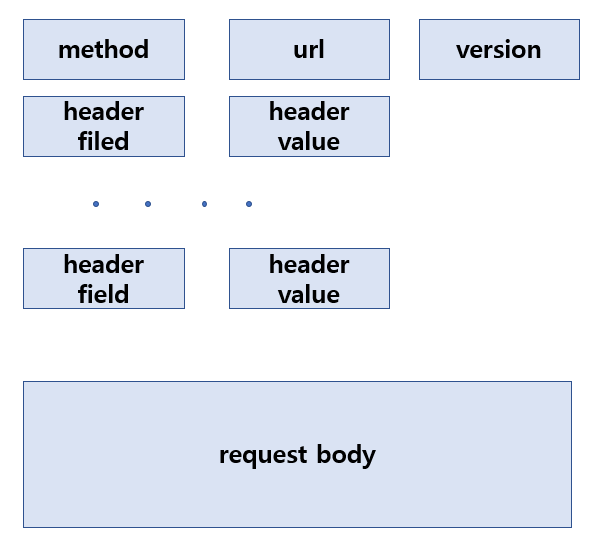
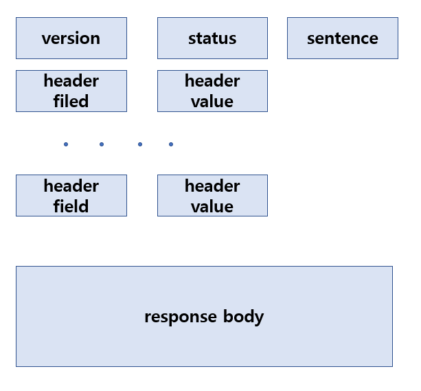
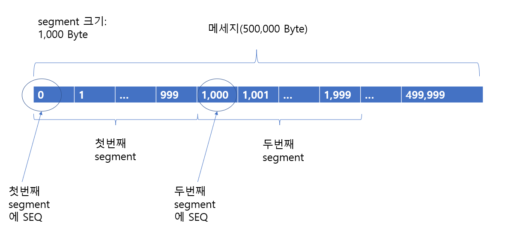

# 목차
- [목차](#목차)
- [Computer Network](#computer-network)
- [OSI 7 layer와 TCP-IP](#osi-7-layer와-tcp-ip)
- [응용 계층 Application Layer](#응용-계층-application-layer)
  - [웹 web](#웹-web)
    - [클라이언트 서버 구조 client-server](#클라이언트-서버-구조-client-server)
    - [웹페이지 web page](#웹페이지-web-page)
    - [웹 브라우저 web browser](#웹-브라우저-web-browser)
    - [URL과 URI](#url과-uri)
    - [DNS](#dns)
      - [브라우저에 웹사이트 주소(domain name)를 입력할때 DNS가 처리하는 과정](#브라우저에-웹사이트-주소domain-name를-입력할때-dns가-처리하는-과정)
      - [브라우저가 웹 페이지를 화면에 그리는 과정](#브라우저가-웹-페이지를-화면에-그리는-과정)
  - [http](#http)
    - [http 특징](#http-특징)
    - [http version](#http-version)
    - [request](#request)
      - [method](#method)
    - [response](#response)
      - [status](#status)
    - [교차 출처 리소스 공유 CORS](#교차-출처-리소스-공유-cors)
  - [https](#https)
    - [대칭키와 공개키](#대칭키와-공개키)
    - [SSL](#ssl)
  - [REST API](#rest-api)
  - [cookie](#cookie)
  - [session](#session)
  - [proxy server](#proxy-server)
  - [reverse proxy server](#reverse-proxy-server)
  - [CDN](#cdn)
  - [DHCP](#dhcp)
  - [socket](#socket)
- [Transport Layer](#transport-layer)
  - [TCP](#tcp)
    - [다중화와 역다중화 multiplexing and demutiplexing](#다중화와-역다중화-multiplexing-and-demutiplexing)
    - [3 hand shake](#3-hand-shake)
    - [4 hand shake](#4-hand-shake)
    - [SYN Flood Atack](#syn-flood-atack)
    - [혼잡 제어](#혼잡-제어)
    - [신뢰 보장](#신뢰-보장)
  - [UDP](#udp)
  - [네이글 알고리즘 nagle algorithm](#네이글-알고리즘-nagle-algorithm)
  - [SSL](#ssl-1)
- [Internet Layer(Network Layer)](#internet-layernetwork-layer)
  - [IP와 port](#ip와-port)
    - [subnet과 subnet mask](#subnet과-subnet-mask)
  - [Forwarding](#forwarding)
  - [Routing](#routing)
  - [Datagram](#datagram)
- [Network Access Layer(Data Link Layer + Physical Layer)](#network-access-layerdata-link-layer--physical-layer)
  - [MAC](#mac)
    - [ARP](#arp)
- [apache 와 nginx](#apache-와-nginx)
- [tomcat](#tomcat)
- [취약점](#취약점)
  - [xss](#xss)
  - [csrf](#csrf)
- [proxy](#proxy)
- [reverse proxy](#reverse-proxy)
- [로드 밸런싱 load balancing](#로드-밸런싱-load-balancing)
  - [algorithm](#algorithm)
- [대용량 트래픽 처리법](#대용량-트래픽-처리법)


----------------------

# Computer Network
- 인터넷 internet
  - inter network에 줄인말
  - 전세계 computer가 연결되어 data를 주고 받는 system
- 프로토콜 protocol
  - internet에서 data를 주고 받을 때 지키는 약속
    - 어떻게 보낼까
    - 어떻게 응답할까
    - 응답이 없을때 어떻게 대응할까
- 노드 node
  - internet에서 data를 주고 받는 주체인 하드웨어를 부르는 말
- 호스트 host
  - application 기능이 있는 node


# OSI 7 layer와 TCP-IP
- Computer Network를 구성하는 요소들을 구분하는 방식


------------

# 응용 계층 Application Layer
- 응용 계층은 인터넷에서 다른 컴퓨터와 통신하는 기능을 갖춘 프로그램을 지칭한다
- 애플리케이션이라고도 부른다
  
- 대표 프로토콜
  - http
    - hyper text transper protocol
    - web server와 web client(browser)사이에 통신 프로토콜
  -  ftp
     - file transper potocol
     - 파일 통신 프로토콜
  - stmp
    - simple mail transfer protocol
    - 문자 통신 프로토콜

## 웹 web
- world wide web을 줄여서 www 혹은 web이라 부른다
- 수 많은 웹 페이지(web page)와 웹 서버(web server)가 연결된 연결망
- 인터넷에 부분집합

### 클라이언트 서버 구조 client-server
- 클라이언트 client: 다른 프로세스와 접속을 시도하는 프로세스
- 서버 server: 다른 프로세스의 접속을 기다리는 프로세스

### 웹페이지 web page
- 웹 페이지 web page
  - 웹상에 존재하는 문서
  - 웹 서버에 저장되며, 브라우저에서 검색(요청)시 서버 응답받아 화면에 띄운다  
  - 하이퍼링크(hypter link)를 이용해 다른 웹 페이지로 이동 가능하다
- 웹 사이트 web site
  - 여러 웹 페이지 묶음
- html
  - hypter text markup language
  - 웹 페이지를 만들 때 사용하는 기본 언어
  - 좀더 복잡한 웹 페이지를 만들기 위해 css, js 언어를 사용한다

### 웹 브라우저 web browser
- web client
- 브라우저라고도 부른다
- html를 이용해 만든 웹 페이지가 돌어가는 프로그램

### URL과 URI
- uniform resource indentifier
  - web상에 resource를 식별하는 형식

- uniform resource locator
  - web상에 resource 위치를 가리키는 형식

- uri는 url 보다 큰 개념
- protocol://domain:port/path?query#fragment 로 구성된다
- 웹 페이지는 url로 지정할 수 있는 파일들(html, jpeg, 등)로 구성된다


### DNS
- domain name system
- ip주소를 사람이 읽을 수 있는 이름(domain name)으로 등록해 둔 계층형 데이터 베이스 시스템
- 인터넷에 모든 domain은 root부터 시작해 . 으로 구분되는 계층 형태로 저장된다

#### 브라우저에 웹사이트 주소(domain name)를 입력할때 DNS가 처리하는 과정
1) 브라우저가 local dns(내 컴퓨터에 저장되어있는 폴더)에게 domain name에 맞는 ip주소를 찾는 쿼리를 보낸다
2) local dns에서 해당 domain name에 맞는 ip 주소가 있으면 반환, 없으면 root dns로 해당 domain name을 관리하는 dns를 찾기 위한 쿼리를 보낸다
3) 해당 domain name을 관리하는 dns가 나올때까지 쿼리를 주고받는다
4) 해당 domain name을 관리하는 dns로 부터 ip주소 응답
5) local dns에 해당 ip주소와 domain name을 캐싱하고 브라우저에게 ip주소 응답
6) 브라우저는 찾은 ip주소를 갖는 웹 서버와 연결을 시도한다 

#### 브라우저가 웹 페이지를 화면에 그리는 과정
1) 주소창에 url이 입력된다
2) dns 처리 과정을 거치고 웹 서버와 연결
3) 서버로부터 html 파일을 받아온다
4) html 내용을 기반으로 DOM Tree 생성
5) html 파싱 과정중 css 파일을 다운받는 태그를 만나면 다운로드 진행한다, header에 link 태그로 있는 편이다
6) html 파싱 과정중 script 태그를 만나면 브라우저는 자바스크립트 엔진을 실행해 해당 과정이 끝날때까지 파싱을 잠시 중단한다. 따라서 사용자에 빠른 렌더링 경험을 위해 script 태그를 body 끝에 두는걸 권장한다
7) DOM Tree가 완성되면 css파일을 바탕으로 CSSOM Tree 생성
8) DOM Tree와 CSSOM Tree를 합쳐 Render Tree 완성
9) Render Tree를 바탕으로 레이아웃 잡기
10) 브라우저에 페인팅

---------------

## http
- hyper text transper protocol
- web server와 web client(browser)사이에 통신 프로토콜
### http 특징
- request
  - client가 server에 보내는 요청
- response
  - server가 요청에 대응해 client에 보내는 응답
- stateless
  - server는 client에 상태를 저장하지 않는다
  - request에 현재 client에 상태를 담아야 한다 
- connectionless
  - response를 보내면 server는 client와 연결을 끊는다

### http version
- 0.9
  - 1991년 발표
  - get method만 있다
  - header가 없다
- 1.0
  - 1996년 발표
  - method 추가
  - header 추가
  - content-type이 헤더에 있어 html외에 다른 형식 주고 받을 수 있다
  - 응답에 status code가 담긴다
- 1.1
  - 1997년 발표
  - TCP 기반 연결
  - 한번 요청을 응답하더라도 header 부분에 keep alive 필드값을 이용해 연결(hand shake)를 해제하지 않고 재사용한다
  - 요청에 응답이 오지 않더라도 다음 요청을 보내는 pipelining 기능 추가
- 2.0
  - 2015년 발표
  - TCP 기반 연결
  - multiplexed stream을 이용해 하나에 연결에서 여러 응답/요청을 동시에 주고 받을 수 있다
- 3
  - UDP 기반 연결
  - QUIC


### request
- request 형태



#### method
| method | 의미 |
|---|---|
| get | server에 resource 가져오기 요청 |
| post | server에 resource 생성 요청|
| delete | server에 resource 삭제 요청|
| put | server에 resource 대체 요청, 기존에 있던 값에 수정사항을 넣지 않으면 null로 수정된다 |
| patch | server에 resource 일부 수정 요청, 기존에 있던 값에 수정사항을 넣지 않으면 기존 값으로 유지된다|
| options | server에 통신 옵션 설명, cors 해결에 사용 |
| head | server에 resource를 요청하지만 응답에 상태코드와 header만 받는다, 웹서버가 동작중인지 확인하는 용도|
| connect| server에 proxy 기능 요청|
| trace| resource 루프백 요청|

### response
- response 형태
  



#### status
- 요청 처리 상태를 표기
- 2xx: 정상 처리 
- 3xx: 처리 완료를 위해 추가 행동 요구
- 4xx: 클라이언트 오류
- 5xx: 서버 오류

|status|의미|
|---|---|
| 200 | 정상 응답 |
| 400 | bad request, 잘 못된 요청 |
| 401 | unauthorized, 로그인 하지 않음(영단어를 해석하면 권한 없음이지만 실제론 인증되지 않음으로 사용한다 ) |
| 403 | forbidden, 권한 없음 |
| 405 | method not allowed, 요청한 resource를 찾을 수 없습니다 |
| 500 | server error |

### 교차 출처 리소스 공유 CORS
- cross origin resource sharing
- http header를 이용해 브라우저가 다른 출처(도메인:포트 가 다른 곳)에서 실행중인 자원에 접근 할 수 있게 하는 체제

1) 브라우저가 options method 로 preflight request를 보낸다
   - access-control-request
2) 서버가 허락 response를 응답
   - access-control-allow
3) 브라우저가 실제 request 보낸다
4) 서바가 처리후 response 응답

-----------------

## https
- hypertext transfer protocol secure
- http에 보안 기능인 SSL을 합친 프로토콜

### 대칭키와 공개키
- 대칭키
  - 암호화와 복호화에 사용하는 키가 같은 암호 체계
- 공개키
  - 누구나 아는 공개키로 암호화, 복호화 키는 비밀인 암호 체계
- 

### SSL
- secure sockets layer
- ca: 인증 기관
- 브라우저는 공인된 ca들에 목록을 갖고 있다

------------------

## REST API

------------------
  
## cookie
- web site가 사용자 정보를 추적하기 위해 저장해두는 정보 
- server가 response header에 'set-cookie' filed로 담은 value를 browser가 저장한다
- request 보낼시 cookie는 header에 담긴다


## session
- session: web server에 저장됨

-----------------

## proxy server
- response cache 역활
- client가 요청을 보낼 경우 proxy server는 response가 cache되어 있는지를 확인하고 있다면 이를 응답한다, 없다면 server에 요청을 보내 response를 받아 와 저장한 후 client에게 응답한다
- 비슷한 목적으로 사용하는 여러 client들을 하나에 proxy server로 request 보내게끔 시스템을 설계하면 server로 직접 가는 트래픽을 줄일 수 있다
- caching시 마지막 수정된 날짜를 함께 저장한다
- client는 cache에서 response를 받기전 server에게 조건부 get를 보내 수정 사항이 있는지 확인(status 304 response)를 확인 받고 cache에서 받는다

## reverse proxy server

---------------

## CDN

--------------

## DHCP

---------------

## socket
- 응용 계층과 전송 계층간 인터페이스
  - 프로세스에서 네트워크로 데이터 송신, 네트워크로부터 프로세스로 데이터 수신을 하는 출입구 역활
- 하나에 컴퓨터에 동작중인 프로세스가 다른 컴퓨터에 동작 중인 프로세스와 통신하기 위해 OS가 제공하는 기능(system call을 이용해 구현) 
- 응용 계층에서 소켓 제어를 할 수 있다
  - 전송 계층 TCP와 UDP 두가지 방식이 있다
  - 최대 버퍼, 최대 세그먼트 크기
- 송신측 소켓은 애플리케이션이 생성한 메세지를 네트워크로 전송하는 책임이
- 수신측 소켓은 받은 메세지를 애플리케이션에 이동시키는 책임이 있다


--------------

# Transport Layer
- 프로세스간 논리적 통신 제공: 서로 다른 호스트에서 동작중인 애플리케이션이 직접 연결된 것처럼 통신한다.
  - 실제론 호스트와 호스트 사이에 수많은 라우터와 링크들이 존재한다
- segment: transport layer에 packet 단위
  - 애플리케이션 message를 분해한 후 header를 붙인다 
  - 이를 송신측은 Network layer로 보내고, 수신측은 Network layer로 부터 받는다
- data 전송, 통신 제어
  - 신뢰, 처리율, 처리시간 보장, 보안을 담당한다
- IP(Internet Protocol)은 segment 전달을 보장하지 않는다.
  - 네트워크에서 전송중인 data packet은 손실될 수 있다. 순서 역시 보장하지 않는다
  - ex) 라우터 버퍼 오버플로우, 비트 조작
- 오디오, 비디오같은 data는 어느 정도(사용자가 이상을 느끼지 않을 정도) 손실을 허용한다
- 처리율: 초당 처리 bit 
- 게임과 같이 실시간 통신이 중요한 경우 처리 시간이 짧아야 한다
  - nagle's algorithm
-  


## TCP
- transmission control protocol
- 프로세스간 논리적 통신
- 연결 지향형(3 hand shake와 4 hand shake)
  - 하나에 client와 하나에 server를 점대점으로 연결한다
- 신뢰도 높음(순서대로 모두 도착함을 보장한다)
- 혼잡 제어 있음
  - 통신중인 호스트 사이에 있는 스위치와 링크가 폭주하는젓을 방지
- 오류 검출 가능
- 타이머



- 순서번호 SEQ
- 확인응답번호 ACK: 

### 다중화와 역다중화 multiplexing and demutiplexing
- network layer에 호스트간 논리적 통신을 프로세스간 논리적 통신으로 확장
- 다중화: 송신을 위해 message를 segment로 만들고 이를 network layer로 보내는 과정
- 역다중화: transport layer에 수신받은 segment를 올바른 socket에 전달하는 과정

### 3 hand shake
- TCP socket을 쓰는 client-server에 통신 연결 과정
1) client가 server에게 SYN=True, ACK=False인 segment를 전송한다, data를 포함하지 않고, SEQ는 random number
2) server가 client에게 SYN=True, ACK=True인 segment를 전송한다, data를 포함하지 않고, SEQ는 random number, ACK는 1번의 SEQ에 +1
3) client가 server에게 SYN=False, ACK=True인 segment를 전송한다, data를 포함할 수 있고, SEQ는 1번의 SEQ+1, ACK는 2번의 SEQ에 +1
이상에 과정을 거친 client와 server는 request, response를 주고 받을 수 있다


### 4 hand shake
- TCP socket을 쓰는 client-server에 통신 종료 과정
1) client가 server에게 FIN=True인 segment를 전송한다
2) server가 client에게 ACK=True인 segment를 전송한다 
3) server가 client에게 FIN=True인 segment를 전송한다
4) client가 server에게 ACk=True인 segment를 전송한다
5) client는 설정한 대기시간동안 대기(4번이 손실될 경우를 재전송을 대비)후 종료, server는 추가 segment가 안 온다면 종료 

### SYN Flood Atack
- 1996년에 발견된 dos 공격
- 악의적으로 3 hand shake에 세번째 단계를 완료시키지 않는 무수히 많은 SYN=True segment를 보내 server 자원을 낭비시켜 정상 client가 통신 시도를 못하게 방해하는 공격
- 현재 대부분에 OS는 SYN cookie기술을 이용한 방어책을 갖고 있다

### 혼잡 제어

### 신뢰 보장


## UDP
- user datagram protocol
- 비연결형
- 신뢰도 낮음(송신한 데이터가 목적지에 제대로 도착함을 보장하지 않는다)
- 혼잡 제어 없음
- 프로세스간 논리적 통신, 오류 검출 두 가지만 제공

## 네이글 알고리즘 nagle algorithm
- 데이터 전송시 네트워를 통해 보내는 패킷수를 줄여 효율성을 높이는 알고리즘
  - ACK를 받기까지 버퍼에 대기하느라 속도는 느려지지만 전송 패킷 수는 줄어든다
  - 실시간성을 요구할땐 좋지 않다
- TCP 소켓이 기본으로 채택하고 있는 알고리즘

```
if 새 데이터 전송
  if 상대가 받을 수 있는 사이즈 >= 세그먼트사이즈최대값 and 데이터 사이즈 >= 세그먼트사이즈
    최대 세그먼트 사이즈 만큼 전송
  else
    if 보내지 못한 데이터 부분이 남음
      ACK를 받을 때까지 버버에 넣고 대기
    else
```

## SSL
- secure socket layer
- TCP, UDP 둘다 보안 기능이 없다
- 

----------------

# Internet Layer(Network Layer)
- host간에 논리적 통신 제공

## IP와 port
- ip: internet 서비스 공급자에서 할당 해준 internet에서 computer를 구분하는 주소 
  - version 4는 . 으로 구분되는 4개의 숫자로 이루어져있다. 각 숫자는 0~255(8bit)범위를 갖는다. 총 32bit
  - 한 computer에 ip는 공급자에 의해 바뀔 수 있다
  - ip주소는 host가 네트워크 어디에 위치하는지 나타낸다
  - ip주소는 32bit다
  - ip주소는 4계층으로 이루어져있다
  - ip주소의 한 계층은 0~255 십진수로 표현한다(8bit)
  - ip주소에 계층은 . 으로 구분한다
- port: 한 computer(동일 ip)에서 process를 구분하는 번호

### subnet과 subnet mask

- 서브네팅
  - IP 주소를 네트워크 영역+호스트영역으로 구성
  - 같은 네트워크 영역내 IP끼리는 라우터를 거치지 않고 패킷 교환 가능
- 서브넷마스크
  - 연속된 1과 그다음 연속된 0으로 된 32 자리 2진수
  - 1은 네트워크 영역을 0은 호스트 영역을 의미
  - Class에서 제공하는 서브넷 마스크 말고 자체 서브넷 마스크를 이용할 경우 IP주소를 표기할때 뒤에 '/1에갯수' 를 적어 해당 IP의 서브넷 마스크를 나타낸다
  - IP주소 AND 서브넷마스크 = 네트워크 영역
  - 가질 수 있는 서브넷 네트워크 수와 각 서브넷 네트워크에 호스트 영역 수를 계산할 줄 알아야 한다
  - 호스트 수는 2^(영역수)-2, 빼기 2는 네트워크 영역 구분용(영역내에 가장 작은 수)과 브로드캐스트 용(영역내 가장 큰 수)


## Forwarding

## Routing
- packet 전송 경로를 결정하는 과정
- 

## Datagram


------
# Network Access Layer(Data Link Layer + Physical Layer)
## MAC
- media access control
- 하드웨가 갖고 있는 고유 주소
- : 으로 구분되는 6개 숫자로 이루어져 있다. 각 숫자는 32bit로 16진수 2자리다  
- ip와 다르게 변하지 않는다


### ARP
- IP 주소를 MAC 주소로 변환하는데 사용하는 프로토콜
- 브로드 캐스트를 통해 해당 IP주소를 가진 host를 찾음


------
# apache 와 nginx
- apache: thread 기반, 요청이 올때마다 thread 생성
- nginx: 최소 thread만으로 event queue


# tomcat


-------

# 취약점
## xss
- cross site scripting
- 
## csrf

---------

# proxy
- client대신 request를 보내고 response 받아 caching한다


# reverse proxy
- server 대신 request를 받아 server가 처리하게 한후 response을 대신 보낸다
- load balancing

----------

# 로드 밸런싱 load balancing
## algorithm
- sticky session
- 

# 대용량 트래픽 처리법
- 발생시점을 예상 가능한가 vs 급작스런 증가인가
- 캐시에서 감당이 안 될때 디비에서 처리하도록 서킷브레이커
- 스케일업
- 스케일아웃
- 스프링이면 톰캣 스레드풀 설정 바꾸기
- 로드밸런싱
- 데이터베이스 샤딩
- 데이터베이스 레플리카
- 캐시
- CDN
- 그럼에도 불구하고 커버가 불가능한 경우 클라이언트에게 실패 응답을 보내 다시 시도하게 끔 한다
