# EC2 설정

- 인스턴스 생성
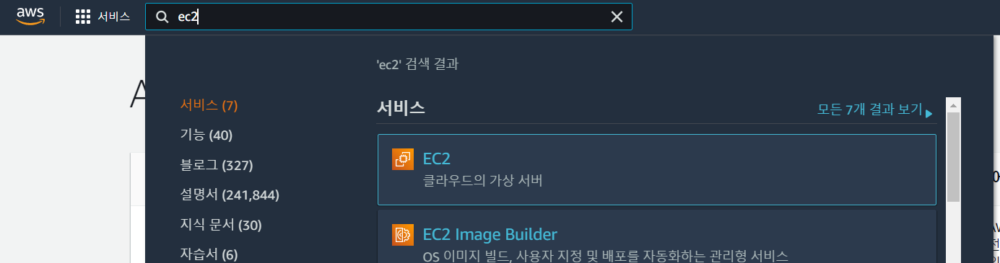
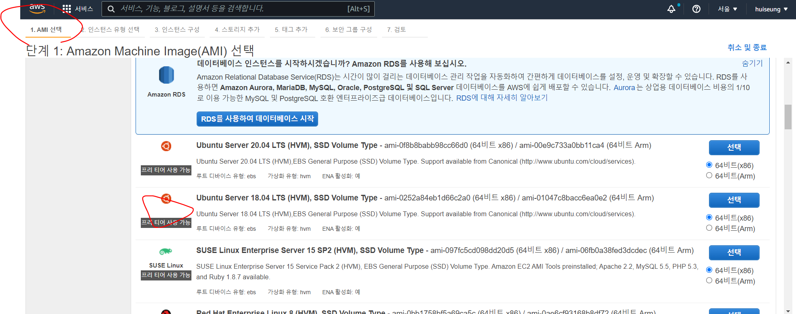
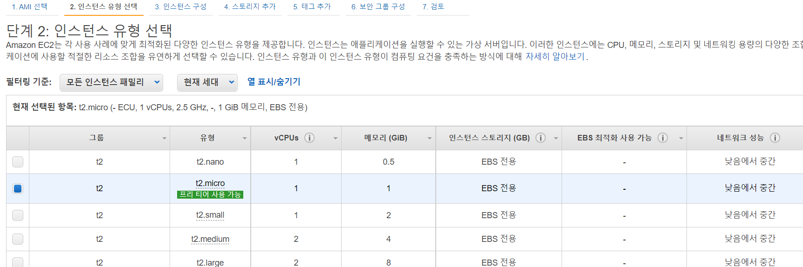

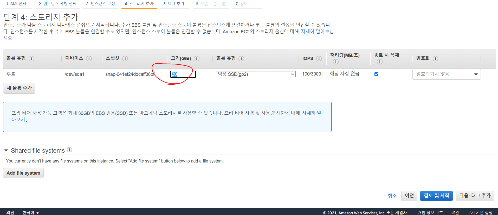
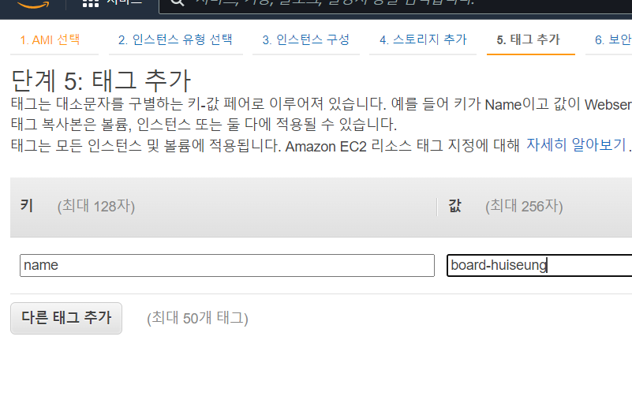

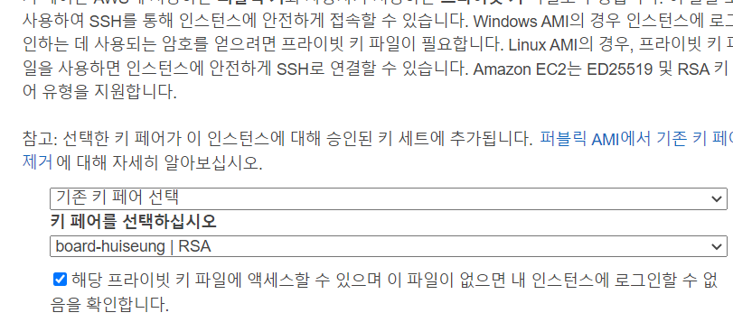

- mobaXterm pem to ppk
  - tools > MobaXterm SSH Key Generator 클릭
  - Conversions > Import Key로 pem 키 불러오기
  - save priavete key를 눌러 ppk로 저장

- mobaXterm EC2 ssh접속
  - remote host:
  - use private key: 

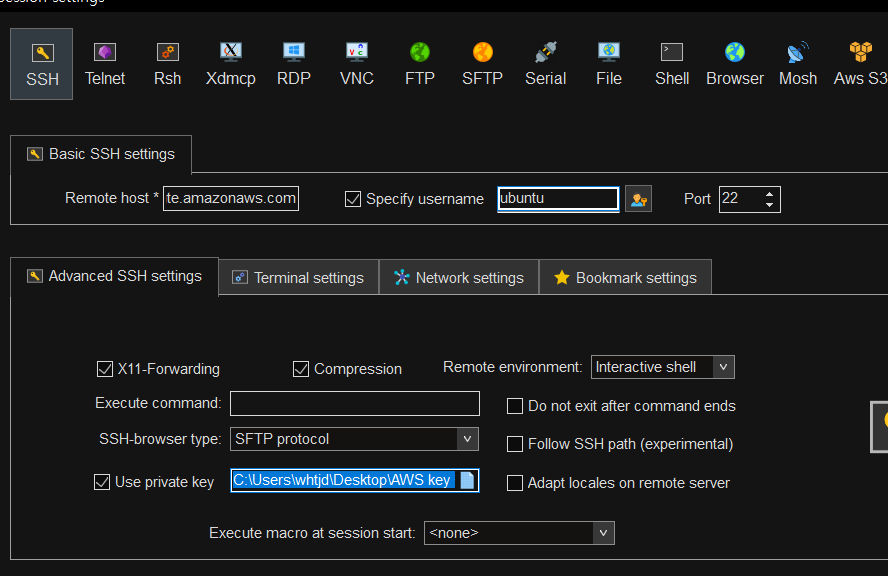


- ubuntu time zone 수정


 


- ubuntu 18.04 도커 설치
  - reference: [도커 설치참고 블로그 주소](https://louky0714.tistory.com/entry/Docker-Ubuntu-1804x-LTS%EC%97%90-docker-%EC%84%A4%EC%B9%98-%ED%95%98%EA%B8%B0)
```

```

- ubuntu java11 설치
  - sudo apt install openjdk-11-jdk


# RDS 설정
- RDS 생성

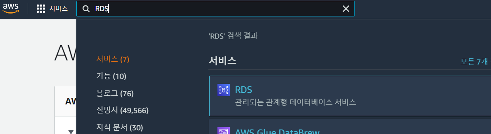


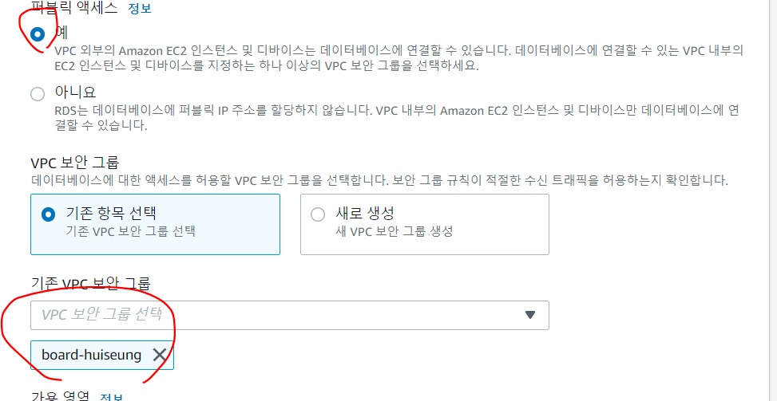
- 보안 그룹 설정이 잘 못 되었다
  - 사진 처럼 board-huiseung로 하지 말고, default로 한 뒤
  - default 보안 그룹 수정으로 가서 board-huiseung그룹을 인바운드 규칙에 {유형: MYSQL/Aurora, 프로토콜:TCP, 포트:3306, 소스: board-huiseung}을 추가한다.
  - 로컬에서 RDS접속을 시도해보고 싶다면 default 그룹 인바운드 규칙에 내 IP를 추가한다.


- 파라미터 그룹 설정
  - 마지막 사진에 있는 것 처럼 설정을 변경합니다.
  - time_zone: aisia/seoul
  - charset_set*: utf8mb4, 이모지를 저장할 수 있게 하는 설정
  - max_connection: 기본값보단 보다 넉넉한 값으로 설정

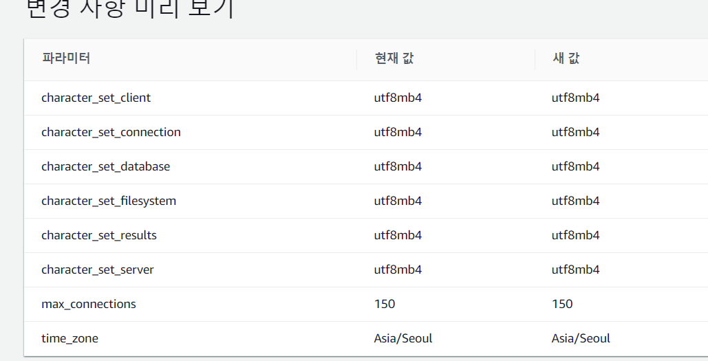

- RDS에 파라미터 그룹 적용
  - 수정 상태를 기다리면 수정이 적용된다

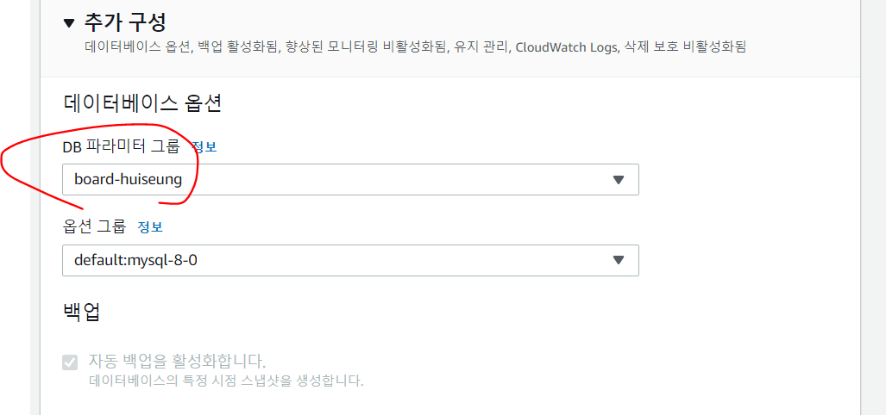


# DNS 등록
- step 1 

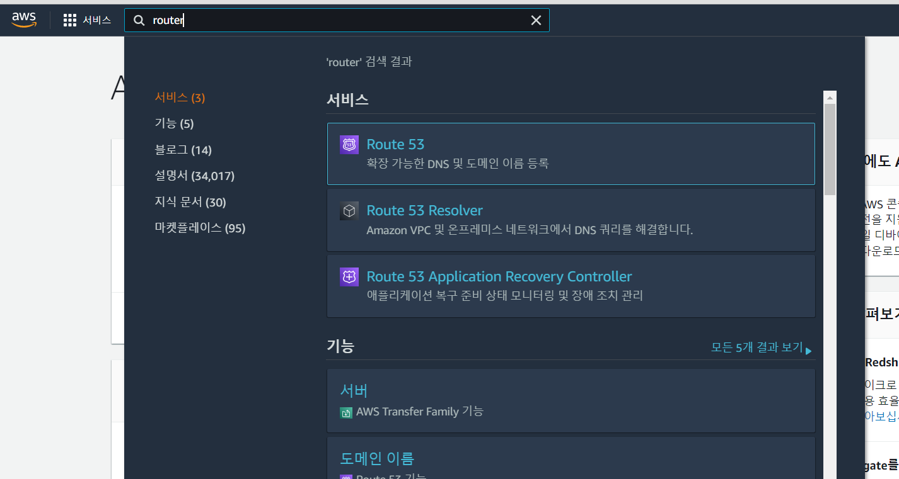
- step 2

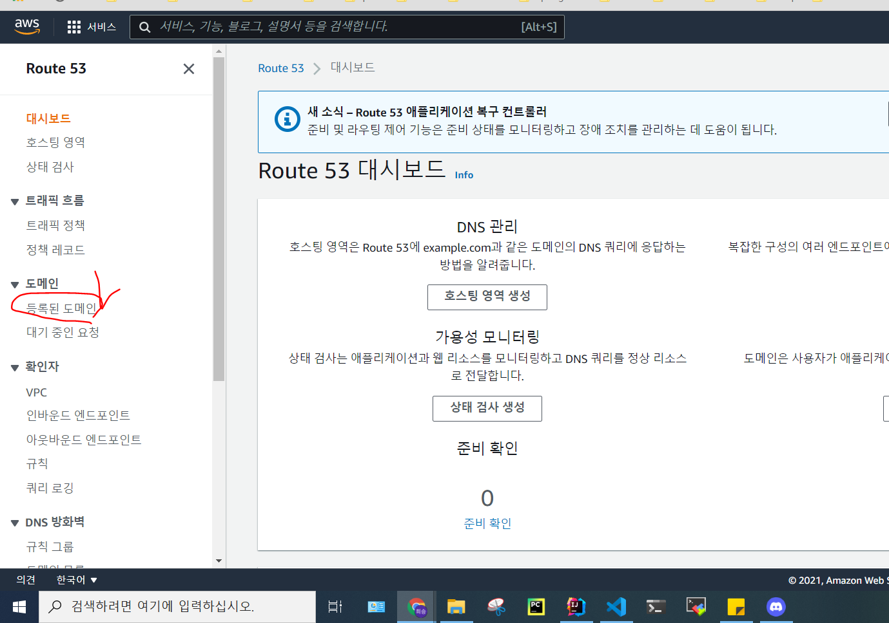

- step 3
  - 원하는 도메인을 등록하고, 결제를 기다리면 된다.
  - 서브 도메인을 쓸 수 있으니 도메인 이름은 큰 단위로 하자.


# Amplify

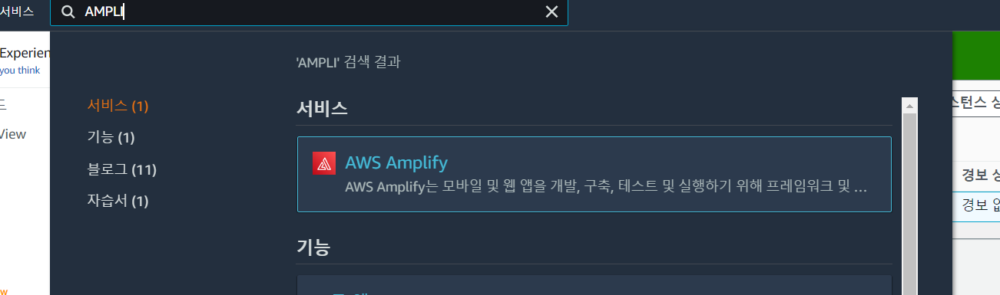

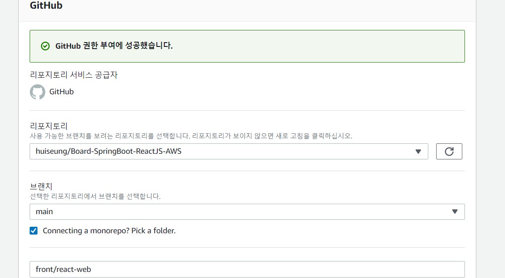

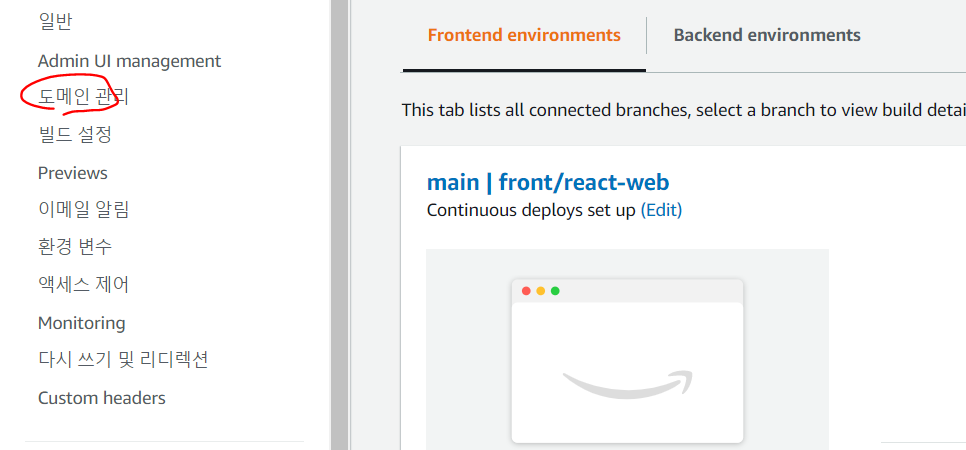


# S3 설정
- 참고 자료: https://willseungh0.tistory.com/2


