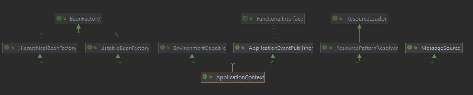

# 목차

- [목차](#목차)
- [스프링 역사](#스프링-역사)
- [Container와 Bean 그리고 Dependency Injection](#container와-bean-그리고-dependency-injection)
  - [Container](#container)
  - [Bean](#bean)
  - [관심사 분리](#관심사-분리)
  - [제어의 역전 Inversion Of Control](#제어의-역전-inversion-of-control)
  - [의존성 주입 Dependency Injection](#의존성-주입-dependency-injection)
  - [Servlet Container](#servlet-container)
- [그냥 Spring을 쓰는 것보다 SpringBoot 사용할 때 좋은 점](#그냥-spring을-쓰는-것보다-springboot-사용할-때-좋은-점)

# 스프링 역사
- 2002년 Rod Johnson이 출판한 Expert One on One J2EE Design and Development에 코드가 Spring에 근간이 되었다.
- 2004년 3월 spring 1.0이 relase되었다.
- 2014년 spring boot 1.0이 release되었다.
- 2017년 9월 spring 5.0이 release되었다.(2022년인 현재 가장 최신 버전)
- 초기 애플리케이션 개발은 관계형데이터베이스를 사용하는 웹 브라우저 기반에 모노 애플리케이션을 주로 만들었다.
- 여전히 이 방식은 유효하지만, 현재는 다양한 NoSQL 데이터베이스를 사용하며, 마이크로서비스로 구성된 애플리케이션 개발에 대한 관심이 높다.
- 더불어 리액티브 프로그래밍도 관심사로 떠오르고 있다.
- 주 언어로 Java를 사용했지만 안드로이드 진영에서 Kotlin을 채택하듯 Spring도 Kotlin으로 작성하려는 개발자들이 생겨나고 있다


# Container와 Bean 그리고 Dependency Injection
## Container



```java
public class BeanFactory implements ObjectFactory{
  @Override
  public Object getObjectInstance(
    Object obj,
    Name name,
    Context nameCtx,
    Hashtable<?, ?> environment
  ){

  }
}
```

```java
public interface ApplicationContext extends EnvironmentCapable, ListableBeanFactory, HierarchicalBeanFactory,
		MessageSource, ApplicationEventPublisher, ResourcePatternResolver {

}

```

## Bean 
- Bean은 스프링 컨테이너가 관리하는 객체
- 싱글톤
- Dispatcher servlet에 의해 multi thread가 지원된다
- @Component, @Repository, @Service, @Controller, @Bean, @Configuration 어노테이션이 붙은 객체가 Bean으로 등록된다.

## 관심사 분리

## 제어의 역전 Inversion Of Control
- 개발자가 직접 객체 생성, 주입 코드를 작성하지 않아도, 프레임 워크가 대신 생성 주입 처리를 해준다
- 빈객체에 생성, 주입, 소멸을 프레임워크가 개발자가 코드를 짜줄 필요없이 대신 관리


## 의존성 주입 Dependency Injection
- 클래스가 다른 클래스를 필드로 가질 경우, 외부에서 이를 주입해 초기화하는 방식
  - 사용 목적: 필드타입을 인터페이스로 할 수 있어 클래스간 강한 연결을 해제할 수 있다. 
- "생성자에 @Autowired", "setter", "필드에 @Autowired" 를 이용해 의존성 주입을 할 수 있다.
  -  생성자를 이용한 의존성 주입을 주로 사용한다
     - 이유: 생성자를 이용한 주입은 생성자 호출 시점에만 호출되어, 주입 받은 객체가 변하지 않는것이 보장된다
  - 스프링은 생성자가 하나만 있을 경우 의존성 주입용 어노테이션인 @Autowired를 생략해도 자동으로 적용시켜 준다
- Bean 등록을 마친 객체에 대해서만 의존성 주입 가능

<details>
<summary>
@Bean, @Component, @Configuration 차이
</summary>
<ul>
<li>@Bean: 어노테이션이 붙은 메서드가 리턴하는 객체를 빈으로 등록</li>
<li>@Component: 어노테이션이 붙은 클래스를 빈으로 등록</li>
<li>@Configuration: 어노테이션이 붙은 클래스를 빈으로 등록 + 내부 메서드에 @Bean을 붙일수 있다</li>
</ul>
</details>

## Servlet Container


# 그냥 Spring을 쓰는 것보다 SpringBoot 사용할 때 좋은 점
- 간편한 configuration 설정
- 의존성 관리, 버전 관리
- embedded tomcat server


---------
