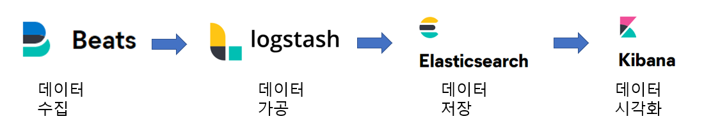

# 목차
- [목차](#목차)
- [역사](#역사)
- [설치 및 실행](#설치-및-실행)
- [엘라스틱서치 ElasticSearch](#엘라스틱서치-elasticsearch)
  - [Analayzer와 reverse Indexing](#analayzer와-reverse-indexing)
- [Index 와 Document CRUD REST API](#index-와-document-crud-rest-api)
- [QueryDSL](#querydsl)
  - [Response Body](#response-body)
  - [Score algorithm: BM25](#score-algorithm-bm25)
  - [fulltext query](#fulltext-query)
    - [match](#match)
    - [match phrase](#match-phrase)
  - [term level query](#term-level-query)
  - [multi_match](#multi_match)
  - [range](#range)
  - [bool query](#bool-query)
    - [filter](#filter)
    - [must](#must)
    - [must_not](#must_not)
    - [should](#should)
    - [같이 사용](#같이-사용)
- [aggregation](#aggregation)
  - [필드 집계](#필드-집계)
  - [document 집계](#document-집계)
- [로그스태시 logstash](#로그스태시-logstash)


---------------

# 역사



---------------

# 설치 및 실행


---------------
# 엘라스틱서치 ElasticSearch


## Analayzer와 reverse Indexing


---------------
# Index 와 Document CRUD REST API


---------------
# QueryDSL
- Query Domain Specific Language
- query rest api에 request body 부분에 json 형태로 작성하는 쿼리문

## Response Body


## Score algorithm: BM25


## fulltext query
- GET index/_search{}

- ?: 한글자 대응, *: 한글자 이상 대응


### match

```json
{
    "query": {
        "match": {
            "필드": "값"
        }
    }

}
```

```json
{
    "query": {
        "match": {
            "필드": "값1 값2" //띄어쓰기는 or로 취급
        }
    }
}
```

```json
{
    "query": {
        "match": {
            "필드": "값1 값2",
            "operator": "and"
        }
    }
}
```

### match phrase
- 값들이 모두 순서까지 맞게 있는 document 검색

```json
{
    "query": {
        "match_phrase": {
            "필드": "값1 값2" 
        }
    }
}
```

## term level query
```json
{
    "query": {
        "term": {
            "필드": "값"
        }
    }
}
```

```json
{
    "query": {
        "terms": {
            "필드": ["값1", "값2"] //or연산
        }
    }
}

```

## multi_match
- 복수 필드에 하나에 값이 맞는지 검색

```json
{
  "query": {
    "multi_match": {
      "query": "값",
      "fields":[
        "필드1",
        "필드2"
      ]
    }
  }
}
```

## range

```json
{
    "query": {
        "range": {
            "timestamp": {
                "gte": "now-1M"
            }
        }
    }
}
```


## bool query
### filter

```json
{
    "query": {
        "bool": {
            "filter": {
            }
        }
        
    }
}

```


### must
- 리스트안에 쿼리문들에 and 연산
```json
{
    "query": {
        "bool": {
            "must": [
                {쿼리문}, //"match": {}
                {쿼리문}  //"term": {}
            ]
        }
    }
}

```

### must_not
- 리스트안에 쿼리문에 and를 취한후 not
```json
{
    "query":{
        "bool": {
            "must_not": [
                {쿼리문}
            ]
        }
    }
}
```

### should
- 리스트안에 쿼리문에 or 연산
```json
{
    "query":{
        "bool": {
            "should": [
                {쿼리문}
            ]
        }
    }
}
```

### 같이 사용
```json
{
    "query": {
        "bool": {
            "should": [
                {}, 
                {}
            ],
            "must": [
                {},
                {}
            ],
            "filter": {}
        }
    }
}

```


---------------

# aggregation
- sql에 group by와 유사, 그룹해 통계값을 계산하는 기능
## 필드 집계
- 집계함수: sum, avg, min, max, cardinality, percentiles 

```json
{
    "size": 0, //size를 0으로 하면 집계에 사용한 document는 결과에 담지 않는다
    "aggs": {
        "집계결과담을이름":  {
            "집계함수": {
                "field": "집계할 필드"
            }
        }
    }
}
```

```json
{
    "size": 0, //size를 0으로 하면 집계에 사용한 document는 결과에 담지 않는다
    "aggs": {
        "집계결과담을이름":  {
            "percentiles": {
                "field": "집계할 필드",
                "percents": [
                    25,
                    50 
                ] //25% 50%
            }
        }
    }
}

```

## document 집계


---------------

# 로그스태시 logstash
- 데이터 가공 소프트웨어


---------------