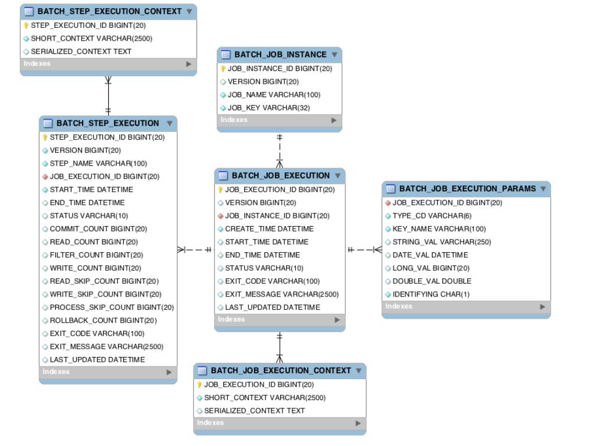

# 목차
- [목차](#목차)
- [스프링 배치](#스프링-배치)
  - [왜 사용하는가](#왜-사용하는가)
  - [사용 사례](#사용-사례)
- [시작](#시작)
  - [설정 클래스들](#설정-클래스들)
    - [SimpleBatchConfiguration](#simplebatchconfiguration)
    - [사용자 정의 JobConfiguration](#사용자-정의-jobconfiguration)
    - [BatchAutoConfiguration](#batchautoconfiguration)
    - [BatchProperties](#batchproperties)
  - [application.yml](#applicationyml)
  - [mysql을 이용하고 싶을때](#mysql을-이용하고-싶을때)
- [Job](#job)
  - [JobLauncherApplicationRunncer](#joblauncherapplicationrunncer)
  - [JobBuilder](#jobbuilder)
  - [JobInstance](#jobinstance)
  - [JobParameters](#jobparameters)
  - [JobExecution](#jobexecution)
  - [JobExecutionDecider](#jobexecutiondecider)
  - [JobLauncher](#joblauncher)
  - [JobRepository](#jobrepository)
    - [meta data table](#meta-data-table)
  - [Job 구현체](#job-구현체)
    - [SimpleJob 과 SimpleJobBuilder](#simplejob-과-simplejobbuilder)
    - [FlowJob 과 FlowJobBuilder](#flowjob-과-flowjobbuilder)
      - [JobExecutionDecider](#jobexecutiondecider-1)
      - [FlowExecution](#flowexecution)
      - [SimpleFlow](#simpleflow)
- [Step](#step)
  - [StepBuilder](#stepbuilder)
  - [StepExecution](#stepexecution)
  - [StepContribution](#stepcontribution)
  - [Step 구현체](#step-구현체)
    - [TaskletStep과 TaskletStepBuilder](#taskletstep과-taskletstepbuilder)
    - [JobStep](#jobstep)
    - [FlowStep](#flowstep)
- [ExecutionContext](#executioncontext)
- [Scope](#scope)
  - [@JobScope](#jobscope)
  - [@StepScope](#stepscope)
- [Chunk](#chunk)
  - [ChunkOrientedTasklet](#chunkorientedtasklet)
  - [ChunkProvider](#chunkprovider)
  - [ChunkProcessor](#chunkprocessor)
  - [ItemReader](#itemreader)
    - [JdbcCursorItemReader](#jdbccursoritemreader)
    - [JdbcPagingItemReader](#jdbcpagingitemreader)
    - [JpaCursorItemReader](#jpacursoritemreader)
    - [JpaPagingItemReader](#jpapagingitemreader)
    - [FlatFileItemReader](#flatfileitemreader)
    - [StaxEventItemReader](#staxeventitemreader)
    - [JsonItemReader](#jsonitemreader)
  - [ItemProcessor](#itemprocessor)
    - [CompositeItemProcessor](#compositeitemprocessor)
    - [ClassifierCompositeItemProcessor](#classifiercompositeitemprocessor)
  - [ItemWriter](#itemwriter)
    - [JdbcBatchItemWriter](#jdbcbatchitemwriter)
    - [JpaItemWriter](#jpaitemwriter)
  - [process로부터 List 객체 받기](#process로부터-list-객체-받기)
  - [CustomItemWriter](#customitemwriter)
    - [FlatFileItemWriter](#flatfileitemwriter)
    - [StaxEventItemWriter](#staxeventitemwriter)
    - [JsonFileItemWriter](#jsonfileitemwriter)
  - [CompletionPolicy](#completionpolicy)
- [Repeat, FaultTolerant, Skip, Retry](#repeat-faulttolerant-skip-retry)
  - [Repeat](#repeat)
  - [FaultTolerant](#faulttolerant)
  - [Skip](#skip)
  - [Retry](#retry)
- [Scailing at SpringBatch](#scailing-at-springbatch)
  - [MultiThreadStep](#multithreadstep)
  - [ParallelStep](#parallelstep)
  - [Partitioning](#partitioning)
  - [AsyncItemProcess/Writer](#asyncitemprocesswriter)
  - [SynchronizedItemStreamReader](#synchronizeditemstreamreader)
- [Listener](#listener)
  - [JobExecutionListener](#jobexecutionlistener)
  - [StepExecutionListener](#stepexecutionlistener)
  - [ChunkListener](#chunklistener)
  - [ItemReaderListener, ItemProcessListener, ItemWriteListener](#itemreaderlistener-itemprocesslistener-itemwritelistener)
  - [SkipListener](#skiplistener)
  - [RetryListener](#retrylistener)
- [Spring Batch Test](#spring-batch-test)
  - [JobExplorer](#jobexplorer)
  - [JobRegistry](#jobregistry)
  - [JobOperator](#joboperator)
- [지연 처리되는 Job 모니터링](#지연-처리되는-job-모니터링)
- [](#)
- [Quartz를 이용한 스케줄링](#quartz를-이용한-스케줄링)
  - [Scheduler](#scheduler)
    - [SchedulerFactory](#schedulerfactory)
  - [Trigger](#trigger)
  - [Job](#job-1)
    - [JobDetails](#jobdetails)
- [Jenkins를 이용한 스케줄링](#jenkins를-이용한-스케줄링)

# 스프링 배치
## 왜 사용하는가
- 호출 빈도는 낮지만, 호출시 처리 시간이 오래 걸리는 작업을 API server에서 진행하는건 자원 낭비다
- 배치 처리를 위한 표준 아키테처
- 배치 처리: 대용량 데이터를 배치단위로 나눠 동일 작업을 반복
- 자동화: 심각한 문제를 제외하고 사용자 개입 없이 지속적으로 동작
- 신뢰: 문제 발생시 추적 가능, 작업 도중 실패시, 실패지점 부터 이어서 재작업 

## 사용 사례
- 일매출 집계
  - 배치작업을 통해 일 매출 집계 데이터를 만들어 둬, 사용자가 일 매출 집계 조회시 별도에 집계 처리없이 조회 가능하게 한다

------

# 시작
- 라이브러리 추가: implementation 'org.springframework.boot:spring-boot-starter-batch'

```java
//main application class
@EnableBatchProcessing //배치 기능 사용하기
@SpringBootApplication
public class BackApplication {

    public static void main(String[] args) {
        SpringApplication.run(BackApplication.class, args);
    }

}
```

- @EnableBatchProcessing
  - 설정 클래스들을 실행
    - SimpleBatchConfiguration
    - 사용자 정의 JobConfig
    - BatchAutoConfiguration
  - 스프링 배치 초기화
    - BatchProperties
  - Job 클래스 초기화, 실행

## 설정 클래스들

### SimpleBatchConfiguration
- Job과 관련한 Bean 객체 등록

```java
//메서드
void initialize()
@Bean
JobExplorer jobExplorer()
@Bean
JobLauncher jobLauncher()
@Bean
JobRegistry jobRegistry()
@Bean
JobRepository jobRepsitory()
@Bean
PlatformTransactionManager transactionManager()


@Bean
JobBuilderFactory jobBuilders()
@Bean
StempBuilderFactory stepBuilders()
void setImportMetadata()
void afterPropertiesSet()
BatchConfigurer getConfigurer()

```

### 사용자 정의 JobConfiguration
- 사용할 Job과 Step을 Bean으로 등록하는 클래스

```java
//example
@RequiredArgsConstructor
@Configuration
public class JobConfig{
	private final JobBuilderFactory jobBuilderFactory;
	private final StepBuilderFactory stepBuilderFactory;

	@Bean
	public Job myJob(){
		return jobBuilderFactory.get("myJob")
			.start(myStep1())
			.next(myStep2())
			.build();
	}

	@Bean
	public Step myStep1(){
		return stepBuilderFactory.get("myStep1")
			.tasklet(((contribution, chunkContext)->{
				return RepeatStatus.FINISHED;
			}))
			.build();
	}
}

```

### BatchAutoConfiguration
- JobLauncherApllicationRunner를 Bean으로 등록하는 클래스

```java
@Configuration(proxyBeanMethods = false)
class BatchAutoConfiguration{
  @Bean
  public JobLauncherApplicationRunner jobLauncherApplicationRunner(JobLauncher jobLauncher, JobExplorer jobExplorer,
			JobRepository jobRepository, BatchProperties properties)
}

```

### BatchProperties
```java
@ConfigurationProperties(prefix = "spring.batch")
class BatchProperties{
  public static class Job{

    public String getNames() { return this.name}
  }
  
}
```


## application.yml
```yml
spring:
  profiles:
    active: local

---

spring:
  config:
    activate:
      on-profile: local
  datasource:
    url: jdbc:mysql://localhost:3306/데이터베이스
    username: 이름
    password: 비밀번호
    driver-class-name: com.mysql.cj.jdbc.Driver
  batch:
    jdbc:
      initialize-schema: never
    job:
      names: ${job.name:None}
```

```
--job.name = 
```


## mysql을 이용하고 싶을때
- table을 미리 만들어 둬야한다
  - schema-mysql.sql에 내용을 이용해 table 생성

```sql
CREATE TABLE BATCH_JOB_INSTANCE  (
    JOB_INSTANCE_ID BIGINT  NOT NULL PRIMARY KEY ,
    VERSION BIGINT ,
    JOB_NAME VARCHAR(100) NOT NULL,
    JOB_KEY VARCHAR(32) NOT NULL,
    constraint JOB_INST_UN unique (JOB_NAME, JOB_KEY)
) ENGINE=InnoDB;

CREATE TABLE BATCH_JOB_EXECUTION  (
    JOB_EXECUTION_ID BIGINT  NOT NULL PRIMARY KEY ,
    VERSION BIGINT  ,
    JOB_INSTANCE_ID BIGINT NOT NULL,
    CREATE_TIME DATETIME NOT NULL,
    START_TIME DATETIME DEFAULT NULL ,
    END_TIME DATETIME DEFAULT NULL ,
    STATUS VARCHAR(10) ,
    EXIT_CODE VARCHAR(2500) ,
    EXIT_MESSAGE VARCHAR(2500) ,
    LAST_UPDATED DATETIME,
    JOB_CONFIGURATION_LOCATION VARCHAR(2500) NULL,
    constraint JOB_INST_EXEC_FK foreign key (JOB_INSTANCE_ID)
    references BATCH_JOB_INSTANCE(JOB_INSTANCE_ID)
) ENGINE=InnoDB;

CREATE TABLE BATCH_JOB_EXECUTION_PARAMS  (
    JOB_EXECUTION_ID BIGINT NOT NULL ,
    TYPE_CD VARCHAR(6) NOT NULL ,
    KEY_NAME VARCHAR(100) NOT NULL ,
    STRING_VAL VARCHAR(250) ,
    DATE_VAL DATETIME DEFAULT NULL ,
    LONG_VAL BIGINT ,
    DOUBLE_VAL DOUBLE PRECISION ,
    IDENTIFYING CHAR(1) NOT NULL ,
    constraint JOB_EXEC_PARAMS_FK foreign key (JOB_EXECUTION_ID)
    references BATCH_JOB_EXECUTION(JOB_EXECUTION_ID)
) ENGINE=InnoDB;

CREATE TABLE BATCH_STEP_EXECUTION  (
    STEP_EXECUTION_ID BIGINT  NOT NULL PRIMARY KEY ,
    VERSION BIGINT NOT NULL,
    STEP_NAME VARCHAR(100) NOT NULL,
    JOB_EXECUTION_ID BIGINT NOT NULL,
    START_TIME DATETIME NOT NULL ,
    END_TIME DATETIME DEFAULT NULL ,
    STATUS VARCHAR(10) ,
    COMMIT_COUNT BIGINT ,
    READ_COUNT BIGINT ,
    FILTER_COUNT BIGINT ,
    WRITE_COUNT BIGINT ,
    READ_SKIP_COUNT BIGINT ,
    WRITE_SKIP_COUNT BIGINT ,
    PROCESS_SKIP_COUNT BIGINT ,
    ROLLBACK_COUNT BIGINT ,
    EXIT_CODE VARCHAR(2500) ,
    EXIT_MESSAGE VARCHAR(2500) ,
    LAST_UPDATED DATETIME,
    constraint JOB_EXEC_STEP_FK foreign key (JOB_EXECUTION_ID)
    references BATCH_JOB_EXECUTION(JOB_EXECUTION_ID)
) ENGINE=InnoDB;

CREATE TABLE BATCH_STEP_EXECUTION_CONTEXT  (
    STEP_EXECUTION_ID BIGINT NOT NULL PRIMARY KEY,
    SHORT_CONTEXT VARCHAR(2500) NOT NULL,
    SERIALIZED_CONTEXT TEXT ,
    constraint STEP_EXEC_CTX_FK foreign key (STEP_EXECUTION_ID)
    references BATCH_STEP_EXECUTION(STEP_EXECUTION_ID)
) ENGINE=InnoDB;

CREATE TABLE BATCH_JOB_EXECUTION_CONTEXT  (
    JOB_EXECUTION_ID BIGINT NOT NULL PRIMARY KEY,
    SHORT_CONTEXT VARCHAR(2500) NOT NULL,
    SERIALIZED_CONTEXT TEXT ,
    constraint JOB_EXEC_CTX_FK foreign key (JOB_EXECUTION_ID)
    references BATCH_JOB_EXECUTION(JOB_EXECUTION_ID)
) ENGINE=InnoDB;

CREATE TABLE BATCH_STEP_EXECUTION_SEQ (
    ID BIGINT NOT NULL,
    UNIQUE_KEY CHAR(1) NOT NULL,
    constraint UNIQUE_KEY_UN unique (UNIQUE_KEY)
) ENGINE=InnoDB;

INSERT INTO BATCH_STEP_EXECUTION_SEQ (ID, UNIQUE_KEY) select * from (select 0 as ID, '0' as UNIQUE_KEY) as tmp where not exists(select * from BATCH_STEP_EXECUTION_SEQ);

CREATE TABLE BATCH_JOB_EXECUTION_SEQ (
    ID BIGINT NOT NULL,
    UNIQUE_KEY CHAR(1) NOT NULL,
    constraint UNIQUE_KEY_UN unique (UNIQUE_KEY)
) ENGINE=InnoDB;

INSERT INTO BATCH_JOB_EXECUTION_SEQ (ID, UNIQUE_KEY) select * from (select 0 as ID, '0' as UNIQUE_KEY) as tmp where not exists(select * from BATCH_JOB_EXECUTION_SEQ);

CREATE TABLE BATCH_JOB_SEQ (
    ID BIGINT NOT NULL,
    UNIQUE_KEY CHAR(1) NOT NULL,
    constraint UNIQUE_KEY_UN unique (UNIQUE_KEY)
) ENGINE=InnoDB;

INSERT INTO BATCH_JOB_SEQ (ID, UNIQUE_KEY) select * from (select 0 as ID, '0' as UNIQUE_KEY) as tmp where not exists(select * from BATCH_JOB_SEQ);

```


------

# Job
## JobLauncherApplicationRunncer
```java
class JobLauncherApplicationRunner{

}
```


## JobBuilder
- job 생성 객체
```java
public class JobBuilderFactory{
  private final JobRepository jobRepository;

  public JobBuilder get(string jobName)
}

public class JobBuilder{
  SimpleJobBuilder start(Step step){
		return new SimpleJobBuilder(this).start(step);
  }
  JobFlowBuilder start(Flow flow){
    return new FlowJobBuilder(this).start(flow);
  }
  JobFlowBuilder flow(Step step) {
		return new FlowJobBuilder(this).start(step);
	}
}

public abstract class JobBuilderHelper<B extends JobBuilderHelper<B>>{
  B incrementer(JobParametersIncrementer jobParametersIncrementer) //JobParameter값 자동 증가
  B validator(JobParametersValidator jobParametersValidator) //JobParameter 검증
  B listener(Object listener)
  B listener(JobExecutionListener listener)
  B preventRestart() //실패 Job 재시작 가능 여부, 해당 메서드를 호출하지 않은상태엔 true, 호출시 false가 된다
  B repository(JobRepository jobRepository)
  String getName()
  JobRepository getJobRepository()
  boolean isRestartable()
  void enhance(Job target)
}

class CustomJobParametersIncrementer implements JobParametersIncrementer{
  static final SImpleDateFormat format = new SImpleDateFormat("yyyy-mm-dd-hh:mm:ss");
  
  @Override
  public JobParameters getNext(JobParameters parameters){
    String id = format.format(new Date());
    return new JobParametersBuilder().addString("run.id", id).toJobParameters();
  }
}
//사용법
.incrementer(new CustomJobParametersIncrementer())
//.incrmenter(new RunIdIncrementer()), Custom을 만들기 귀찮다면, 이를 사용, 최초 1 이후 1씩 증가

class CustomJobParametersValidator implements JobParametersValidator{
  @Override
  public void validate(JobParameters parameters) throws JobParametersInvalidException{
    if(parameters.getString("key") == null){
      throw new JobParametersInvalidException("");
    }
  }
}

```


## JobInstance
- 논리적 Job 단위 객체
  - 같은 Job 객체라도 실행시 처리하는 내용(JobParameter)은 다르다
  - Job + JobParameter
- BATCH_JOB_INSTANCE table에 매핑된다
- JobLauncher가 Job 실행시, 처음 시작하는 (Job, Job Parameter)일 경우 JobRepository는 JobInstance를 생성하고, 이전과 동일할 경우 존재하는 JobInstance를 반환한다


## JobParameters
- Job 살행시 설정값을 나타내는 객체
- BATCH_JOB_EXECUTION_PARAMS table에 매핑된다

```java
public class JobParameters{
  LinkedHashMap<String, JobParameter> parameters;
}

public class JobParameter{
  T parameter;
  boolean identifying;
}

//생성 예제
JobParamters jobParameters = JobParametersBuilder()
  .addString("key", "value")
  .addDate("key", new Date().now())
  .addLong("key", 1L)
  .addDouble("key", 0.1)
  .toJobParameters();

```
  
## JobExecution
- Job 실행을 표현한 객체
- JobInstance 실행시 생성되는 객체
- BATCH_JOB_EXECUTIOn table과 매핑

```java
class JobExecution{
  JobInstance jobInstance;
  JobParameters jobPrameters;
  Collection<StepExecution> stepExecutions;

  String jobConfigurationName
  
  BatchStatus batchStatus;
  /*
  최종 종료 결과 상태
  COMPLETED: JobInstance 완료, 동일 JobInstance 재 실행 불가, 실행 시 JobInstanceAlreadyCompleteException
  FAILED: JobInstance 실패, new JobExecution를 통한 JobInstance 재실행 
  STARTING, STARTED, STOPPING, STOPPED, ABANDONED, UNKNOWN
  */
  ExitStatus exitStatus;
  /*
  실행 종료 결과 상태
  COMPLETED, FAILED, STOPPED, EXCUTING, NOOP, UNKNOWN
  */

  Date startTime;
  Date createTime;
  Date endTime;
  Date lastUpdated;

  ExcutionContext excutionContext;

  List<Exception> failureExceptions;

}
```

## JobExecutionDecider


## JobLauncher
- Job과 Job Parameters 객체를 받아 실행(run)시킨다

```java
interface JobLauncher{
  JobExeuction run(Job job, JobParameters jobParameters) throws JobExecutionAlreadyRunningException,
  JobRestartException, JobInstanceAlreadyCompleteException, JobParametersInvalidException;
  //이미 JobInstance가 존재하는 (Job, Job Parameter)를 실행시키면 Exception 발생

}

class JobLauncherApplicationRunner{
  JobLauncher jobLauncher;

  void execute(Job  job, JobParameters jobParameters){
    JobParameters parameters = getNextJobParameters(job, jobParameters);
    JobExcution execution = this.jobLauncher.run(job, parameters);
  }
}

```

## JobRepository
- meta data 관리

```java
public interface JobRepository{
  //Create
  JobExecution createJobExecution(JobInstance jobInstance, JobParameters jobParameters)
  JobInstance createJobInstance(String jobName, JobParameters jobParameters)
  //Read
  JobExecution getLastJobExecution(String jobName, JobParameters jobParameters);
  StepExecution getLastStepExecution(JobInstance jobInstance, String stepName);
  int getStepExecutionCount(JobInstance jobInstance, String stepName);
  //Update
  void update(JobExecution jobExecution);
  void update(StepExeuction stepExeuction);
  void updateExeuctionContext(JobExecution jobExecution);
  void updateExeuctionContext(StepExeuction stepExeuction);
  void add(StepExecution stepExecution)
  void addAll(Collection<StepExcution>stepExecutions)

}
```

### meta data table



- sprinb batch안에는 schema-*.sql 형태로 meta data table을 생성하는 스키마 코드가 들어있다. 사용하고픈 database에 맞춰 사용하면 된다
<br></br>
- Job 관련 테이블
- BATCH_JOB_INSTANCE: Job 실행시 Job Parameter에 따라 job_name, job_key(Job Parameter에 해쉬값) 이 저장 된다
- BATCH_JOB_EXECUTION_PARAMS: Job parameter 정보
- BATCH_JOB_EXECUTION: Job 실행 정보가 저장되는 테이블. 생성시간, 시작시간, 종료시간, 실행상태, 메세지
- BATCH_JOB_EXECUTION_CONTEXT: step간 공유 가능한 데이터를 Jso 형태로 저장
- BATCH_JOB_SEQ
- BATCH_JOB_EXECUTION_SEQ
<br></br>
- Step 관련 테이블
- BATCH_STEP_EXECUTION: step 실행 정보.
- BATCH_STEP_EXECUTION_CONTEXT: step별 데이터를 json형태로 저장
- BATCH_STEP_EXECUTION_SEQ


## Job 구현체
### SimpleJob 과 SimpleJobBuilder
- 여러개에 Step을 순차적으로 실행하는 Job
  - 실행중인 Step이 COMPLETED되어야 다음 Step으로 넘어간다
  - 모든 Step이 COMPLETED되어야 Job이 COMPLETED된다
```java
class SimpleJob{
  List<Step> steps

  void setSteps(List<Step> steps)
  void addStep(Step step)
  void doExecute(JobExecution exeuction)
  Step getStep(String stepName)
  Collection<String> getStepNames()
}


public class SimpleJobBuilder extends JobBuilderHelper<SimpleJobBuilder>{
  List<Step> steps;
  JobFlowBuilder builder;

  Job build() //SimpleJob 생성
  SimpleJobBuilder start(Step step) //처음 시작하는 Step 설정, 최초 한번 호출
  SimpleJobBuilder next(Step step) //다음 실행할 Step 설정, 호출 횟수 제한 없음
  TransitionBuilder<FlowJobBuilder> on(String pattern) //
  JobFlowBuilder start(JobExecutionDecider decider)
  JobFlowBuilder next(JobExecutionDecider decider)
  SplitBuilder<FlowJObBUilder> split(taskExecutor)
}

```

### FlowJob 과 FlowJobBuilder
- 진행중이던 Step 결과를 조건으로 다음 실행할 Step에 흐름을 바꾸는 Job
```java
//사용법 ex1
@Bean
public Job ConditionJob(){
  return jobBuilderFactory.get("conditionJob")
  .start(conditionStep1())
    .on("FAILED") //conditionStep1에 ExitStatus가 실패일때,
    .to(conditionStep3()) //conditionStep3로 이동
    .on("*") 
    .end()
  .from(conditionStep1())
    .on("*") //정규표현식 0개 이상에 문자를 의미, conditionStep1에 ExitStatus가 실패이외의 결과일때,
    .to(conditionStep2()) //conditionStep2로 이동
    .on("*")
    .end()
  .end()
  .build()
}

///
public class FlowJobBuilder extends JobBuilderHelper<FlowJobBuilder>{
  Flow flow;

  Job build()
  JobFlowBuilder start(Step step)
  JobFlowBuilder start(Flow flow)
  FlowJobBuilder flow(Flow flow)
}

public class JobFlowBuilder{
  FlowJobBuilder parent;

  FlowJobBuilder build()
}

public class FlowBuilder<Q> {
  Q build()
  FlowBuilder<Q> next(Step step)
  FlowBuilder<Q> start(Step step)
  FlowBuilder<Q> from(Step step) 

  FlowBuilder<Q> next(Flow flow) 
  FlowBuilder<Q> from(Flow flow)
  FlowBuilder<Q> start(Flow flow)

  UnterminatedFlowBuilder<Q> next(JobExecutionDecider decider)
  UnterminatedFowBuilder<Q> start(JobExecutionDecider decider)
  UnterminatedFlowBuilder<Q> from(JobExecutionDecider decider)

  SplitBuilder<Q> split(TaskExecutor executor)

  TransitionBuilder<Q> on(String pattern) //Step ExitStatus를 읽음
  Q end()
  void stop(String pattern) //Flow 중지
  void end(String pattern) //Flow 종료
  void fail(String pattern) //Flow 실패

  Flow flow()

  void doNext(Object input)
  void doStart(Object input)
  void doFrom(Object input)

  State createState(Object input)
  SplitState createState(Collection<Flow> flows, TaskExecutor executor)

  void addDanglingEndStates()

  static class TransitionBuilder<Q>{
    FlowBuilder<Q> to(Step step) //다음 이동할 Step 지정
    FlowBuilder<Q> to(Flow flow)
    FlowBuilder<Q> to(JobExecutionDecider decider)
    FlowBuilder<Q> stop()

    //진행중인 Flow ExistStatus를 어떻게 할것인가
    FlowBuilder<Q> end() 
    FlowBuilder<Q> end(String status)
    FlowBuilder<Q> fail() 
    FlowBuilder<Q> stopAndRestart(Flow flow)
    FlowBuilder<Q> stopAndRestart(JobExecutionDecider decider)
    FlowBuilder<Q> stopAndRestart(Step restart)
  }

  static class SplibBuilder<Q>{
    FlowBuilder<Q> add(Flow... flows)
  }
}

public class FlowJob{
  Flow flow;
  Map<String, Step> stepMap;
}


```

#### JobExecutionDecider
- Transition 전용 클래스
  - Transition 조건으로 Step 클래스를 사용하지 않고 해당 클래스를 사용하길 권장

```java
//사용법
@Bean
public Job job(){
  return jobBuilderFactory.get("job")
  .start(Step1())
  .next(decider())
  .from(decider()).on("condition1").to(Condition1Step())
  .from(decider()).on("condition2").to(Condition2Step())
  .end()
  .build();
}

@Bean
public JobExecutionDecider decider(){
  return new CustomDecider();
}

public static calss CustomDecider implements JobExecutionDecider{
  @Override
  public FlowExecutionStatus decide(JobExecution jobExcution, StepExecution stepExcution){
    if(){
      return new FlowExecutionStatus("condition1");
    }
    else if{
      return new FlowExecutionStatus("condition2");
    }

  }
}

```

#### FlowExecution
```java
class FlowExecution implements Comparable<FlowExecution>{
  private final String name;
  private final FlowExecutionStatus status;
  /*COMPLETED, STOPPED, FAILED, UNKNOWN*/
}
```

#### SimpleFlow
- Flow 구현체

```java
class SimpleFlow{
  String name;
  State startState;

}

```


# Step
## StepBuilder
```java
class StepBuilderFactory{
  JobRepository jobRepository;
  PlaformTransactionManager transactionManager;


  StepBuilder get(String name){
    StepBuilder builder = new StepBuilder(name).repository(jobRepository).transactionManager(
				transactionManager);
		return builder;
  }
}

class StepBuilder{
  TaskletStepBuilder tasklet(Tasklet tasklet) //TaskletStep 생성
  SimpleStepBuilder<I, O> chunk(int chunkSize) //TaskletStep, ChunkOrientedTasklet 생성
  SimpleStepBuilder<I, O> chunk(CompletionPolicy completionPolicy)
  PartitionStepBuilder partitioner(String stepName, Partitioner partitioner) //PartitionStep 생성
  PartitionStepBuilder partitioner(Step step)
  JobStepBuilder job(Job job) //step안에서 job을 생성
  FlowStepBuilder flow(Flow flow) //step안에서 flow를 생성
}

abstract class StepBuilderHelper<B extends StepBuilderHelper<B>>{
  B repository(JobRepository jobRepository)
  B transactionManager(PlatformTransactionManager transactionManager)
  B startLimit(int startLimit) //Step 실행 최대 횟수, 기본값은 INTEGER.MAX_VALUE, 설정값 초과시 오류 발생
  B listener(Object listener) 
  B listener(StepExecutionListener listener)
  B allowStartIfComplete(boolean allowStartIfComplete) //Job실패후 재 시작시, 성공했던 Step도 재 시작하는지 여부 
  String getName()
  JobRepository getJobRepository()
  PlatformTransactionManager getTransactionManager()
  boolean isAllowStartIfComplete()
  void enhance(Step target)
}
```

## StepExecution
- Step에 실행을 표현한 객체
- BATCH_STEP_EXECUTION 테이블에 매핑

```java
class StepExeuction{
  String stepName
  JobExcution parentJobExcution;
  
  BatchStatus batchStatus;
  ExitStatus exitStatus;
  
  int readCount;
  int writeCount;
  int rollbackCount;
  int readSkipCount;
  int processSkipCount;
  int writeSkipCount;
  int filterCount;
  
  Date startTime;
  Date endTime;
  Date lastUpdated;
  
  ExecutionContext executionContext;

  boolean terminateOnly;

  List<Throwable> failureException;
}

```

## StepContribution
- chunk process 변경사항을 가져와 StepExecution 상태 업데이터하는 객체

```java
class StepContribution {
  StepExecution stepExecution;
  int readCount;
  int writeCount;
  int filterCount;
  int parentSkipCount;
  int parentSkipCount;
  int readSkipCount;
  int writeSkipCount;
  int processSkipCount;
  ExitStatus exitStatus;
}
```

## Step 구현체
### TaskletStep과 TaskletStepBuilder
- RepeatTemplate를 사용해 TaskletStep에 동작을 트랜잭션 안에서 반복 실행
  - RepeatStatus.FINISHED가 리턴되거나, 예외가 발생하기 전까지 반복
- Tasklet과 ChunkOrientedTasklet 두가지 동작 방식이 있다
  - Tasklet: 단일 작업 처리
  - ChunkOrientedTakslet: 하나에 큰 데이터를 n 개에 chunk로 나누어 처리. ItemReader, Processor, Writer 와 같이 사용
```java
class TaskletStep{

}

class TaskletStepBuilder{
  public TaskletStepBuilder tasklet(Tasklet tasklet)
  TaskletStep build()
}


interface Tasklet {
	@Nullable
	RepeatStatus execute(StepContribution contribution, ChunkContext chunkContext) throws Exception;
}

enum RepeatStatus{
  FINISHED,
  CONTINUABLE;
}

//사용법
stepBuilderFactory
.get("")
.tasklet(new Tasklet() {
    @Override
    public RepeatStatus execute(StepContribution contribution, ChunkContext chunkContext) throws Exception {
        return RepeatStatus.FINISHED;
    }
})
.build();
})
```

### JobStep
- job을 실행시키는 steo
```java
class JobStepBuilder{
  JobStepBuilder job(job job)
  JobStepBuilder launcher(JobLauncher jobLauncher) //Job 실행할 Launcher 설정
  JobStepBuilder parametersExtractor(JobParametersExtractor jobParametersExtractor) //StepExcutionContext를 JobParameters로 변경
  Step build()
}

//사용법
@Bean
Step jobStep(JobLauncher jobLauncher){
  return stepBuilderFactory
  .get("")
  .job(childJob())
  .launcher(jobLauncher)
  .parameterExtractor(jobPrametersExtractor())
  .build()
}

@Bean
Job childJob(){
  return 
}

private DefaultJobParametersExtractor jobPrametersExtractor(){
  DefaultJobParametersExtractor extractor = new DefaultJobParametersExtractor();
  extractor.setKeys(new String[]{"name"});
  return extractor;
}
```

### FlowStep
- flow를 실행시키는 step


# ExecutionContext
- Excution에 상태를 저장
- JobExcution에 ExecutionContext: JobExcution간 공유 불가, JobExcution에 연관된 StepExcution과 공유 가능 
- StepExcution에 ExecutionContext: StepExcution간 공유

```java
class ExecutionContext implements Serializable{
  boolean dirty;
  Map<String, Object> map;
}
```

# Scope
- Scopde: 빈이 관리되는 범위
- 기본 Job, Step은 애플리케이션 실행 시점에 Singleton 빈으로 생성된다
- Scope를 설정하면, 애플리케이션 실행시점에는 Job, Step에 프록시 객체만 만들어 두고, 사용 시점에 빈을 생성한다
  - JobParameter를 Lazy Binding 가능해 진다
    - 외부에서 값을 주입하는 방식으로 멱등성을 구현한다
  - 멀티스레드 사용시 StepScope를 활용하면 thread safe하게 객체 사용이 가능하다
- @Value(): Job, Step에 파라미터에 붙이는 어노테이션, Scope선언시 사용 가능하다
  - import org.springframework.beans.factory.annotation.Value;
  - @Value(#{jobParameters[]}")
  - @Value("#{jobExecutionContext[]}")
  - @Value("#{stepExecutionContext[]}")

## @JobScope
- Step에 선언
- @Value(#{jobParameters[]}"), @Value("#{jobExecutionContext[]}") 선언 가능

## @StepScope
- Tasklet, ItemReader, ItemWriter, ItemProcess에 선언
- @Value(#{jobParameters[]}"), @Value("#{jobExecutionContext[]}"), @Value("#{stepExecutionContext[]}") 선언가능

------

# Chunk
- chunk: 하나에 트랜잭션에서 처리하는 data 수, 단위
- 하나에 item씩 읽고, 처리해, chunk size만큼 item이 쌓이면 쓰기 작업 후 commit

```java
public class ChunkJobConfig{
  private final JobBuilderFactory jobBuilderFactory;
  private final StepBuilderFactory stepBuilderFactory;
  private final DataSource dataSource;
  private static final int chunkSize = 10;

  @Bean
  public Job job(){
    return jobBuilderFactory.get("job")
        .start(step())
        .build();
  }
  @Bean 
  Step step(){
    return stepBuilderFactory.get("step")
        .<ReaderEntity, WriterEntity>chunk(chunkSize)
        .reader(itemReader())
        .process(itemProcesss())
        .writer(itemWriter())
        .build();
  }

  @Bean
  public ItemReader<ReaderEntity> itemReader(){
    return null;
  }

  @Bean
  public ItemProcess<ReaderEntity, WriterEntity> itemProcess(){
    return null;
  }

  @Bean ItemWriter<WriterEntity> itemWriter(){
    return null;
  }
}

```

## ChunkOrientedTasklet
```java
public class ChunkOrientedTasklet<I> implements Tasklet{
  private final ChunkProvider<I> chunkProvider;
  private final ChunkProcessor<I> chunkProcessor;

  @Override
  public RepeatStatus execute(StepContribution contribution, ChunkContext chunkContext){
    //reader
    Chunk<I> inputs = (Chunk<I>) chunkContext.getAttribute(INPUTS_KEY);
    if(inputs == null){
      inputs = chunkProvider.provide(contribution); 
    }
    //process, writer
    chunkProcessor.process(contribution, inputs); 
  }
}

```
## ChunkProvider
```java
public interface ChunkProvider<T> {

	Chunk<T> provide(StepContribution contribution) throws Exception;
	
	void postProcess(StepContribution contribution, Chunk<T> chunk);
	
}
```

```java
//구현체
public class SimpleChunkProvider<I> implements ChunkProvider<I> {
  protected final ItemReader<? extends I> itemReader;
  private final RepeatOperations repeatOperations;

  	@Override
	public Chunk<I> provide(final StepContribution contribution) throws Exception {

		final Chunk<I> inputs = new Chunk<>();
    //Chunk Size만큼 쌓일때까지 read 반복
		repeatOperations.iterate(new RepeatCallback() {
			@Override
			public RepeatStatus doInIteration(final RepeatContext context) throws Exception {
				I item = null;
				Timer.Sample sample = Timer.start(Metrics.globalRegistry);

			  //
        item = read(contribution, inputs);
				//
        if (item == null) {
					inputs.setEnd();
					return RepeatStatus.FINISHED;
				}
				
        inputs.add(item);
				
        contribution.incrementReadCount();
				
        return RepeatStatus.CONTINUABLE;
			}
    });
    return inputs;
  }
}

```

## ChunkProcessor
```java
public interface ChunkProcessor<I> {
	void process(StepContribution contribution, Chunk<I> chunk) throws Exception;
}

```

```java
//구현체
public class SimpleChunkProcessor<I, O> implements ChunkProcessor<I>, InitializingBean {
	private ItemProcessor<? super I, ? extends O> itemProcessor;
	private ItemWriter<? super O> itemWriter;
	private final MulticasterBatchListener<I, O> listener = new MulticasterBatchListener<>();

  
  @Override
	public final void process(StepContribution contribution, Chunk<I> inputs) throws Exception {
		initializeUserData(inputs);
    if (isComplete(inputs)) {
			return;
		}

		Chunk<O> outputs = transform(contribution, inputs);
		contribution.incrementFilterCount(getFilterCount(inputs, outputs));
		
    write(contribution, inputs, getAdjustedOutputs(inputs, outputs));
	}
  //trasnform
  protected Chunk<O> transform(StepContribution contribution, Chunk<I> inputs){
    Chunk<O> outputs = new Chunk<>();
    for (Chunk<I>.ChunkIterator iterator = inputs.iterator(); iterator.hasNext();) {
      output = doProcess(item);
    }
  }
  protected final O doProcess(I item){
    if (itemProcessor == null) {
			@SuppressWarnings("unchecked")
			O result = (O) item;
			return result;
		}
    //
    listener.beforeProcess(item);
    O result = itemProcessor.process(item);
    listener.afterProcess(item, result);
		return result;
  }
  //write
  protected void write(StepContribution contribution, Chunk<I> inputs, Chunk<O> outputs){
    doWrite(outputs.getItems());
  }
  protected void doWrite(List<O> items){
    if (itemWriter == null) {
			return;
		}
    listener.beforeWrite(items);
    writeItems(items);
    doAfterWrite(items);
  }
  protected void writeItems(List<O> items) throws Exception {
		if (itemWriter != null) {
			itemWriter.write(items);
		}
	}
}
```

## ItemReader
- 다양한 종류에 데이터를 읽어 들일 수 있는 기능 제공
  - JDBC, JPA, FlatFile, XML, Json 
- Cursor 기반: Streaming으로 fetch size 만큼 가져온다

- Paging 기반: 한번에 page size 만큼 가져온다, offset(가져올 데이터 시작 위치)과 limit(가져올 양)을 이용해 가져올 데이터 구분
  - 상당히 큰 페이지 크기를 설정하고, 페이지 크기와 Chunk Size를 같게 하면 성능 향상에 좋다
  - 

```java
//interface
package org.springframework.batch.item.ItemReader; //import시 중복 인터페이스 있으니 주의

public interface ItemReader {
  T read() throws Exception; //data 읽기
}

public interface ItemStream{
  void open(ExecutionContext executionContext) throws ItemStreamException; //stream 열기
  void update(ExecutionContext executionContext) throws ItemStreamException; //작업 처리 상태 업테이트
  void close() throws ItemStreamException; //stream 닫기
}

public interface ItemStreamReader<T> extends ItemStream, ItemReader<T> {}

//abstract class
public abstract class ItemStreamSupport implements ItemStream {}

public abstract class AbstractItemStreamItemReader<T> extends ItemStreamSupport implements ItemStreamReader<T> {}

public abstract class AbstractItemCountingItemStreamItemReader<T> 
extends AbstractItemStreamItemReader<T> {
  public T read() throws Exception, UnexpectedInputException, ParseException {
		if (currentItemCount >= maxItemCount) {
			return null;
		}
		currentItemCount++;
		T item = doRead();
		if(item instanceof ItemCountAware) {
			((ItemCountAware) item).setItemCount(currentItemCount);
		}
		return item;
	}

  protected abstract T doRead() throws Exception;
}

public abstract class AbstractPagingItemReader<T> extends AbstractItemCountingItemStreamItemReader<T>{

  protected T doRead() throws Exception {
    synchronized (lock){
      //처음 읽는 상활일때 ,results == null
      //
      if (results == null || current >= pageSize) {
				doReadPage();
        page++;
        if (current >= pageSize) {
					current = 0;
				}
      }
    }
  }

  abstract protected void doReadPage();
}

public abstract class AbstractCursorItemReader<T> extends AbstractItemCountingItemStreamItemReader<T>{
  protected T doRead() throws Exception {
    if (!rs.next()) {
      return null;
    }
    int currentRow = getCurrentItemCount();
    T item = readCursor(rs, currentRow);
    verifyCursorPosition(currentRow);
    return item;
	}
  protected abstract T readCursor(ResultSet rs, int currentRow) throws SQLException;
}

```
### JdbcCursorItemReader
```java
private final DataSource dataSource;
private static final int chunkSize = 10;

@Bean
public JdbcCursorItemReader<ReaderEntity> readerEntityJdbcCursorItemReader(){
  return new JdbcCursorItemReaderBuilder<ReaderEntity>()
  .fetchSize(chunkSize) //
  .dataSource(dataSource) //읽어올 data에 접근하는 기능이 있는 객체
  .rowMapper(new BeanPropertyRowMapper<>(ReaderEntity.class)) //쿼리 결과를 객체에 매핑
  .sql("SELECT id, col1, col2 FROM ReaderEntity") //read 쿼리문
  .name("readerEntityJdbcCursorItemReader") //ExecutionContext에 저장될 Reader에 이름
  .build();
} 
```
### JdbcPagingItemReader

```java
private final DataSource dataSource;
private static final int chunkSize = 10;

@Bean
public JdbcPagingItemReader<ReaderEntity> readerEntityjdbcPagingItemReader() throws Exception {
    Map<String, Object> parameterValues = new HashMap<>();
    parameterValues.put("col1", 2000);

    return new JdbcPagingItemReaderBuilder<ReaderEntity>()
            .pageSize(chunkSize) //
            .fetchSize(chunkSize) //
            .dataSource(dataSource) //
            .rowMapper(new BeanPropertyRowMapper<>(ReaderEntity.class)) //
            .queryProvider(createQueryProvider()) //
            .parameterValues(parameterValues) //
            .name("readerEntityjdbcPagingItemReader")
            .build();
}


@Bean
public PagingQueryProvider createQueryProvider() throws Exception {
    SqlPagingQueryProviderFactoryBean queryProvider = new SqlPagingQueryProviderFactoryBean();
    queryProvider.setDataSource(dataSource);
    queryProvider.setSelectClause("id, col1, col2");
    queryProvider.setFromClause("from ReaderEntity");
    queryProvider.setWhereClause("where col1 >= :col1");

    Map<String, Order> sortKeys = new HashMap<>(1);
    sortKeys.put("id", Order.ASCENDING);

    queryProvider.setSortKeys(sortKeys);

    return queryProvider.getObject();
}


```

### JpaCursorItemReader
- SpringBatch 4.3 release

```java
private final EntityManagerFactory entityManagerFactory;

@Bean
public JpaCursorItemReader<ReaderEntity> jpaCursorItemReader() {
    return new JpaCursorItemReaderBuilder<ReaderEntity>()
            .name("jpaCursorItemReader")
            .entityManagerFactory(entityManagerFactory)
            .queryString("SELECT r FROM ReaderEntity r")
            .build();
}
```

### JpaPagingItemReader
```java
private final EntityManagerFactory entityManagerFactory;
private int chunkSize = 10;

@Bean
public JpaPagingItemReader<ReaderEntity> jpaPagingItemReader() {
    return new JpaPagingItemReaderBuilder<ReaderEntity>()
            .name("jpaPagingItemReader")
            .entityManagerFactory(entityManagerFactory)
            .pageSize(chunkSize)
            .queryString("SELECT r FROM ReaderEntity r WHERE col1 >= 1000 ORDER BY r.id ASCENDING")
            .build();
}
```


### FlatFileItemReader
### StaxEventItemReader
### JsonItemReader


## ItemProcessor
- Chunk 처리 인터페이스

```java
interface ItemProcessor{
  O process(I item) throws Exception
}

@Bean
class ItemProcessorAdapter<> itemProcessor(){
  ItemProcessorAdapter<> adapter;
  return adapter;
}
```

### CompositeItemProcessor

### ClassifierCompositeItemProcessor


## ItemWriter
- DB에 저장, API 응답 역활
- chunk size 만큼 item이 쌓이면 동작

```java
public interface ItemWriter<T>{
  void write(List<? extends T> items) throws Exception;
}
```

### JdbcBatchItemWriter
- JdbcBatchItemWriter는 process로 부터 Entity가 아니라 Dto를 받아도 처리 가능하다
```java
//두가지 방식으로 사용 가능
@Bean
public JdbcBatchItemWriter<WriterEntity> itemWriter(){
  return new JdbcBatchItemWriterBuilder<WriterEntity>()
    .beanMapped()
    .dataSource(dataSource)
    .sql("insert into WriterEntity(col1, col2) values (:col1, :col2)") //dto에 getter에 대응
    .build();
}
//
```java
@Bean
public JdbcBatchItemWriter<WriterEntity> itemWriter(){
  return new JdbcBatchItemWriterBuilder<Map<String, Object>>()
    .columnMapped()
    .dataSource(dataSource)
    .sql("insert into WriterEntity(col1, col2) values (:col1, :col2)") //Map에 key에 대응
    .build();
}

```


```java
public class JdbcBatchItemWriter<T> implements ItemWriter<T>, InitializingBean{
  @Override
	public void write(final List<? extends T> items) throws Exception {
		if (!items.isEmpty()) {
			int[] updateCounts;

			if (usingNamedParameters) {
				if(items.get(0) instanceof Map && this.itemSqlParameterSourceProvider == null) {
					updateCounts = namedParameterJdbcTemplate.batchUpdate(sql, items.toArray(new Map[items.size()]));
				} else {
					SqlParameterSource[] batchArgs = new SqlParameterSource[items.size()];
					int i = 0;
					for (T item : items) {
						batchArgs[i++] = itemSqlParameterSourceProvider.createSqlParameterSource(item);
					}
					updateCounts = namedParameterJdbcTemplate.batchUpdate(sql, batchArgs);
				}
			}
			else {
				updateCounts = namedParameterJdbcTemplate.getJdbcOperations().execute(sql, new PreparedStatementCallback<int[]>() {
					@Override
					public int[] doInPreparedStatement(PreparedStatement ps) throws SQLException, DataAccessException {
						for (T item : items) {
							itemPreparedStatementSetter.setValues(item, ps);
							ps.addBatch();
						}
						return ps.executeBatch();
					}
				});
			}
		}
	}
}
```


### JpaItemWriter
- 반드시 process로 부터 Entity 객체를 받아야 한다

```java
//사용법
@Bean
public JpaItemWriter<WriterEntity> jpaItemWriter() {
    JpaItemWriter<WriterEntity> jpaItemWriter = new JpaItemWriter<>();
    jpaItemWriter.setEntityManagerFactory(entityManagerFactory);
    return jpaItemWriter;
}
```

```java
public class JpaItemWriter<T> implements ItemWriter<T>, InitializingBean{
  public void write(List<? extends T> items) {
    EntityManager entityManager = EntityManagerFactoryUtils.getTransactionalEntityManager(this.entityManagerFactory);
    if (entityManager == null) {
        throw new DataAccessResourceFailureException("Unable to obtain a transactional EntityManager");
    } else {
        this.doWrite(entityManager, items);
        entityManager.flush();
    }
  }

  protected void doWrite(EntityManager entityManager, List<? extends T> items) {
    if (!items.isEmpty()) {
        long addedToContextCount = 0L;
        Iterator var5 = items.iterator();

        while(var5.hasNext()) {
            T item = var5.next();
            if (!entityManager.contains(item)) {
                if (this.usePersist) {
                    entityManager.persist(item);
                } else {
                    entityManager.merge(item);
                }
                ++addedToContextCount;
            }
        }
    }
  }

}

```

## process로부터 List 객체 받기
```java
public class JpaItemListWriter<T> extends JpaItemWriter<List<T>>{
  private JpaItemWriter<T> jpaItemWriter;

  public JpaItemListWriter(JpaItemWriter<T> jpaItemWriter){
    this.jpaItemWriter = jpaItemWriter;
  }

  @Override
  public void write(List<? extends List<T>> items){
    List<T> totlaList = new ArrayList<>();
    for(List<T> list : items){
      totalList.addAll(list);
    }
    jpaItemWriter.write(totalList);
  }
}

@Bean
public JpaItemListWriter<List<>> writer(){
  JpaItemWriter<> writer = new JpaItemWriter<>();
  writer.setEntityManagerFactory(entityManagerFactory);
  return new JpaItemListWriter<>(writer);
}
```

## CustomItemWriter
```java
@Bean
public ItemWriter<WriterEntity> itemWriter(){
  return items -> {
    for(WriterEntity item : items){

    }
  }
}
```

### FlatFileItemWriter
### StaxEventItemWriter
### JsonFileItemWriter


## CompletionPolicy
- 구현체
  - CompositeCompletionPolicy
  - SimpleCompletionPolicy
  - TimeoutTerminationPolicy
```java
interface CompletionPolicy{
  boolean isComplete(RepeatContext context, RepeatStatus result)
  boolean isComplete(RepeatContext context)
  RepeatContext start(RepeatContext parent)
  void update(RepeatContext context)
}
```


```java
// 사용법
stepBuilder.get("")
.<String, String>chunk(completionPolicy)  
.reader(itemReder(null))
.writer(itemWriter(null))
.build();

@Bean
public CompletionPolicy completionPolicy(){
  CompositionCompletionPolicy policy =  new CompositeCompletionPolicy();
  policysetPolicies(
    new CompletionPolicy[]{
      new TimeoutTerminationPolicy(3),
      new SimpleCompletionPolicy(1000)
    }
  )
  return policy;
}

```


------
# Repeat, FaultTolerant, Skip, Retry
- 작업 중간 실패하면 어떻게 처리할까에 대한 고민
## Repeat
## FaultTolerant
## Skip
## Retry

------
# Scailing at SpringBatch
- 처리해야할 데이터가 많아질때 고민


## MultiThreadStep
- 단일 Step에 각 Chunk별로 별도에 thread를 할당해 계산


```java
stepBuilderFactory
.get("")
.<,>chunk()
.reader()
.processor()
.writer()
.taskExecutor(taskExecutor) //
.throttleLimit() //
.build();

@Bean TaskExecutor taskExecutor(){
  return new SimpleAsyncTaskExecutor("");
}
```

## ParallelStep
- 여러 Step을 병렬로 계산

## Partitioning
- Manager, Worker

```java
//사용법
public TaskExecutorPartitionHandler partitionHandler(){
  TaskExecutorPartitionHandler partitionHandler = new TaskExecutorPartitionHandler();
  
  partitionHandler.setStep(workerStep());
  partitionHandler.setTaskExecutor(taskExecutor());
  partitionHandler.setGridSize(poolSzie);
  
  return partitionHandler
}

@Bean
public Step managerStep(){
  return stepBuilderFactory.get()
  .partitioner("", partitioner(null, null))
  .step(workerStep())
  .partitionHandler(partitionHandler())
  .build();
}

@Bean
public Step workerStep(){
  return stepBuilderFactory.get()
  .<,>chunk(chunkSize)
  .reader(itemReader(null, null))
  .processor(itemProcessor())
  .writer(itemWriter(null, null))
  .build();
}


```


```java
interface Partitioner{

}


```

```java
interface PartitionerHandler{
  
}

//구현체
class TaskExecutorPartitionHandler implments PartitionerHandler{}

class MessageChannelPartitionHandler implments PartitionerHandler{} 


```

## AsyncItemProcess/Writer


## SynchronizedItemStreamReader
- thread safe 한 reader를 만드는 방법


------
# Listener
## JobExecutionListener
```java
class CustomListener implements JobExecutionListener{
  @Override
  public void beforeJob(JobExcution jobExecution){

  }

  @Override
  public void afterJob(JobExcution jobExcution){

  }
}


jobBuilder
.get()
.start()
.listener(new CustomListenr())
.build()
```

## StepExecutionListener

```java
class CustomStepListener{
  @BeforeStep
  public void beforeStep(StepExecution stepExecution){}
  
  @AfterStep
  public ExitStatus afterStep(StepExecution stepExecution){}


}

```

## ChunkListener

## ItemReaderListener, ItemProcessListener, ItemWriteListener

## SkipListener

## RetryListener


------
# Spring Batch Test
## JobExplorer
## JobRegistry
## JobOperator

----
# 지연 처리되는 Job 모니터링


----
# 


-----


# Quartz를 이용한 스케줄링
```java
@Configuration
public class QuartzConfig{
  @Bean
  public JobDetail quartzJobDetail(){
    return JobBuilder.newJob(BatchScheduledJob.class)
    .storeDurably()
    .build();
  }

  @Bean
  public Trigger jobTrigger(){
    SimpleScheduleBuilder scheduleBuilder = ;
    return TriggerBuilder.newTrigger()
      .forJob(quartJobDetail())
      .withSchedule(scheduleBuilder)
      .build();
  }
}


public class BatchScheduledJob extends QuartzJobBean{
  private final Job job;
  private final JobExplorer jobExplorer;
  private final JobLauncher jobLauncher;

  @Override
  protected void executeInternal(JobExeuctionContext context){}
}

```


## Scheduler
### SchedulerFactory

## Trigger

## Job
### JobDetails


# Jenkins를 이용한 스케줄링


