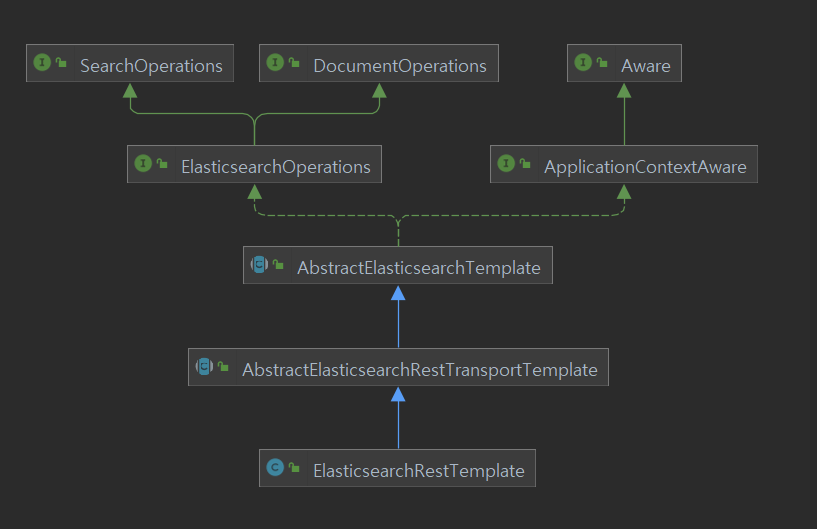

# Elastic Search
- 엘라스틱 서치(Elastic Search)는 웹사이트 데이터에 전문 검색 기능을 제공하는 오픈 소스다
- 분산 환경 지원, http상에서 json 인터페이스 지원, 다양한 프로그래밍 언어 호환  
- 2010년 발표
- 데이터 수집 도구인 로그스태시(Logstash)와 비츠(Beat), 시각화 UI 도구인 키바나(Kibana)를 결합해 ELK 스택이 완성되었다
- 인덱싱을 이용해 빠른 전문 검색 기능을 제공한다
- 로그 발생량이 많아지고, 여러 서비스가 연계되어 발생 위치가 다양해진 경우 로그를 추적하기 어려워진다.
- 비츠를 사용하면 로그들을 빠르게 수집할 수 있고, 로그스태시는 필터를 이용해 수집한 로그를 동일한 형태로 바꿀 수 있다.
-  

- document: 데이터 단위, json으로 관리, 텍스트 말고도 다양한 데이터 타입 지원
- index: 논리적으로 비슷한 document 집합, 불변 자료구조로 삽입 삭제 over head가 크다 
- indexing: document를 저장하는 행위
- reverse indexing
- shard: 하나에 index가 분리되어 저장되는 단위
- score: 검색어와 검색결과 사이 유사도

- 각 document는 url을 갖는다
  - "http://host:port/index/_doc/document_id"

## 데이터 CRUD
```
입력
PUT index/_doc/document_id
{

}

조회
GET index/_doc/document_id

수정
POST index/_update/document_id
{

}

삭제
DELETE index/_doc/docuemnt_id

```
## 검색
```
//index에 모든 document 검색
GET index/_search


//index에 field에 값이 value인 document 검색
GET index/_search
{
    "query": {
        "match": {
            "field": "value"
        }
    }
}

//or 연산 검색
GET index/_search
{
    "query": {
        "match": {
            "field": "value1 value2"
        }
    }
}

//and 연산 검색
GET index/_search
{
    "query": {
        "match": {
            "field": "value1 value2",
            "operator": "and"
        }
    }
}

//정확히 일치
GET index/_search
{
    "query": {
        "match_phrase": {
            "field": "value1 value2",
        }
    }
}
```


```
//
GET index/_search
{
    "query":{
        "bool":{
            "must":[ 
                //개별 쿼리를 and로 묶음
                {},
                {}
            ] 
        }
    }
}


//
GET index/_search
{
    "query":{
        "bool":{
            "must_not":[
                
            ]
        }
    }
}

//
GET index/_search
{
    "query":{
        "bool":{
            "should":[
                
            ]
        }
    }
}

//
GET index/_search
{
    "query":{
        "bool":{
            "filter":[
                
            ]
        }
    }
}
```

- 검색 응답 형태
  
```json
{
    "took": ,
    "timed_out": false,
    "_shards": {
        "total": ,
        "successful": ,
        "skipped": ,
        "failed": 
    },
    "hits": {
        "total": {
            "value": , // 검색 결과 걸린 document 수
            "relation": 
        },
        "max_score": ,  //가장 높은 정확도
        "hits": [
            {
                "_index": , 
                "_type": ,
                "_id": ,
                "_score": , //검색 정확도
                "_source": {
                    "field": 
                }
            }
        ]
    }
}

```


# Logstash

# Kibana


# 설치및 실행

```sh
<<END
elastic search
END

docker pull docker.elastic.co/elasticsearch/elasticsearch:7.9.1

docker run -d -p 9200:9200 -p 9300:9300 -e "discovery.type=single-node" --name elasticsearch7 docker.elastic.co/elasticsearch/elasticsearch:7.9.1

<<END
kibana
END

docker pull odcker.elastic.co/kibana/kibana:7.9.1

docker run -d --link elasticsearch7:elasticsearch -p 5601:5601 --name kibana7 docker.elastic.co/kibana/kibana:7.9.1

```


```yml
"""
docker-compose
"""

version: '3'
services:
    elasticsearch:
        image:
        continaer_name:
        ports:
            - "9200:9200"
            - "9300:9300"
        environment:
            - node.name = "es01"
            - cluster.name = "es-docker-cluster"
            - discovery.type=single-node
        networks:
            elastic

networks:
    elastic:
        diver: bridge

```


------------
# Spring Data Elastic Search

- 문서 전문 검색, 정렬및 집계에 특화된 고수준 추상화 템플릿 


# version 정보

##  Spring Data Elasticsearch 4.3
- elastic search 7.15.2 이상
- index mapping에 runtime_fields 정의 가능
- range object에 사용 가능한 range filed types를 기본 지원
- nullable or empty 속성을 위한 repository 검색 추가
- single fields를 위한 converters 커스텀 가능
- Sort.Order 커스텀 가능

## 호환 정보

----------------


# Elasticsearch Clients
## High Level Rest Client

```java
@Configuration
public class ESConfig extends AbstractElasticsearchConfiguration{
    @Override
    public RestHighLevelClient elasticsearchClient(){
        return RestClients.create().rest();
    }
}

```

----------------

# Elasticsearch Object Mapping


----------------
# Elsticsearch Query
- elastic search는 josn형태에 query문을 사용한다

```json


```

# Elasticsearch Operations
- Elasticsearch API를 활용해 index를 다루는 동작들이 정의된 interface
  - 4 종류가 있다
  - IndexOperations
  - DocumentOperations
  - SearchOperations
  - ElasticsearchOperations
  - ReactiveElasticsearchOperations

 
## ElasticsearchOperations(Interface) 와 ElasticsearchRestTemplate(구현체) 



- DocumentOperations는 조건에 맞는 Docuement를 찾아 Entity로 반환하는 기능, SearchOperations는 score나 sort같은 Entity 정보를 활용하는 기능이 있다
  
- 검색으로 찾은 Entitiy를 SearchHit등에 클래스로 감싸 반환한다
  - SearchHit\<T\>
    - Id, Score, Sort Values
  - SearchHits\<T\>
  - SearchPage\<T\>

### Query(Interfae)와 CriteriaQuery, StringQuery, NativeSearchQuery(구현체들)

```java
//CriteriaQuery
Criteria criteria = new Criteria("lastname").is("Miller").and("firstname").is("James");
Query query = new CriteriaQuery(criteria);

//StringQuery
String string = "{\"match\": {\"firstname\": {\"query\": \"James\"}}}";
Query query = new StringQuery(string);

//NativeSearchQuery
Query query = new NativeSearchQUeryBuilder()
    .build();
```

----------------
# ElasticsearchRepository(Interface)

```json
//findByContent(String Content);
{
    "query":{
        "bool":{
            "must": [
                {
                    "field": {
                        "content": "?"
                    }
                }
            ]
        }

    }
}

```

```json
//findByTitleAndContent(String title, String content);
{
    "query":{
        "bool":{
            "must": [
                {
                    "field": {
                        "title": "?"
                    }
                },
                {
                    "field": {
                        "content": "?"
                    }
                }
            ]
        }

    }
}

```

```json
//findByContentContaining(String content)
{
    "query":{
        "bool":{
            "must": [
                {
                    "field": {
                        "content": {
                            "query": "**?**",
                            "analyze_wildcard": true
                        }
                    }
                }
            ]
        }

    }
}


```

------
# reference
- https://docs.spring.io/spring-data/elasticsearch/docs/current/reference/html/#preface
- https://docs.spring.io/spring-data/elasticsearch/docs/current/reference/html/#reference  
- https://docs.spring.io/spring-data/elasticsearch/docs/current/api/
