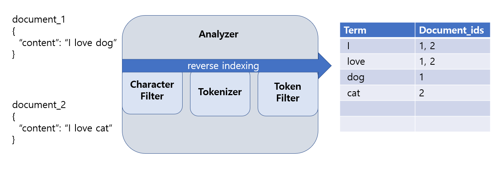

# Elastic Search
- 엘라스틱 서치(Elastic Search)는 웹사이트 데이터에 전문 검색 기능을 제공하는 오픈 소스다
- 분산 환경 지원, http상에서 json 인터페이스 지원, 다양한 프로그래밍 언어 호환  
- 2010년 발표
- 데이터 수집 도구인 로그스태시(Logstash)와 비츠(Beat), 시각화 UI 도구인 키바나(Kibana)를 결합해 ELK 스택이 완성되었다
- 인덱싱을 이용해 빠른 전문 검색 기능을 제공한다
- 로그 발생량이 많아지고, 여러 서비스가 연계되어 발생 위치가 다양해진 경우 로그를 추적하기 어려워진다.
- 비츠를 사용하면 로그들을 빠르게 수집할 수 있고, 로그스태시는 필터를 이용해 수집한 로그를 동일한 형태로 바꿀 수 있다.
-  

- document: 데이터 단위, json으로 관리, 텍스트 말고도 다양한 데이터 타입 지원
- index: 논리적으로 같은 document 집합(RDBMS에 table 역활), 불변 자료구조로 삽입 삭제 over head가 크다 
- indexing: document를 저장하는 행위
- reverse indexing: 장문에 문자열을 분석해 token단위로 쪼개어 indexing 한다
- 분석기는 문자열에 character filter를 활용해 불필요한 문자를 제거, 이를 tokenizer로 분해해 token생성, token filter를 이용해 불필요한 token을 걸러내고 이를 indexing 한다. indexing 상태에 token을 term이라 부른다. character filter와 token filter는 분석기에 필수 동작 과정은 아니다
- shard: 하나에 index가 분리되어 저장되는 단위
- score: 검색어와 검색결과 사이 유사도

- 각 document는 url을 갖는다
  - "http://host:port/index/_doc/document_id"



##
```
# cat: compact and aligned text, 시스템 상테 확인
GET _cat

#
GET _cat/indices?v
```

## 데이터 CRUD
```
생성: 인덱스 ex_index생성
POST ex_index
GET ex_index
DELETE ex_index


입력: 인덱스 ex_index에 1번 도큐먼트 생성 
POST ex_index/_doc/1
{

}

조회: 인덱스 ex_index에 1번 도큐먼트 조회
GET ex_index/_doc/1

수정: 인덱스 ex_index에 1번 도큐먼트 특정 필드값 수정
PUT ex_index/_update/1
{

}
수정: 
PUT ex_index/_doc/1
{

}

삭제: 인덱스 ex_index에 1번 도큐먼트 삭제
DELETE ex_index/_doc/1

```


- get query context 응답 결과
```json
{
  "took" : 32,
  "timed_out" : false,
  "_shards" : {
    "total" : 1,
    "successful" : 1,
    "skipped" : 0,
    "failed" : 0
  },
  "hits" : {
    "total" : {
      "value" : 3927,  //검색결과로 찾은 document 수
      "relation" : "eq"
    },
    "max_score" : 0.20545526,
    "hits": [{}, ..., {}] //검색결과 document를 score 높은 순으로 정렬
  }
}
```


##

```
# field 타입을 지정한 index 생성
# text: 전문검색을 위해 문자열을 토큰으로 분해해 저장해 둔다. 여러 단어가 나열된 문자열은 지정하지 않아도 text로 다이나믹 매핑
# keyword: 범주형 데이터에 정렬, 집계를 위해 문자열욜 통으로 저장해 둔다
PUT ex_index
{
    "mappings":{
        "properties":{
            "age": {"type": "short"},
            "name": {"type": "text"},
            "gender": {"type": "keyword"}
        }
    }
}
```

## 검색
```
//index에 모든 document 검색
GET index/_search


//인덱스 ex_index에 필드 ex_field에 값이 value인 document 검색
GET ex_index/_search
{
    "query": {
        "match": {
            "ex_field": "value"
        }
    }
}

//검색 결과
{
  "took" : 1,
  "timed_out" : false,
  "_shards" : {
    "total" : 1,
    "successful" : 1,
    "skipped" : 0,
    "failed" : 0
  },
  "hits" : {
    "total" : {
      "value" : ,
      "relation" : "eq"
    },
    "max_score" : 0.2876821,
    "hits" : [
      {
        "_index" : "text_index",
        "_type" : "_doc",
        "_id" : "1",
        "_score" : 0.2876821,
        "_source" : {
          "contents" : ""
        }
      }
    ]
  }
}


//or 연산 검색
GET index/_search
{
    "query": {
        "match": {
            "field": "value1 value2"
        }
    }
}

//and 연산 검색
GET index/_search
{
    "query": {
        "match": {
            "field": "value1 value2",
            "operator": "and"
        }
    }
}

//정확히 일치
GET index/_search
{
    "query": {
        "match_phrase": {
            "field": "value1 value2",
        }
    }
}
```


```
//
GET index/_search
{
    "query":{
        "bool":{
            "must":[ 
                //개별 쿼리를 and로 묶음
                {},
                {}
            ] 
        }
    }
}


//
GET index/_search
{
    "query":{
        "bool":{
            "must_not":[
                
            ]
        }
    }
}

//
GET index/_search
{
    "query":{
        "bool":{
            "should":[
                
            ]
        }
    }
}

//
GET index/_search
{
    "query":{
        "bool":{
            "filter":[
                
            ]
        }
    }
}
```

- 검색 응답 형태
  
```json
{
    "took": ,
    "timed_out": false,
    "_shards": {
        "total": ,
        "successful": ,
        "skipped": ,
        "failed": 
    },
    "hits": {
        "total": {
            "value": , // 검색 결과 걸린 document 수
            "relation": 
        },
        "max_score": ,  //가장 높은 정확도
        "hits": [
            {
                "_index": , 
                "_type": ,
                "_id": ,
                "_score": , //검색 정확도
                "_source": {
                    "field": 
                }
            }
        ]
    }
}

```


# Logstash

# Kibana

# 설치및 실행

```sh
<<END
elastic search
END

docker pull elasticsearch:7.9.1

<<END
kibana
END

docker pull kibana:7.10.1
```

- curl은 터미널 환경에서 통신 프로토콜을 사용할 수 있는 소프트웨어다. 리눅스, 맥, 윈도우10이상 버전에 기본으로 설치되어 있다
- 옵션 -X: 메서드 정의, -d: POST에 request body 정의

```sh
# elastic search정상 실행 확인
curl -X GET "localhost:9200/?pretty"

#응답 결과
{
    "name": ,
    "cluster_name": ,
    "cluster_uuid": ,
    "version": {},
    "tagline": 
}
```

- kibana: localhost:5601 접속 dev tools를 이용해 elastic search api 호출 가능

```yml
"""
docker-compose
"""

version: '3'

services:
  mysql:
    image: mysql:8.0.22
    container_name: mysql
    ports:
      - 13306:3306
    environment:
      - MYSQL_USER=root
      - MYSQL_ROOT_PASSWORD=password
      - MYSQL_DATABASE=devdb
      - MYSQL_ROOT_HOST=%
    networks:
      - mysql-elk
  elasticsearch:
    image: elasticsearch:7.10.0
    container_name: elasticsearch
    ports:
      - 9200:9200
      - 9300:9300
    environment:
      - discovery.type=single-node
      - "ES_JAVA_OPTS=-Xms512m -Xmx512m"
      - TZ=Asia/Seoul
    networks:
      - mysql-elk
  kibana:
    image: kibana:7.10.1
    container_name: kibana
    ports:
      - 5601:5601
    environment:
      - ELASTICSEARCH_URL=http://elasticsearch:9200
      - ELASTICSEARCH_HOSTS=http://elasticsearch:9200
      - TZ=Asia/Seoul
    depends_on:
      - elasticsearch
    networks:
      - mysql-elk
    restart: always

networks:
  mysql-elk:
    driver: bridge
```


------------
# Spring Data Elastic Search

- 문서 전문 검색, 정렬및 집계에 특화된 고수준 추상화 템플릿 


# version 정보

##  Spring Data Elasticsearch 4.3
- elastic search 7.15.2 이상
- index mapping에 runtime_fields 정의 가능
- range object에 사용 가능한 range filed types를 기본 지원
- nullable or empty 속성을 위한 repository 검색 추가
- single fields를 위한 converters 커스텀 가능
- Sort.Order 커스텀 가능

## 호환 정보

----------------


# Elasticsearch Clients
## High Level Rest Client

```java
@Configuration
public class ESConfig extends AbstractElasticsearchConfiguration{
    @Override
    public RestHighLevelClient elasticsearchClient(){
        return RestClients.create().rest();
    }
}

```

----------------

# Elasticsearch Object Mapping


----------------
# Elsticsearch Query
- elastic search는 josn형태에 query문을 사용한다

```json


```

# Elasticsearch Operations
- Elasticsearch API를 활용해 index를 다루는 동작들이 정의된 interface
  - 4 종류가 있다
  - IndexOperations
  - DocumentOperations
  - SearchOperations
  - ElasticsearchOperations
  - ReactiveElasticsearchOperations

 
## ElasticsearchOperations(Interface) 와 ElasticsearchRestTemplate(구현체) 


- DocumentOperations는 조건에 맞는 Docuement를 찾아 Entity로 반환하는 기능, SearchOperations는 score나 sort같은 Entity 정보를 활용하는 기능이 있다
  
- 검색으로 찾은 Entitiy를 SearchHit등에 클래스로 감싸 반환한다
  - SearchHit\<T\>
    - Id, Score, Sort Values
  - SearchHits\<T\>
  - SearchPage\<T\>

### Query(Interfae)와 CriteriaQuery, StringQuery, NativeSearchQuery(구현체들)

```java
//CriteriaQuery
Criteria criteria = new Criteria("lastname").is("Miller").and("firstname").is("James");
Query query = new CriteriaQuery(criteria);

//StringQuery
String string = "{\"match\": {\"firstname\": {\"query\": \"James\"}}}";
Query query = new StringQuery(string);

//NativeSearchQuery
Query query = new NativeSearchQUeryBuilder()
    .build();
```

----------------
# ElasticsearchRepository(Interface)

```json
//findByContent(String Content);
{
    "query":{
        "bool":{
            "must": [
                {
                    "field": {
                        "content": "?"
                    }
                }
            ]
        }

    }
}

```

```json
//findByTitleAndContent(String title, String content);
{
    "query":{
        "bool":{
            "must": [
                {
                    "field": {
                        "title": "?"
                    }
                },
                {
                    "field": {
                        "content": "?"
                    }
                }
            ]
        }

    }
}

```

```json
//findByContentContaining(String content)
{
    "query":{
        "bool":{
            "must": [
                {
                    "field": {
                        "content": {
                            "query": "**?**",
                            "analyze_wildcard": true
                        }
                    }
                }
            ]
        }

    }
}


```

------
# reference
- https://docs.spring.io/spring-data/elasticsearch/docs/current/reference/html/#preface
- https://docs.spring.io/spring-data/elasticsearch/docs/current/reference/html/#reference  
- https://docs.spring.io/spring-data/elasticsearch/docs/current/api/
