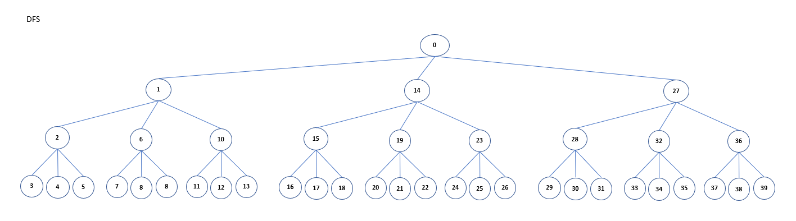
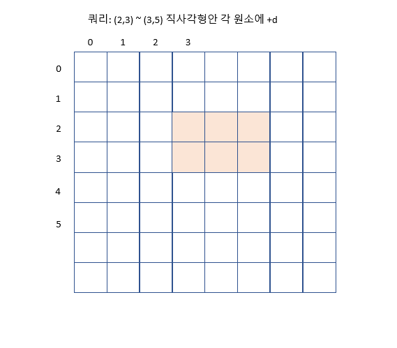

# 목차
- [목차](#목차)
- [리스트 활용](#리스트-활용)
- [숫자칸 채우기, 돌리기, 뒤집기](#숫자칸-채우기-돌리기-뒤집기)
  - [문제 파악](#문제-파악)
  - [풀이](#풀이)
  - [예제](#예제)
- [stack 이용](#stack-이용)
  - [예제](#예제-1)
- [queue 이용](#queue-이용)
- [Linked List 이용](#linked-list-이용)
- [문자열 조작](#문자열-조작)
- [완전탐색](#완전탐색)
  - [문제 파악](#문제-파악-1)
  - [풀이](#풀이-1)
  - [예제](#예제-2)
- [BackTracking](#backtracking)
  - [문제 파악](#문제-파악-2)
  - [풀이](#풀이-2)
  - [예제](#예제-3)
- [Greedy Algorithm](#greedy-algorithm)
  - [문제 파악](#문제-파악-3)
  - [풀이](#풀이-3)
  - [예제](#예제-4)
- [Dynamic Programming](#dynamic-programming)
  - [문제 파악](#문제-파악-4)
  - [풀이](#풀이-4)
  - [예제](#예제-5)
  - [- 프로그래머스 lv2 가장 큰 정사각형](#--프로그래머스-lv2-가장-큰-정사각형)
- [Parameter Search](#parameter-search)
  - [문제 파악](#문제-파악-5)
  - [풀이](#풀이-5)
  - [예제](#예제-6)
- [BFS 2차원 최단거리](#bfs-2차원-최단거리)
  - [문제 파악](#문제-파악-6)
  - [풀이](#풀이-6)
  - [예제](#예제-7)
- [?](#)
  - [문제 파악](#문제-파악-7)
  - [풀이](#풀이-7)
  - [예제](#예제-8)
- [누적합](#누적합)
  - [문제 파악](#문제-파악-8)
  - [풀이](#풀이-8)
  - [예제](#예제-9)
- [정수론](#정수론)
  - [문제 파악](#문제-파악-9)
  - [예제와 풀이](#예제와-풀이)
- [정규표현식](#정규표현식)
  - [풀이법](#풀이법)
  - [예제](#예제-10)

------

# 리스트 활용

|method|example|big O|note|
|----|---|---|---|
|조회|l[i]|O(1)||
|슬라이싱|l[a:b]|O(b-a)||
|길이|length(l)|O(1)||
|삽입|l.append(e)|O(1)||
|변화|l[i] = e|O(1)||
|마지막 삭제|e = l.pop()|O(1)|l.pop(-1)|
|k번째 삭제|e = l.pop(k)|O(k)||


# 숫자칸 채우기, 돌리기, 뒤집기
## 문제 파악
- 달팽이 채우기
- 정삼각형 채우기
- 직사각형 태두리 돌리기

## 풀이

## 예제


# stack 이용
## 예제
- 프로그래머스 lv2 짝지어 제거하기
```python
def solution(s):
    answer = -1
    stack = []
    for char in s:
        if len(stack) == 0:
            stack.append(char)
        elif stack[-1] == char:
            stack.pop()
        else:
            stack.append(char)
    if len(stack) == 0:
        return 1
    return 0
```

# queue 이용

```python
from collections import deque
# 파이썬 List의 pop(0)은 O(N)이 소요된다, O(1)에 pop(0)을 지원하는 deque 사용하자

q = deque()
# 삽입
q.appendleft("e") #왼쪽
q.append("e") #오른쪽
# 삭제후 반환
e = q.popleft() #왼쪽
e = q.pop() #오른쪽
# 조회
e = q[0] #왼쪽
e = q[-1] #오른쪽
```


# Linked List 이용


# 문자열 조작
```python
# 대문자는 소문자로(그외는 유지)
string = string.upper()
# 소문자는 대문자로(그외는 유지)
string = string.lower()
```

------

# 완전탐색
## 문제 파악

## 풀이


## 예제
- 프로그래머스 lv2 피로도
  - permutations
- 프로그래머스 lv2 양궁대회
  - combinations_with_replacement
- 프로그래머스 lv2 카펫
  - 정수 연립 방정식 해 찾기

------
# BackTracking
## 문제 파악
- 최적화 문제

## 풀이


## 예제


------
# Greedy Algorithm
## 문제 파악
- 최적화 문제
- 최적 부분 구조
  - 작게 쪼갠 부분 문제에 최적해를 합쳐 큰 문제에 최적해를 만들 수 있다
- 탐욕 선택


## 풀이

## 예제
- 프로그래머스 lv2 구명보트

------

# Dynamic Programming
## 문제 파악
- 문제 해를 작은 문제 해들로 구성 가능
- 한번 구한 부분해가 하나에 큰 문제 해를 구할때 뿐 아니라 다른 문제 해를 구할때도 사용된다
  
## 풀이

## 예제
- 프로그래머스 lv2 가장 큰 정사각형
------

# Parameter Search
## 문제 파악
- 최적화 문제
- 최적화 문제를 결정 문제(현재 해가 조건에 맞습니까)로 바꾸기
- 이분 탐색으로 최적해를 찾다
- 시간복잡도 lgN

- 조건을 만족하는 최소 해 찾기
  - 해 x는 음이 아닌 정수
  - 해 x에 상한, 하한이 있다
  - 해 x가 조건 충족시, x보다 큰 모든 음이 아닌 정수대해서도 조건을 만족
  - 해 x가 조건을 만족하지 않을때, x보다 작은 모든 음이 아닌 정수에 대해서도 조건을 만족하지 않는다

- 조건을 만족하는 최대 해 찾기
  - 해 x는 음이 아닌 정수
  - 해 x에 상한, 하한이 있다
  - 해 x가 조건 충족시, x보다 작은 음이 아닌 정수대해서도 조건을 만족
  - 해 x가 조건을 만족하지 않을때, x보다 큰 모든 음이 아닌 정수에 대해서도 조건을 만족하지 않는다

## 풀이
- start=하한, end=상한, mid = (start+end)//2 로 둔다
- start <= end 일 동안 다음을 반복
- mid가 조건에 맞지 않을때
  - 최소해 찾기는, start = mid로 두고 다시 시도(mid보다 작은 해도 조건을 만족하지 않으므로) 
  - 최대해 찾기는, end = mid로 두고 다시 시도(mid보다 큰 해도 조건을 만족하지 않으므로)
- 반복 결과 계산된 mid가 최소/최대 해이다

## 예제

```python
# 금과 은 운반하기
"""

"""

```


------

# BFS 2차원 최단거리
## 문제 파악

## 풀이

## 예제


------

# ?
## 문제 파악

## 풀이

## 예제


------

# 누적합
## 문제 파악
- 연속된 구간에 같은 값을 더하거나 빼는 쿼리를 여러번 동작

## 풀이





## 예제
- 프로그래머스 lv3 파괴되지 않은 건물


----
# 정수론
## 문제 파악
- 정수 성질과 관련한 다양한 문제가 존재한다
- n진수
- 최소공배수, 최대공약수
- 직사각형

## 예제와 풀이
- 프로그래머스 lv3 최고의 집합
  - 자연수 n개로 이루어진 숫자쌍(중복 존재 가능)중 원소 합이 S면서 원소 곱이 최대인 숫자쌍 찾기
  - 풀이
    - 숫자간에 차이가 작을 수록 곱이 최대이다
    - s//n이 n개인 숫자쌍에 s%n개에 원소에 각 1씩 더한 숫자쌍이 찾는 숫자쌍이다
    - n > s이면 조건을 만족하는 숫자쌍이 없다  

- 프로그래머스 lv2 124의 나라
- 프로그래머스 lv2 멀쩡한 사각형

# 정규표현식

## 풀이법
```python
import re
pattern = ""
string = ""
p = re.compile(pattern)
m = p.match(string)
```
## 예제
- 프로그래머스 lv2 뉴스 클러스터링