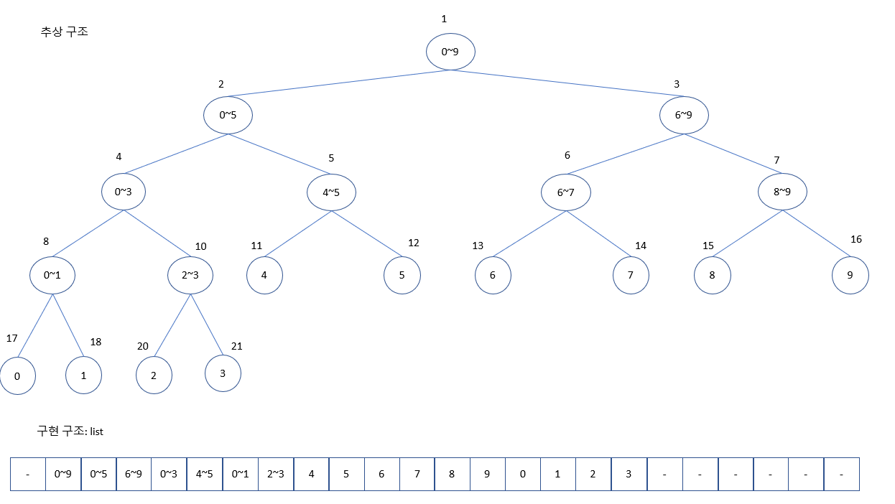

# 목차
- [목차](#목차)
- [자세](#자세)
- [input/output](#inputoutput)
- [사칙 연산](#사칙-연산)
- [range](#range)
- [자연수 각 자리수 돌기](#자연수-각-자리수-돌기)
- [이진수](#이진수)
- [http request](#http-request)
- [달팽이 채우기](#달팽이-채우기)
- [쿼드 트리](#쿼드-트리)
- [two pointer](#two-pointer)
  - [제시된 배열 aList에서 sort 없이 O(N) 시간안에  가장 큰 수, 두번째 큰 수, 가장 작은 수, 두번째 작은 수 찾기](#제시된-배열-alist에서-sort-없이-on-시간안에--가장-큰-수-두번째-큰-수-가장-작은-수-두번째-작은-수-찾기)
- [누적합](#누적합)
  - [연속된 구간에 같은 값을 더하거나 빼는 쿼리](#연속된-구간에-같은-값을-더하거나-빼는-쿼리)
    - [1D-Matrix](#1d-matrix)
    - [2D-Matrix](#2d-matrix)
- [완전 탐색](#완전-탐색)
  - [경우의 수 후보 생성](#경우의-수-후보-생성)
    - [정수로 이루어진 두 배열에 각 부분 배열의 합들이 정수 T가 되는 부분 배열 쌍 수](#정수로-이루어진-두-배열에-각-부분-배열의-합들이-정수-t가-되는-부분-배열-쌍-수)
  - [Back Tracking](#back-tracking)
  - [MinMaxTree](#minmaxtree)
- [이분 탐색](#이분-탐색)
- [Dynamic Programming](#dynamic-programming)
- [Memoization](#memoization)
- [Greedy Algorithm](#greedy-algorithm)
- [Divide and conquer](#divide-and-conquer)
- [List](#list)
  - [Linked List](#linked-list)
- [Queue](#queue)
- [Deque](#deque)
- [Stack](#stack)
- [String](#string)
- [Graph](#graph)
  - [구현](#구현)
    - [인접행렬](#인접행렬)
    - [인접리스트](#인접리스트)
  - [DFS](#dfs)
  - [BFS](#bfs)
  - [Shortest Path](#shortest-path)
  - [Minimum Spanning Tree](#minimum-spanning-tree)
  - [Maximum Flow](#maximum-flow)
- [Tree](#tree)
  - [순회](#순회)
    - [이진 트리 전위, 후위, 중위 순회](#이진-트리-전위-후위-중위-순회)
    - [양과 늑대 순회](#양과-늑대-순회)
    - [트리 높이 구하기(가장 긴 root-leaf 경로 길이)](#트리-높이-구하기가장-긴-root-leaf-경로-길이)
    - [가장 긴 leaf-leaf 길이](#가장-긴-leaf-leaf-길이)
  - [Binary Search Tree](#binary-search-tree)
  - [Heap](#heap)
  - [Segment Tree](#segment-tree)
    - [1D-Array Segment Tree](#1d-array-segment-tree)
  - [union find disjoint set](#union-find-disjoint-set)
  - [Trie](#trie)

# 자세
- 방법이 바로 안 떠오를땐 작은 케이스부터 문제 크기를 키워가며 풀이법을 생각해보자


# input/output
```python
# 상하좌우
direction = [(-1, 0), (0, 1), (11, 0), (0, -1)]
# 팔방
direction = [(-1, 0), (-1, 1), (0, 1), (1, 1), (1, 0), (1, -1), (0, -1), (-1, -1)]

# 프로그래머스 matrix
nRow = 0
nCol = 0

def solution(board):
  global nRow, nCol
  nRow = len(board)
  nCol = len(board[0])

# 백준형 matirx
# 한줄에 두개 이상 문자형숫자를 각각의 정수형 숫자로 받기
nRow, nCol = map(int, input().split())
# 한줄에 두개 이상 문자형숫자를 정수형숫자로 구성된 리스트로 받기
matrix = [[0 for _ in range(nRow)] for _ in range(nCol)]
for c in range(nCol):
  row = list(map(int, input().split()))
  for r in range(nRow):
    matrix[r][c] = row[r]
```

# 사칙 연산
```python
#정수 연산
num = 5
print(num / 2)  #2.5		소수점연산 살아있는 나누기
print(num // 2)  #2		몫, 소수점 버리는 나누기
print(num % 2)  #1		나머지


num = -5
print(num / 2)  #-2.5
print(int(num/2)) #-2
print(num // 2)  #-3	
print(num % 2)  #1	

```

# range
```python
# range(start=0, stop, step=1)
# start부터 시작해 stop이 되기 직전까지 step씩 차이나는 등차 수열을 원소로 갖는 리스트 반환
# 실제로는 range엔 parmeter_name이 없다. 몇 개의 paramter가 기입되었는가에 의해 작동이 정해진다.


for i in range(5):
  print(i)
	# 0, 1, 2, 3, 4

for i in range(2, 5):
  print(i)
	# 2, 3, 4

for i in range(5, 5):
  print(i)
  # 아무 동작 안함
for i in range(5, 3):
  print(i)
  # 아무 동작 안함

# 내림차순
for i in range(5, 0, -1):
  print(i)
  # 5, 4, 3, 2, 1

# 내림차순
for i in range(5, -1, -1):
  print(i)
  # 5, 4, 3, 2, 1, 0


# stride 
aList = []
stride = 3
for i in range(0, 5, stride):
	print(aList[i:i+stride])
	# aList[0:3], aList[3:6]


```

# 자연수 각 자리수 돌기
```python
#369 박수 세기
import sys
input = sys.stdin.readline
N = int(input())
numbers  = [i for i in range(1, N+1)]
answer = 0
for num in numbers:
    while num != 0:
        if num%10 == 3 or num%10==6 or num%10==9: # 일의 자리 수 확인
            answer +=1
        num = num//10  # 일의 자리수를 버리고 모든 자리수 하나씩 내리기
print(answer)

```

# 이진수
```python
num = 6
biString = bin(num) # "0b110"

num = int("0b110", 2) # 6

```

# http request
```python
import requests
import json

url = "http://"
params = {"key1": "value1", "key2": "value2"}
data = json.dumps({'outer': {'inner': 'value'})

//get
response = requests.get(url=url, params=params)
//post
response = request.post(url=url, data=data)
```

# 달팽이 채우기


- 정삼각형을 달팽이 채우기 할땐 3-방향으로 채울 생각을 한다

```python
# 정삼각형

def print_matrix(matrix):
    for row in matrix:
        print(row)
    print()

def center(board, r, c, num):
    board[r][c] = num
    return

def toDown(board, r, c, length, num):
    for dr in range(length):
        nr = r+dr
        board[nr][c] = num
        num += 1
    nr += 1
    nc = c
    return nr, nc, num

def toRight(board, r, c, length, num):
    for dc in range(length):
        nc = c+dc
        board[r][nc] = num
        num += 1
    nc += 1
    nr = r
    return nr, nc, num

def toUp(board, r, c, length, num):
    for d in range(length):
        nr = r-d
        nc = c-d
        board[r-d][c-d] = num
        num += 1
    nr += 1        
    return nr, nc, num

def triangle(board, r, c, length, num):
    if length == 0:
        board[r][c] = num
        return
    while length >= 3:
        r, c, num = toDown(board, r, c, length, num)
        r, c, num = toRight(board, r, c, length, num)
        r, c, num = toUp(board, r, c, length, num)
        length -= 3
    if length == 0:
        center(board, r, c, num)
    else:
        r, c, num = toDown(board, r, c, length, num)
        r, c, num = toRight(board, r, c, length, num)
        r, c, num = toUp(board, r, c, length, num)
    return

def solution(n):
    answer = []
    board = [[0 for _ in range(i+1)] for i in range(n)]   
    num = 1
    length = n-1
    r = 0
    c = 0
    triangle(board, r, c, length, num)   
    for row in board:
        for e in row:
            answer.append(e)     
    return answer

```

# 쿼드 트리

```python
"""
0과 1로 이루어진 배열을 압축
압축 영역안에 수가 모두 같다면 한 칸으로 압축
아니라면, 4개의 정삭가형으로 쪼갠후 다시 압축 시도
최종 압축시 0과 1의 개수 리턴
"""

def search(board, corList, r, c, length):
    standard = board[r][c]
    
    isAllSame = True
    for dr in range(length):
        for dc in range(length):
            if board[r+dr][c+dc] != standard:
                isAllSame= False
    if not isAllSame:
        corList += [(r+length//2, c), (r, c+length//2), (r+length//2, c+length//2)]
        search(board, corList, r, c, length//2)
        search(board, corList, r+length//2, c, length//2)
        search(board, corList, r, c+length//2, length//2)
        search(board, corList, r+length//2, c+length//2, length//2)    

def solution(arr):
    answer = []
    corList = [(0, 0)]
    search(arr, corList, 0, 0, len(arr))
    print(corList)    
    nZero = 0
    nOne = 0
    for r, c in corList:
        if arr[r][c] == 1:
            nOne += 1
        elif arr[r][c] == 0:
            nZero += 1
    return [nZero, nOne]

```

# two pointer
## 제시된 배열 aList에서 sort 없이 O(N) 시간안에  가장 큰 수, 두번째 큰 수, 가장 작은 수, 두번째 작은 수 찾기
```python
def find(aList):
  first_max_val = -1
  second_max_val = -1
  first_min_val = sys.maxsize
  second_min_val = sys.maxsize
  
  for num in aList:
    if num > first_max_val:
		first_max_val = num
        second_max_val = first_max_val
   elif second_max_val < num < first_max_val:
   		second_max_val = num
   
   if first_min_val < num:
   		first_min_val = num
        second_min_val = first_min_val
   elif first_min_val > num > second_min_val:
		second_min_val = num
   
   return first_max_val, second_max_val, first_min_val, second_min_val
```

# 누적합
## 연속된 구간에 같은 값을 더하거나 빼는 쿼리
### 1D-Matrix


### 2D-Matrix


```python
"""
공격받으면, 내구도 감소, 파괴되도 감소 가능
회복되면 내구도 증가, 파괴되도 증가 가능
0이하면 파괴 상태
최종가서 파괴 되지 않은 갯수 리턴
"""

def solution(board, skill):
    answer = 0
    nRow = len(board)
    nCol = len(board[0])
    sumMatrix = [[0 for _ in range(nCol+1)] for _ in range(nRow+1)]
    for s in skill:
        cmd, r1, c1, r2, c2, degree = s
        if cmd == 1:
            degree *= -1
        sumMatrix[r1][c1] += degree
        sumMatrix[r2+1][c1] += -1*degree
        sumMatrix[r1][c2+1] += -1*degree
        sumMatrix[r2+1][c2+1] += degree
    for c in range(1, nCol):
        for r in range(nRow):
            sumMatrix[r][c] += sumMatrix[r][c-1]
    for r in range(1, nRow):
        for c in range(nCol):
            sumMatrix[r][c] += sumMatrix[r-1][c]
    for r in range(nRow):
        for c in range(nCol):
            if board[r][c] + sumMatrix[r][c] > 0:
                answer += 1
    return answer
```


# 완전 탐색
## 경우의 수 후보 생성
- 조합 combinations
  - 비복원: 한번 사용한 원소는 다시 사용 불가
  - 순서 의미 없음: 같은 원소구성이면 순서가 달라도 같은 경우의 수로 인정
  - $\frac{n!}{(n-r)!r!}$

```python
from itertools import combinations
population = [1, 2, 3, 4]
r = len(population)
cand_list = combinations(population, r)

"""
(1, 2, 3, 4)
"""
```

- 순열 permutaions
  - 비복원: 한번 사용한 원소를 다시 사용 불가
  - 순서 의미 있음: 같은 원소구성이여도 순서가 다르면 다른 경우의 수로 인정
  - $\frac{n!}{(n-r)!}$
```python
from itertools import permutaions
population = [1, 2, 3, 4]
r = len(population)
cand_list = permutations(population, r)
"""
(1, 2, 3, 4)
(1, 2, 4, 3)
...
(1, 4, 3, 2)
(2, 1, 3, 4)
(2, 1, 4, 3)
...
(4, 3, 1, 2)
(4, 3, 2, 1)
"""
```

- 중복 조합 combinations_with_replacement
  - 복원: 한번 사용한 원소를 다시 사용 가능
  - 순서 의미 없음
  - $\frac{(n+r-1)!}{(n-1)!r!}$
```python
from itertools import combinations_with_replacement
population = [1, 2, 3, 4]
r = len(population)
cand_list = combinations_with_replacement(population, r)
"""
(1, 1, 1, 1)
(1, 1, 1, 2)
...
(1, 4, 4, 4)
(2, 2, 2, 2)
(2, 2, 2, 3)
...
(3, 4, 4, 4)
(4, 4, 4, 4)
"""
```

- 중복 순열 product
  - 복원: 한번 사용한 원소를 다시 사용 가능
  - 순서 의미 있음
  - $n^r$
```python
from itertools import product
population = [1, 2, 3, 4]
r = len(population)
cand_list = product(population, repeat=r)
"""
(1, 1, 1, 1)
(1, 1, 1, 2)
...
(1, 4, 4, 4)
(2, 1, 1, 1)
(2, 1, 1, 2)
...
(4, 4, 4, 4)
"""
```


### 정수로 이루어진 두 배열에 각 부분 배열의 합들이 정수 T가 되는 부분 배열 쌍 수
```python
"""
n <= 1000
m <= 1000
"""
n = 0
m = 0
T = 0

T = int(input())
n = int(input())
aList = list(map(int, input().split()))
m = int(input())
bList = list(map(int, input().split()))

def solution(aList, bList):
    answer = 0
    global T, n, m
    aDict = {}
    bDict = {}
    for start in range(n):
        for end in range(start+1, n+1):
            subList = aList[start:end]
            key = sum(subList)
            if key not in aDict:
                aDict[key] = 0
            aDict[key] += 1
    for start in range(m):
        for end in range(start+1, m+1):
            subList = bList[start:end]
            key = sum(subList)
            if key not in bDict:
                bDict[key] = 0
            bDict[key] += 1
    for key in aDict.keys():
        opKey = T-key
        if opKey in bDict:
            answer += aDict[key]*bDict[opKey]            
    return answer

print(solution(aList, bList))

```

## Back Tracking

## MinMaxTree


# 이분 탐색


# Dynamic Programming
- bottom up 
- 점화식
  - f(1), f(2)는 구하기 쉽다
  - f(n)은 n보다 작은 변수 x들에 대한 함수값 f들의 합으로 구성된다
  - n은 일 변수가 아니라 이변수일 수 있다

```python
# 일변수
table = [0 for _ in range(n+1)]
table[0] = ZERO_VAL
for i in range(1, n+1):
  table[i] = table[i-1] 


# 이변수
table = [[0 for _ in range(numRow+1)] for _ in range(numCol+1)]
table[0][0] = ZERO_ZERO_VAL
table[0][1] = ZERO_ONE_VAL
table[1][0] = ONE_ZERO_VAL 
for r in range(1, numRow+1):
  for c in range(1, numCol+1):
    table[r][c] = table[r-1][c] + table[r-1][c-1] + table[r][c-1]

```
 

# Memoization
- top down
- 

# Greedy Algorithm


# Divide and conquer


# List
## Linked List

# Queue

# Deque

# Stack

# String

# Graph
- vertex
- edge
## 구현
### 인접행렬

### 인접리스트
## DFS

## BFS

## Shortest Path

## Minimum Spanning Tree

## Maximum Flow 

# Tree
- 자료간 상하위, 포함관계를 나타내는 자료구조
- 빠른 검색을 위해, 조건에 맞춰 자료를 추가, 삭제, 검색하는 자료구조
- vertex
- edge
- tree에 root
- tree에 leaf
- vertex에 parent
- vertex에 child
- vertex에 sibling
- vertex에 depth: root부터 해당 vertex까지 거치는 edge 수
- tree에 height: tree에서 가장 큰 depth

## 순회
### 이진 트리 전위, 후위, 중위 순회

### 양과 늑대 순회
```python
max_num_sheep = 0

def solve(info, graph, num_sheep, num_wolf, now_node, next_nodes):
    global max_num_sheep
    if info[now_node] == 0: 
        num_sheep += 1
    else:
        num_wolf += 1
    #
    max_num_sheep = max(max_num_sheep, num_sheep)
    #
    if(num_sheep <= num_wolf):
        return
    #
    copy_next_nodes = next_nodes.copy()
    copy_next_nodes.remove(now_node)
    for adj_node in graph[now_node]:
        copy_next_nodes.add(adj_node)
    for next_node in copy_next_nodes:
        solve(info, graph, num_sheep, num_wolf, next_node, copy_next_nodes)

def solution(info, edges):
    answer = 0
    global max_num_sheep
    graph = {i: [] for i in range(len(info))}
    for parent, child in edges:
        graph[parent].append(child)
    next_nodes = set()
    next_nodes.add(0)
    solve(info, graph, 0, 0, 0, next_nodes)
    return max_num_sheep
```

### 트리 높이 구하기(가장 긴 root-leaf 경로 길이)


### 가장 긴 leaf-leaf 길이

## Binary Search Tree

## Heap

## Segment Tree



- 숫자로 이루어진 배열이나 행렬에서 임의에 영역과 관련한 질의를 작은 시간복잡도로 처리하는 자료구조
- 숫자 변경도 가능하다
- 트리 형태로 leaf는 주어진 숫자들을, non-leaf는 자식들로 이루어진 질의 결과 값을 저장한다

### 1D-Array Segment Tree
- 1차원 배열로 표현한 이진 트리를 활용 
  - root는 index 1, i-vertex에 왼쪽 자식은 index 2i, 오른쪽 자식은 index 2i + 1에 vertex 값을 저장한다  
- 각 vertex마다 대응하는 영역이 있고, 영역에 질의를 처리한 결과를 저장한다

```python
import math

BREAK_NUM = 0
INIT_VAL = 0

def init(tree, numList, vertex, left, right):
    if left == right:
        tree[vertex] = numList[left]
        return tree[vertex]
    mid = (left+right)//2
    leftVal = init(tree, numList, vertex*2, left, mid)
    rightVal = init(tree, numList, vertex*2+1, mid+1, right)
    tree[vertex] = operation(leftVal, rightVal)
    return tree[vertex]


def operation(leftVal, rightVal):
    return leftVal + rightVal


# O(lgN)
def select(tree, b, c, n):
    # index b이상, c이하 범위의 값의 operation 결과
    return treeSelect(tree, b-1, c-1, 1, 0, n-1)


def treeSelect(tree, left, right, vertex, vertexLeft, vertexRight):
    if right < vertexLeft or vertexRight < left:
        return BREAK_NUM
    if left <= vertexLeft and vertexRight <= right:
        return tree[vertex]
    vertexMid = (vertexLeft+vertexRight)//2
    leftVal = treeSelect(tree, left, right, vertex*2, vertexLeft, vertexMid)
    rightVal = treeSelect(tree, left, right, vertex *
                          2+1, vertexMid+1, vertexRight)
    return operation(leftVal, rightVal)

# O(lgN)
def update(tree, b, c, n):
    # index b-1에 해당하는 숫자를 c로 바꿈
    return treeUpdate(tree, b-1, c, 1, 0, n-1)


def treeUpdate(tree, numIndex, newVal, vertex, vertexLeft, vertexRight):
    if numIndex < vertexLeft or vertexRight < numIndex:
        return tree[vertex]
    if vertexLeft == vertexRight:
        tree[vertex] = newVal
        return tree[vertex]
    vertexMid = (vertexLeft+vertexRight)//2
    leftVal = treeUpdate(tree, numIndex, newVal, vertex*2, vertexLeft, vertexMid)
    rightVal = treeUpdate(tree, numIndex, newVal, vertex*2+1, vertexMid+1, vertexRight)
    tree[vertex] = operation(leftVal, rightVal)
    return tree[vertex]

def printTree(tree):
    # 1
    # 2~3
    # 4~7

    for h in range(int(math.log2(len(tree)))):
        print(tree[2**h:2**(h+1)])


n, m, k = map(int, input().split(" "))

tree = [INIT_VAL for _ in range(4*n)]
numList = [int(input()) for _ in range(n)]
init(tree, numList, 1, 0, n-1)
printTree(tree)

for _ in range(m+k):
    a, b, c = map(int, input().split(" "))
    if a == 1:
        update(tree, b, c, n)
        printTree(tree)
    elif a == 2:
        print(select(tree, b, c, n))
```


## union find disjoint set

## Trie

