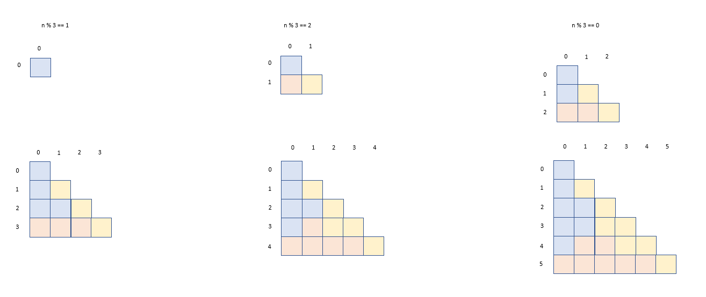
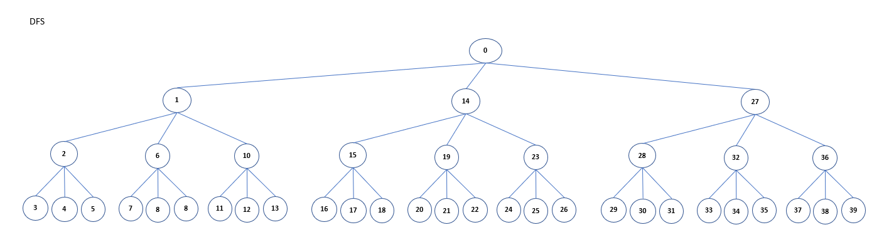
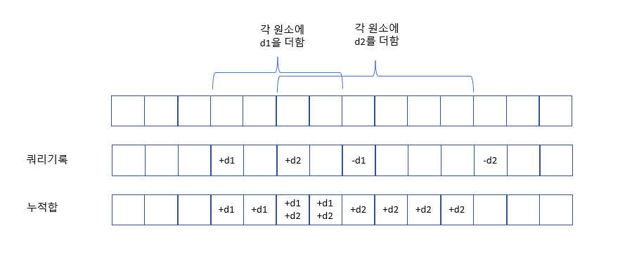
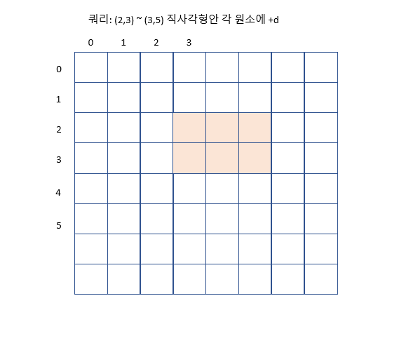
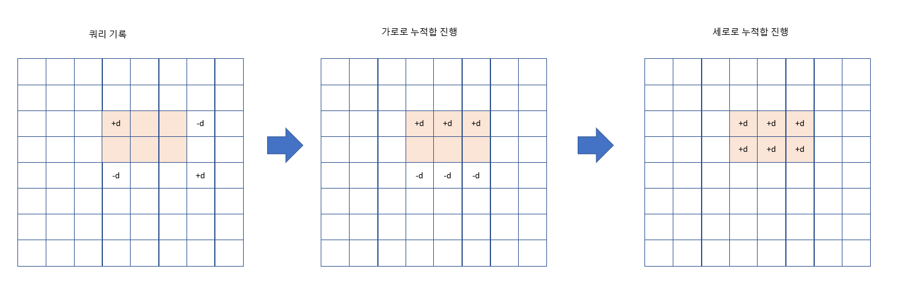

# 목차
- [목차](#목차)
- [input](#input)
- [리스트 활용](#리스트-활용)
  - [정렬](#정렬)
- [여러가지 행렬 조작](#여러가지-행렬-조작)
  - [숫자칸 채우기](#숫자칸-채우기)
    - [문제 파악](#문제-파악)
    - [풀이](#풀이)
  - [가로, 세로 한칸씩 옮기기](#가로-세로-한칸씩-옮기기)
  - [가로, 세로, y=x, y=-x 구간 확인](#가로-세로-yx-y-x-구간-확인)
  - [직각 라인별로 배열 바라보기](#직각-라인별로-배열-바라보기)
- [LinkedList](#linkedlist)
- [stack 이용](#stack-이용)
  - [예제](#예제)
- [deque 이용](#deque-이용)
  - [예제](#예제-1)
- [heap, priority queu 이용](#heap-priority-queu-이용)
- [산수](#산수)
- [문자열 조작](#문자열-조작)
- [날짜](#날짜)
- [완전탐색](#완전탐색)
  - [문제 파악](#문제-파악-1)
  - [풀이](#풀이-1)
  - [예제](#예제-2)
- [BackTracking](#backtracking)
  - [문제 파악](#문제-파악-2)
  - [풀이](#풀이-2)
  - [예제](#예제-3)
- [탐욕법 Greedy Algorithm](#탐욕법-greedy-algorithm)
  - [문제 파악](#문제-파악-3)
  - [풀이](#풀이-3)
  - [예제](#예제-4)
- [동적 계획법 Dynamic Programming](#동적-계획법-dynamic-programming)
  - [문제 파악및 풀이](#문제-파악및-풀이)
  - [예제](#예제-5)
- [Two Pointer](#two-pointer)
  - [문제 파악](#문제-파악-4)
  - [풀이법](#풀이법)
  - [예제](#예제-6)
- [Parameter Search](#parameter-search)
  - [문제 파악](#문제-파악-5)
  - [풀이](#풀이-4)
  - [예제](#예제-7)
- [BFS 2차원 최단거리](#bfs-2차원-최단거리)
  - [문제 파악](#문제-파악-6)
  - [풀이](#풀이-5)
  - [예제](#예제-8)
- [BFS tree에서 path를 갖는 노드쌍 찾기](#bfs-tree에서-path를-갖는-노드쌍-찾기)
  - [문제 파악](#문제-파악-7)
  - [풀이](#풀이-6)
  - [예제](#예제-9)
- [누적합](#누적합)
  - [문제 파악](#문제-파악-8)
  - [풀이](#풀이-7)
  - [예제](#예제-10)
- [정수론](#정수론)
  - [문제 파악](#문제-파악-9)
  - [예제와 풀이](#예제와-풀이)
- [정규표현식](#정규표현식)
  - [풀이법](#풀이법-1)
  - [예제](#예제-11)

------

# input
```python
# 1개
N = int(input())
# 2개
nRow, nCol = map(int, input().split())
# 한줄 띄어쓰기 없을때
row = list(map(int, list(input())))
# 한줄 띄어쓰기 있을때
row = list(map(int, input().split()))


# def global 이용
nRow = 0
nCol = 0
answer = 0
def solution(board):
  global nRow, nCol, answer


# direction
# 상하좌우
direction = [(-1, 0), (0, 1), (11, 0), (0, -1)]
# 팔방
direction = [(-1, 0), (-1, 1), (0, 1), (1, 1), (1, 0), (1, -1), (0, -1), (-1, -1)]


# 행렬 출력
def printMatrix(matrix):
  for row in matrix:
    print(row)
  print()

```

# 리스트 활용
- 파이썬의 리스트는 ArrayList
  
|method|example|big O|note|
|----|---|---|---|
|조회|l[i]|O(1)||
|슬라이싱|l[a:b]|O(b-a)||
|길이|length(l)|O(1)||
|삽입|l.append(e)|O(1)||
|변화|l[i] = e|O(1)||
|마지막 삭제|e = l.pop()|O(1)|l.pop(-1)|
|k번째 삭제|e = l.pop(k)|O(k)||

## 정렬
- 파이썬에 정렬 내장 함수는 Timsort algorithm으로 구현되어 있다
  - stable, inplace
  - best case O(N), 
```python
aList = [(0, 1), (2, 1), (1, 0), (-1, 5)]
sortedList = sorted(aList, key=lambda x: (x[0], -x[1]), reverse=True)

```

# 여러가지 행렬 조작
## 숫자칸 채우기
### 문제 파악
- 달팽이 채우기(시계, 반시계)
- 회오리 채우기(시계, 반시계)
- 정삼각형 채우기
- 직사각형 태두리 돌리기

### 풀이
- 정삼각형 달팽이: 밖에서 안으로 & 3가지 방향



```python
# 정삼각형

def print_matrix(matrix):
    for row in matrix:
        print(row)
    print()

def center(board, r, c, num):
    board[r][c] = num
    return

def toDown(board, r, c, length, num):
    for dr in range(length):
        nr = r+dr
        board[nr][c] = num
        num += 1
    nr += 1
    nc = c
    return nr, nc, num

def toRight(board, r, c, length, num):
    for dc in range(length):
        nc = c+dc
        board[r][nc] = num
        num += 1
    nc += 1
    nr = r
    return nr, nc, num

def toUp(board, r, c, length, num):
    for d in range(length):
        nr = r-d
        nc = c-d
        board[r-d][c-d] = num
        num += 1
    nr += 1        
    return nr, nc, num

def triangle(board, r, c, length, num):
    if length == 0:
        board[r][c] = num
        return
    while length >= 3:
        r, c, num = toDown(board, r, c, length, num)
        r, c, num = toRight(board, r, c, length, num)
        r, c, num = toUp(board, r, c, length, num)
        length -= 3
    if length == 0:
        center(board, r, c, num)
    else:
        r, c, num = toDown(board, r, c, length, num)
        r, c, num = toRight(board, r, c, length, num)
        r, c, num = toUp(board, r, c, length, num)
    return

def solution(n):
    answer = []
    board = [[0 for _ in range(i+1)] for i in range(n)]   
    num = 1
    length = n-1
    r = 0
    c = 0
    triangle(board, r, c, length, num)   
    for row in board:
        for e in row:
            answer.append(e)     
    return answer
```

- 정사각형 달팽이: 밖에서 안으로 & 4가지 방향


## 가로, 세로 한칸씩 옮기기
- 행렬에서 특정 행 혹은 특정 열을 한칸씩 민다
- 끝에 있는 원소는 반대로 밀린다
- 행은 오른쪽 또는 왼쪽으로 열은 위 또는 아래쪽으로 밀 수 있다

```python

def moveRow(board, rowIdx, cmd):
  retBoard = [row[::] for row in board]
  nCol = len(retBoard[0])
  if cmd == "toRight":
    temp = retBoard[rowIdx][-1]
    for colIdx in range(nCol-1, 0, -1):
      retBoard[rowIdx][colIdx] = retBoard[rowIdx][colIdx-1]
    retBoard[rowIdx][0]=temp
  elif cmd == "toLeft":
    temp = retBoard[rowIdx][0]
    for colIdx in range(0, nCol-1, 1):
      retBoard[rowIdx][colIdx] = retBoard[rowIdx][colIdx+1]
    retBoard[rowIdx][-1] = temp
  return retBoard

def moveCol(board, colIdx, cmd):
  retBoard = [row[::] for row in board]
  nRow = len(retBoard)
  if cmd == "toDown":
    temp = retBoard[-1][colIdx]
    for rowIdx in range(nRow-1, 0, 1):
      retBoard[rowIdx][colIdx] = retBoard[rowIdx-1][colIdx]
    retBoard[0][colIdx] = temp
  elif cmd == "toUp":
    temp = retBoard[0][colIdx]
    for rowIdx in range(0, nRow-1, 1):
      retBoard[rowIdx][colIdx] = retBoard[rowIdx+1][colIdx]
    retBoard[-1][colIdx] = temp
  return retBoard

```


## 가로, 세로, y=x, y=-x 구간 확인
- 1과 0으로 구성된 행렬
- 원하는 한 줄에 연속된 1의 갯수 확인 

```python

matrix [
  [1, 1, 0, 1, 1],
  [0, 1, 1, 1, 1],
  [0, 1, 1, 0, 0],
  [1, 1, 1, 1, 1],
  [1, 1, 0, 1, 1]
]
target = 5 # target초과로 연속된건 치지 않는다
nRow = len(matrix)
nCol = len(matrix[0])
totalCount = 0
# 가로
for rowIdx in range(nRow):
  count = 0
  for colIdx in range(nCol):
    num = matrix[rowIdx][colIdx]
    if num == 1:
      count += 1
    elif num == 0 and count > 0:
      if count == target:
        totalCount += 1
      count = 0
  if count == target:
    totalCount += 1
# 세로
for colIdx in range(nCol):
  count = 0
  for rowIdx in range(nRow):
    num = matrix[rowIdx][colIdx]
    if num == 1:
      count += 1
    elif num == 0 and count > 0:
      if count == target:
        totalCount += 1
      count = 0
  if count == target:
    totalCount += 1
# y=x
for rowStart in range(nRow+nCol):
  count = 0
  for colIdx in range(nCol):
    rowIdx = rowStart-colIdx
    if 0 <= rowIdx < nRow:
      num = matrix[rowIdx][colIdx]
      if num == 1:
        count += 
  


# y=-x

```

## 직각 라인별로 배열 바라보기

```python
"""
#
1 2 3 4
2 2 3 4
3 3 3 4
4 4 4 4

# max(i//n, i%n) 을 이용하면 직각 라인 별로 값을 만들 수 있다
#
(0, 0) (0, 1) (0, 2) (0, 3) 
(1, 0) (1, 1) (1, 2) (1, 3)
(2, 0) (2, 1) (2, 2) (2, 3)
(3, 0) (3, 1) (3, 2) (3, 3) 
"""

def solution(n, left, right):
    answer = []
    for i in range(left, right+1):
        answer.append(max(i//n,i%n)+1)
    return answer
```

# LinkedList
- 파이썬 기본 제공 링크드 리스트는 없다


# stack 이용
## 예제
- 프로그래머스 lv2 짝지어 제거하기
```python
def solution(s):
    answer = -1
    stack = []
    for char in s:
        if len(stack) == 0:
            stack.append(char)
        elif stack[-1] == char:
            stack.pop()
        else:
            stack.append(char)
    if len(stack) == 0:
        return 1
    return 0
```

# deque 이용

```python
from collections import deque
# 파이썬 List의 pop(0)은 O(N)이 소요된다, O(1)에 pop(0)을 지원하는 deque 사용하자

q = deque()
# 삽입
q.appendleft("e") #왼쪽
q.append("e") #오른쪽
# 삭제후 반환
e = q.popleft() #왼쪽
e = q.pop() #오른쪽
# 인덱스 조회
e = q[0] #왼쪽
e = q[-1] #오른쪽
# deque는 slice 불가
```

## 예제
- 프로그래머스 lv2 프린터

# heap, priority queu 이용
```python

```


# 산수
```python
# 내림(주어진 수보다 작은 수중 가장 큰 정수), 반올림, 올림(주어진 수보다 큰 수중 가장 작은 정수)
from math import floor, ceil

num = floor(3.5) # 3
num = round(3.5) #4
num = ceil(3.5) #4

```


# 문자열 조작
```python
# 대문자는 소문자로(그외는 유지)
string = string.upper()
# 소문자는 대문자로(그외는 유지)
string = string.lower()


# 문자와 아스키코드
ord('a') # 97
chr(65) # A
chr(90) # Z
chr(97) # a
chr(122) # z
```


##

```python
a = [1, 5, 1, 3]
b = "123"
string = ""
_dict = {}
for i, num in enumerate(sorted(list(set(a)))):
    _dict[num] = i
for val in a:
    string += b[_dict[val]]
print(string)

```


# 날짜
```python
from datetime import datetime


```


------

# 완전탐색
## 문제 파악
- 조합 combinations
  - 비복원: 한번 사용한 원소는 다시 사용 불가
  - 순서 의미 없음: 같은 원소구성이면 순서가 달라도 같은 경우의 수로 인정
  - $\frac{n!}{(n-r)!r!}$

```python
from itertools import combinations
population = [1, 2, 3, 4]
r = len(population)
cand_list = combinations(population, r)

"""
(1, 2, 3, 4)
"""
```

- 순열 permutaions
  - 비복원: 한번 사용한 원소를 다시 사용 불가
  - 순서 의미 있음: 같은 원소구성이여도 순서가 다르면 다른 경우의 수로 인정
  - $\frac{n!}{(n-r)!}$
```python
from itertools import permutaions
population = [1, 2, 3, 4]
r = len(population)
cand_list = permutations(population, r)
"""
(1, 2, 3, 4)
(1, 2, 4, 3)
...
(1, 4, 3, 2)
(2, 1, 3, 4)
(2, 1, 4, 3)
...
(4, 3, 1, 2)
(4, 3, 2, 1)
"""
```

- 중복 조합 combinations_with_replacement
  - 복원: 한번 사용한 원소를 다시 사용 가능
  - 순서 의미 없음
  - $\frac{(n+r-1)!}{(n-1)!r!}$
```python
from itertools import combinations_with_replacement
population = [1, 2, 3, 4]
r = len(population)
cand_list = combinations_with_replacement(population, r)
"""
(1, 1, 1, 1)
(1, 1, 1, 2)
...
(1, 4, 4, 4)
(2, 2, 2, 2)
(2, 2, 2, 3)
...
(3, 4, 4, 4)
(4, 4, 4, 4)
"""
```

- 중복 순열 product
  - 복원: 한번 사용한 원소를 다시 사용 가능
  - 순서 의미 있음
  - $n^r$
```python
from itertools import product
population = [1, 2, 3, 4]
r = len(population)
cand_list = product(population, repeat=r)
"""
(1, 1, 1, 1)
(1, 1, 1, 2)
...
(1, 4, 4, 4)
(2, 1, 1, 1)
(2, 1, 1, 2)
...
(4, 4, 4, 4)
"""
```


- 오름차순 생성
```python
total = []
n = 5
m = 3
def search(total, now, start, end, targetCategory):
  if len(now) == targetCategory:
    total.append(now[::])
  for i in range(start, end):
    now.append(i)
    search(total, now, i+1, end, targetCategory)
    now.pop()
search(total, [], 1, n+1, m)
```


- 정수 방적식


## 풀이


## 예제
- 프로그래머스 lv2 피로도
  - permutations
- 프로그래머스 lv2 양궁대회
  - combinations_with_replacement
- 프로그래머스 lv2 카펫
  - 정수 연립 방정식 해 찾기

------
# BackTracking
## 문제 파악
- 최적화 문제

## 풀이


## 예제


------
# 탐욕법 Greedy Algorithm
## 문제 파악
- 최적화 문제
- 최적 부분 구조
  - 작게 쪼갠 부분 문제에 최적해를 합쳐 큰 문제에 최적해를 만들 수 있다
- 탐욕 선택 속성
  - 앞선 부분문제해가 나머지 문제 풀기에 영향을 주지 않는다


## 풀이

## 예제
- 프로그래머스 lv1 체육복

- 프로그래머스 lv2 구명보트
  
------

# 동적 계획법 Dynamic Programming
## 문제 파악및 풀이
- 문제 해를 작은 문제 해들로 구성 가능
  - 아주 작은 사이즈의 문제와 나머지 문제로 분해해 생각해 봤을때, 아주 작은 사이즈의 문제 해는 구하기 쉽고, 나머지 문제 역시 동일한 방식으로 분해 가능하다
- 한번 구한 문제 해가 보다 큰 문제 해를 구할때 사용된다
  
- bottom up 점화식 
  - f(1), f(2), 등 작은 n에 대해 f값은 구하기 쉽다
  - f(n)은 n보다 작은 변수 x들에 대한 함수값 f들의 합으로 구성된다
  - n은 일 변수가 아니라 이변수일 수 있다

- n이 클경우 f값이 너무 커 정해진 큰 수로 나눈 나머지를 요구하는 경우가 있다
  - 그럴경우 점화식 자체에도 큰 수로 나누는 식을 사용하면 된다
  - $A_1 = p*Q_1 + r_1$
  - $A_2 = p*Q_2+r_2$
  - $(a*A_1+b*A_2) mod_p = (a*r_1+b*r_2) mod_p$

## 예제
- 프로그래머스 lv2 가장 큰 정사각형
- 프로그래머스 lv3 2 x n 타일링
- 프로그래머스 lv3 스티커 모으기 (2)

- 최소 생산 비용
- 최단 경로
  - 반드시 한번 대각선을 지나는 최단 경로

------

# Two Pointer
## 문제 파악

## 풀이법

## 예제


-------

# Parameter Search
## 문제 파악
- 최적화 문제
- 최적화 문제를 결정 문제(현재 해가 조건에 맞습니까)로 바꾸기
- 이분 탐색으로 최적해를 찾다
- 시간복잡도 lgN

- 조건을 만족하는 최소 해 찾기
  - 해 x는 음이 아닌 정수
  - 해 x에 상한, 하한이 있다
  - 해 x가 조건 충족시, x보다 큰 모든 음이 아닌 정수대해서도 조건을 만족
  - 해 x가 조건을 만족하지 않을때, x보다 작은 모든 음이 아닌 정수에 대해서도 조건을 만족하지 않는다

- 조건을 만족하는 최대 해 찾기
  - 해 x는 음이 아닌 정수
  - 해 x에 상한, 하한이 있다
  - 해 x가 조건 충족시, x보다 작은 음이 아닌 정수대해서도 조건을 만족
  - 해 x가 조건을 만족하지 않을때, x보다 큰 모든 음이 아닌 정수에 대해서도 조건을 만족하지 않는다

## 풀이
- start=하한, end=상한, mid = (start+end)//2 로 둔다
- start <= end 일 동안 다음을 반복
- mid가 조건에 맞지 않을때
  - 최소해 찾기는, start = mid로 두고 다시 시도(mid보다 작은 해도 조건을 만족하지 않으므로) 
  - 최대해 찾기는, end = mid로 두고 다시 시도(mid보다 큰 해도 조건을 만족하지 않으므로)
- 반복 결과 계산된 mid가 최소/최대 해이다

## 예제

```python
# 금과 은 운반하기
"""

"""

```


------

# BFS 2차원 최단거리
## 문제 파악

## 풀이

## 예제


------

# BFS tree에서 path를 갖는 노드쌍 찾기
## 문제 파악

## 풀이
- 각 노드들을 root삼아 BFS를 돌린다

## 예제


------

# 누적합
## 문제 파악
- 연속된 구간에 같은 값을 더하거나 빼는 쿼리를 여러번 동작

## 풀이







## 예제
- 프로그래머스 lv3 파괴되지 않은 건물


----
# 정수론
## 문제 파악
- 정수 성질과 관련한 다양한 문제가 존재한다
- n진수
- 소수 판별, 애라토스테네스체
- 최소공배수, 최대공약수
- 직사각형

## 예제와 풀이
- 프로그래머스 lv3 최고의 집합
  - 자연수 n개로 이루어진 숫자쌍(중복 존재 가능)중 원소 합이 S면서 원소 곱이 최대인 숫자쌍 찾기
  - 풀이
    - 숫자간에 차이가 작을 수록 곱이 최대이다
    - s//n이 n개인 숫자쌍에 s%n개에 원소에 각 1씩 더한 숫자쌍이 찾는 숫자쌍이다
    - n > s이면 조건을 만족하는 숫자쌍이 없다  

- 프로그래머스 lv2 124의 나라
- 프로그래머스 lv2 소수 판별
```python
# 단일 숫자에 소수 판별
# 시간: O(sqrtN)

# 범위안 숫자들에 소수 판별
# 시간: O(NlglgN), 공간: O(N)

```

- 프로그래머스 lv2 멀쩡한 사각형


# 정규표현식

## 풀이법
```python
import re
pattern = ""
string = ""
p = re.compile(pattern)
m = p.match(string)
```
## 예제
- 프로그래머스 lv2 뉴스 클러스터링