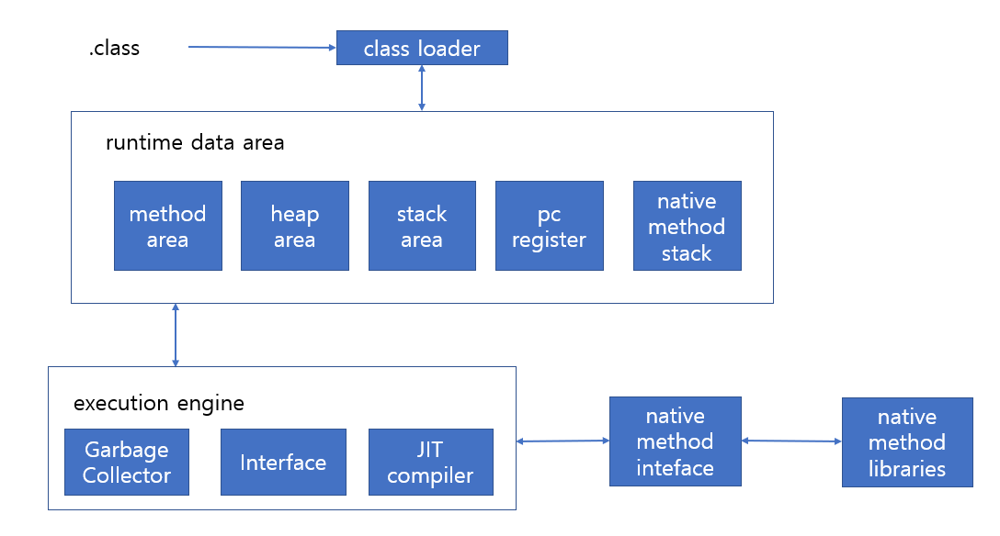

# 목차
- [목차](#목차)
- [언어 공부 목적](#언어-공부-목적)
- [객체지향 프로그래밍 OOP](#객체지향-프로그래밍-oop)
  - [4가지 특징](#4가지-특징)
  - [5대 원칙 SOLID](#5대-원칙-solid)
- [JVM](#jvm)
  - [class loader](#class-loader)
  - [runtime data area](#runtime-data-area)
    - [method area](#method-area)
    - [heap area](#heap-area)
    - [stack area](#stack-area)
    - [pc register](#pc-register)
    - [native method stack](#native-method-stack)
  - [Execution Engine](#execution-engine)
    - [Garbage Collector 동작원리](#garbage-collector-동작원리)
- [Java Version Update 중요 사항](#java-version-update-중요-사항)
- [키워드 keyowrd](#키워드-keyowrd)
  - [접근 제한자](#접근-제한자)
  - [static](#static)
  - [final](#final)
  - [abstract](#abstract)
- [Primitive Type](#primitive-type)
- [Wrapper](#wrapper)
- [String literal, new String, StrinBuilder, StringBuffer](#string-literal-new-string-strinbuilder-stringbuffer)
- [Array](#array)
- [java.util.Collections](#javautilcollections)
- [Class](#class)
  - [Constructor와 Design Pattern](#constructor와-design-pattern)
  - [equals 와 hascode](#equals-와-hascode)
  - [상속 Inheritance](#상속-inheritance)
- [Enum](#enum)
- [Generic](#generic)
- [Interface](#interface)
  - [interface 사용 목적](#interface-사용-목적)
- [Abstract class](#abstract-class)
- [Anotation](#anotation)
- [Exception과 Error](#exception과-error)
  - [Throwable 상속 구조](#throwable-상속-구조)
  - [checked exception](#checked-exception)
  - [unchecked exception](#unchecked-exception)
- [Optional](#optional)
- [stream](#stream)
- [lamda](#lamda)
- [serialize](#serialize)
- [reflection](#reflection)
- [input/output](#inputoutput)
- [thread](#thread)

------------

# 언어 공부 목적
- 문법을 공부하는 이유는 효율적인 코드 작성을 위해서이다.
  - 효율적인 코드 필요 조건
    - 제대로 동작한다
    - 빠르게 동작한다
    - 다른 사람도 알아 보기 쉽다
    - 수정, 확장이 쉽다

------------

# 객체지향 프로그래밍 OOP
- Object Oriented Programming
- 프로그램을 역할을 갖는 객체들에 데이터 처리와 메세지 주고 받음 형태로 하는 프로그래밍
- 유지 보수와 코드 재사용이 쉽다

## 4가지 특징
- 캡슐화
  - 객체에 속성과 기능을 외부로부터 숨긴다
- 추상화
  - 추상(인터페이스)과 구현체(객체)가 존재한다
  - 의존 객체를 추상(인터페이스)으로 설정해 의존 객체에 변경이 사용 객체에 영향을 주지 않는다
- 상속
  - 부모 클래스에 속성(field)과 기능(method)을 자식 클래스가 재사용
- 다형성
  - 오버로딩 overloading
    - 같은 이름을 가지며 다른 파라미터를 갖는 기능(method) 정의
  - 오버라이딩 overriding
    - 부모 클래스에 기능(method)을 자식 클래스가 변경해 정의

## 5대 원칙 SOLID
- Single Responsibility Principle
  - 하나에 클래스는 하나에 책임만 갖는다
- Open Close Principle
  - 기능 추가는 가능하며, 그런 과정에서 기존 코드에 수정이 일어나지 않는다
- Liskov Subtitution Principle
- Interface Segregation Principle
  - 범용 인터페이스 하나보다 여러개에 인터페이스가 좋다
- Dependency Inversion Principle
  - 제어에 역전
  - 의존 객체는 인터페이스로 설정해 두고 어느 구현체를 쓸지를 사용 객체 외부에서 지정해준다

------------
# JVM
- .java 파일을 javac 컴파일러가 .class 파일(Byte Code 파일)로 바꾼다. JIT이 .class파일을 OS에 맞춰 실행킨다.



## class loader
- class 파일들을 runtime data area에 적재

## runtime data area
- class파일을 실행시 JVM에 OS로 부터 할당 받은 memory
### method area
- runtime 종료시까지 유지
- 클래스 정보(이름, 속성 타입, 접근제어자, 등), static 변수, interface를 저장
### heap area
- 실제 인스터스에 값이 저장
- 가비지 컬랙터가 관리
### stack area
- 메서드 호출시 메서드안에서 사용하는 지역변수를 저장한다. 메서드 리턴시 해제된다 
### pc register
- 다음 실행시킬 명령어가 저장된 주소를 저장하고 있다
### native method stack
- 자바외에 언어로 작성된 코드 할당 영역

## Execution Engine
### Garbage Collector 동작원리


------------

# Java Version Update 중요 사항
- version 5
  - generic 추가
- version 8
  - lambda, stream, optional 추가
- version 9
  - module 추가
- verion 11


------------

# 키워드 keyowrd
## 접근 제한자
- public: 전체 접근 가능
- protected: 상속한 클래스만 접근 가능
- default: 해당 패키지에서만 접근 가능
- private: 해당 클래스만 접근 가능

## static
  - 실행시 메모리에 할당된 이후로 주소 변경 재할당을 하지 않는다
  - static이 붙은 속성(field)을 클래스 변수라 부른다
  - method에 static을 붙이면 인스턴스 생성없이 클래스.method 형태로 호출 가능하다  

## final
  - 클래스에 붙이면 상속 불가
  - 속성(field)에 붙이면 변경 불가
  - 기능(method)에 붙이면 오버라이딩 불가

## abstract
  - 클래스에 붙이는 키워드
  - 인스턴스 생성을 못하고, 상속만 가능한 클래스

------------

# Primitive Type
- 기본 타입(primitive type)을 제외한 모든 자료형은 참조 타입(reference type)이다. 참조 타입은 값이 저장되는 heap area 주소값으로 4byte를 사용한다

# Wrapper

# String literal, new String, StrinBuilder, StringBuffer
- java.lang 패키지에 있어, import 하지 않아도 사용 가능하다
  
```java
String str = "test"; //literal
String str = new String("test");
```
- string literal 방식
  - heap area에 intern pool에 literal을 저장, 같은 문자열로 추가 변수를 선언할때 동일한 intern pool주소값을 가르킨다 
- new String 방식
  - 변수 선언할때 마다 heap area에 새로 인스턴스 할당
- string에 equals는 값 비교를 하는걸로 오버라이딩 되어있다.

- String은 불변 객체(immutable), thread safe하다
- StringBuilder와 StringBuffer는 가변 객체로 값이 변경 되더라도 heap area에 주소를 새로 할당하지 않는다
- StringBuilder는 thread safe하지 않고, StringBuffer는 thread safe하다

- String: 문자열 조작이 적을때 사용
- StringBuilder: 싱글 스레드 환경이면서, 문자열 조작이 많을때 사용
- StringBuffer: 멀티스레드 환경이면서, 문자열 조작이 많을때 사용

# Array
```java
int[] arr = new int[5];

```

# java.util.Collections


-------------

# Class
- Field, Method, Constructor로 구성
- 모든 클래스는 Object란 이름에 클래스에 자식이다

## Constructor와 Design Pattern
- static factory method

- Builder
  - 매개변수가 많은 생성자에 적용.
  - 생성시 파라미터 이름에 맞춰 값을 적어, 어떤 파라미터에 해당하는 값인지 알 수 있다.

- singleton

- dependecy injection
## equals 와 hascode
- Object 클래스에 정의된 메서드

- equals는 현재 객체와 파라미터로 받은 객체가 같은 객체(같은 heap area 주소를 가리키는지)인지 반환

```java
boolean equals(Object obj){
  return (this == obj);
}
```
- entity class를 만들때 id가 같으면 같은 인스턴스가 되게끔 equals를 오버라이딩 해야한다

```java
class MyEntity{
  private Long id;

  //
  boolean equals(Object obj){
    if(obj == null){
      return false;
    }
    if(obj == this){
      return true;
    }
    if(this.getClass() != obj.getClass()){
      return false;
    }
    MyEntity e = (MyEntity) obj;
    return (this.getId() == e.getId());
  }
}


```

- hascode는 인스턴스를 구별할 수 있는 숫자
- 자신이 만든 클래스를 원소로 같는 hashtable을 사용할 경우, table에 key 값으로 사용된다
- 한 인스턴스를 table에 저장하고 같은 인스턴스를 저장할때 덮어씌워지게 하기 위해선 hashcode를 오버라이딩해야한다 

```java
class MyEntity{
  int hasCode(){
    final int PRIME_NUM = 31;
    return PRIME_NUM+this.getId();
  }
}


```


- 두 객체에 equals가 true면(같은 인스턴스면), hashcode는 같다
- 두 객체에 equals가 false면, hascode는 같을 수도 다를 수 도 있다. 
- 두 객체에 hashcode가 같으면, equals는 true일수도 false일 수도 있다.
- 두 객체에 hascode가 다르면, equals는 false다.


## 상속 Inheritance


# Enum

# Generic

# Interface
- 협업시 클래스에서 사용하는 메서드에 이름과 반환값을 사전에 선언해 둔것
  - 해당 인터페이스를 상속받은 클래스에 메서드는 인터페이스에서 선언한것만 있음을 약속 받음
- 다수의 인터페이스를 상속하는게 가능
- 인터페이스를 구현(implement)하는 클래스에게 인터페이스에서 선언한 메서드를 정의하도록 강제
- 약한 연결
  - 객체를 속성으로 갖는 클래스를 정의할때 자료형을 속성을 정의한 클래스로 두지 않고 인터페이스로 두면 속성 클래스 변경에 용이하다

## interface 사용 목적

# Abstract class

# Anotation

----------------

# Exception과 Error
## Throwable 상속 구조
```
Object
|-Throwable
  |-Exception
    |-RuntimeException
      |-NullPointException
      |-ArithmeticException
      |-IndexOutOfBoundException
      |-...
    |-IOException
    |-SQLException
    |-...
  |-Error
    |-VirtualMochineError
      |-StackOverFlowError
      |-OutOfMemoryError
      |-...
    |-...

```

## checked exception
- compile 시점에 확인 가능
- 예외 처리를 하지 않으면 컴파일 불가
- Exception을 상속한 클래스중 RuntimeException을 제외한 모든 클래스
  - ex) IOException, SQLException

## unchecked exception
- compile 시점에 잡아 내지 못해 run time 도중 발생
- 개발자가 예외 처리 코드를 짜 실행 도중 발생시 처리 문을 받을 수 있게 해야한다
- RuntimeException과 Error


----------------


----------------

# Optional

# stream

# lamda

# serialize

# reflection

# input/output

# thread

----------------

