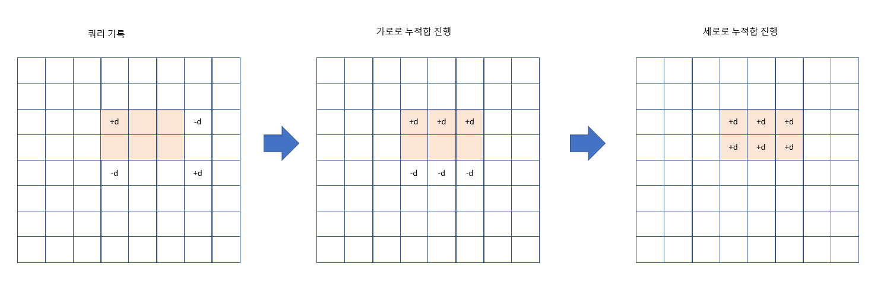

# 목차
- [목차](#목차)
- [시험 대비 포인트](#시험-대비-포인트)
- [input](#input)
- [리스트 활용](#리스트-활용)
  - [정렬](#정렬)
  - [range](#range)
- [여러가지 행렬 조작](#여러가지-행렬-조작)
  - [숫자칸 채우기](#숫자칸-채우기)
    - [정사각형 달팽이: 밖에서 안으로](#정사각형-달팽이-밖에서-안으로)
    - [정사각형 풍차](#정사각형-풍차)
    - [정삼각형 달팽이: 밖에서 안으로 & 3가지 방향](#정삼각형-달팽이-밖에서-안으로--3가지-방향)
  - [가로, 세로 한칸씩 옮기기](#가로-세로-한칸씩-옮기기)
  - [가로, 세로, y=x, y=-x 구간 확인](#가로-세로-yx-y-x-구간-확인)
  - [직각 라인별로 배열 바라보기](#직각-라인별로-배열-바라보기)
  - [0 내리기](#0-내리기)
- [LinkedList](#linkedlist)
- [stack 활용](#stack-활용)
  - [예제](#예제)
- [deque 활용](#deque-활용)
  - [예제](#예제-1)
- [heap, priority queu 이용](#heap-priority-queu-이용)
- [산수](#산수)
- [이진수](#이진수)
- [정수론](#정수론)
  - [문제 파악](#문제-파악)
  - [예제와 풀이](#예제와-풀이)
- [문자열 조작](#문자열-조작)
- [Counter](#counter)
- [날짜](#날짜)
- [http request](#http-request)
- [정규표현식](#정규표현식)
  - [풀이법](#풀이법)
  - [예제](#예제-2)
- [Two Pointer](#two-pointer)
  - [문제 파악](#문제-파악-1)
  - [풀이법](#풀이법-1)
  - [예제](#예제-3)
- [누적합](#누적합)
  - [연속된 구간에 같은 값을 더하거나 빼는 쿼리](#연속된-구간에-같은-값을-더하거나-빼는-쿼리)
    - [1D-Matrix](#1d-matrix)
    - [2D-Matrix](#2d-matrix)
- [쿼리 시뮬레이션 결과 목표 지점으로 도달 가능한 시작점들 찾기](#쿼리-시뮬레이션-결과-목표-지점으로-도달-가능한-시작점들-찾기)
- [완전탐색](#완전탐색)
  - [문제 파악](#문제-파악-2)
  - [예제](#예제-4)
- [BackTracking](#backtracking)
  - [문제 파악](#문제-파악-3)
  - [풀이](#풀이)
  - [예제](#예제-5)
- [탐욕법 Greedy Algorithm](#탐욕법-greedy-algorithm)
  - [문제 파악](#문제-파악-4)
  - [풀이](#풀이-1)
  - [예제](#예제-6)
- [동적 계획법 Dynamic Programming](#동적-계획법-dynamic-programming)
  - [문제 파악및 풀이](#문제-파악및-풀이)
  - [예제](#예제-7)
- [Parameter Search](#parameter-search)
  - [문제 파악](#문제-파악-5)
  - [풀이](#풀이-2)
  - [예제](#예제-8)
- [lower bound & upper bound](#lower-bound--upper-bound)
- [Graph](#graph)
  - [BFS](#bfs)
  - [DFS](#dfs)
    - [dfs:인접그룹 탐색](#dfs인접그룹-탐색)
  - [BFS: 2차원 최단거리](#bfs-2차원-최단거리)
  - [Dijkstra Algorithm: single source & all dest 최단거리](#dijkstra-algorithm-single-source--all-dest-최단거리)
  - [bellman ford: single source & all dest 최단거리](#bellman-ford-single-source--all-dest-최단거리)
  - [floyd-warshall: all source & all dest 최단거리](#floyd-warshall-all-source--all-dest-최단거리)
  - [Kruskal's algorithm: Minimum Spanning Tree](#kruskals-algorithm-minimum-spanning-tree)
- [Tree](#tree)
  - [BFS: 같은 높이를 가진 node끼리 묶기, leaf node 구하기, 높이 구하기](#bfs-같은-높이를-가진-node끼리-묶기-leaf-node-구하기-높이-구하기)
  - [topology sort](#topology-sort)
  - [Tree DP](#tree-dp)

-------------

# 시험 대비 포인트
- 예제를 이용해 문제를 정확하게 이해하는게 제일 먼저 할 일 
- 복잡한 구현 문제는 단계 단위 함수로 짜기
  - 가장 어려운 단계를 못 짜면 결국 못 푸는 문제
- 배열 칸수 변화가 있는가?, 회전하고 옮기고 난리치더라도 전체 칸수만 유지된다면 직사각형 배열을 사용해 해결
- global 정수 변수 사용이 어색하다면 [0] 활용


-------------

# input
```python
# 1개
N = int(input())
# 2개
nRow, nCol = map(int, input().split())
# 한줄 띄어쓰기 없을때
row = list(map(int, list(input())))
# 한줄 띄어쓰기 있을때
row = list(map(int, input().split()))

# def global 이용
nRow = 0
nCol = 0
answer = 0
def solution(board):
  global nRow, nCol, answer
  nRow = len(board)
  nCol = len(board[0])


# direction
# 상하좌우
direction = [(-1, 0), (0, 1), (1, 0), (0, -1)]
# 팔방
direction = [(-1, 0), (-1, 1), (0, 1), (1, 1), (1, 0), (1, -1), (0, -1), (-1, -1)]

# 행렬 출력
def printMatrix(matrix):
  for row in matrix:
    print(row)
  print()

```

-----------------------------------

# 리스트 활용
- 파이썬의 리스트는 ArrayList
  
|method|example|big O|note|
|----|---|---|---|
|조회|l[i]|O(1)||
|슬라이싱|l[a:b]|O(b-a)||
|길이|length(l)|O(1)||
|삽입|l.append(e)|O(1)||
|변화|l[i] = e|O(1)||
|마지막 삭제|e = l.pop()|O(1)|l.pop(-1)|
|k번째 삭제|e = l.pop(k)|O(k)||

## 정렬
- 파이썬에 정렬 내장 함수는 Timsort algorithm으로 구현되어 있다
  - stable, inplace
  - best case O(N), 
```python
aList = [(0, 1), (2, 1), (1, 0), (-1, 5)]
sortedList = sorted(aList, key=lambda x: (x[0], -x[1]), reverse=True)

```

## range
```python
# range(start=0, stop, step=1)
# start부터 시작해 stop이 되기 직전까지 step씩 차이나는 등차 수열을 원소로 갖는 리스트 반환
# 실제로는 range엔 parmeter_name이 없다. 몇 개의 paramter가 기입되었는가에 의해 작동이 정해진다.


for i in range(5):
  print(i)
	# 0, 1, 2, 3, 4

for i in range(2, 5):
  print(i)
	# 2, 3, 4

for i in range(5, 5):
  print(i)
  # 아무 동작 안함
for i in range(5, 3):
  print(i)
  # 아무 동작 안함

# 내림차순
for i in range(5, 0, -1):
  print(i)
  # 5, 4, 3, 2, 1

# 내림차순
for i in range(5, -1, -1):
  print(i)
  # 5, 4, 3, 2, 1, 0


# stride 
aList = []
stride = 3
for i in range(0, 5, stride):
	print(aList[i:i+stride])
	# aList[0:3], aList[3:6]


```

-----------------------------------

# 여러가지 행렬 조작
## 숫자칸 채우기
### 정사각형 달팽이: 밖에서 안으로


### 정사각형 풍차


### 정삼각형 달팽이: 밖에서 안으로 & 3가지 방향


```python
# 정삼각형

def print_matrix(matrix):
    for row in matrix:
        print(row)
    print()

def center(board, r, c, num):
    board[r][c] = num
    return

def toDown(board, r, c, length, num):
    for dr in range(length):
        nr = r+dr
        board[nr][c] = num
        num += 1
    nr += 1
    nc = c
    return nr, nc, num

def toRight(board, r, c, length, num):
    for dc in range(length):
        nc = c+dc
        board[r][nc] = num
        num += 1
    nc += 1
    nr = r
    return nr, nc, num

def toUp(board, r, c, length, num):
    for d in range(length):
        nr = r-d
        nc = c-d
        board[r-d][c-d] = num
        num += 1
    nr += 1        
    return nr, nc, num

def triangle(board, r, c, length, num):
    if length == 0:
        board[r][c] = num
        return
    while length >= 3:
        r, c, num = toDown(board, r, c, length, num)
        r, c, num = toRight(board, r, c, length, num)
        r, c, num = toUp(board, r, c, length, num)
        length -= 3
    if length == 0:
        center(board, r, c, num)
    else:
        r, c, num = toDown(board, r, c, length, num)
        r, c, num = toRight(board, r, c, length, num)
        r, c, num = toUp(board, r, c, length, num)
    return

def solution(n):
    answer = []
    board = [[0 for _ in range(i+1)] for i in range(n)]   
    num = 1
    length = n-1
    r = 0
    c = 0
    triangle(board, r, c, length, num)   
    for row in board:
        for e in row:
            answer.append(e)     
    return answer
```


## 가로, 세로 한칸씩 옮기기
- 행렬에서 특정 행 혹은 특정 열을 한칸씩 민다
- 끝에 있는 원소는 반대로 밀린다
- 행은 오른쪽 또는 왼쪽으로 열은 위 또는 아래쪽으로 밀 수 있다

```python

def moveRow(board, rowIdx, cmd):
  retBoard = [row[::] for row in board]
  nCol = len(retBoard[0])
  if cmd == "toRight":
    temp = retBoard[rowIdx][-1]
    for colIdx in range(nCol-1, 0, -1):
      retBoard[rowIdx][colIdx] = retBoard[rowIdx][colIdx-1]
    retBoard[rowIdx][0]=temp
  elif cmd == "toLeft":
    temp = retBoard[rowIdx][0]
    for colIdx in range(0, nCol-1, 1):
      retBoard[rowIdx][colIdx] = retBoard[rowIdx][colIdx+1]
    retBoard[rowIdx][-1] = temp
  return retBoard

def moveCol(board, colIdx, cmd):
  retBoard = [row[::] for row in board]
  nRow = len(retBoard)
  if cmd == "toDown":
    temp = retBoard[-1][colIdx]
    for rowIdx in range(nRow-1, 0, 1):
      retBoard[rowIdx][colIdx] = retBoard[rowIdx-1][colIdx]
    retBoard[0][colIdx] = temp
  elif cmd == "toUp":
    temp = retBoard[0][colIdx]
    for rowIdx in range(0, nRow-1, 1):
      retBoard[rowIdx][colIdx] = retBoard[rowIdx+1][colIdx]
    retBoard[-1][colIdx] = temp
  return retBoard

```


## 가로, 세로, y=x, y=-x 구간 확인
- 1과 0으로 구성된 행렬
- 원하는 한 줄에 연속된 1의 갯수 확인 

```python

matrix [
  [1, 1, 0, 1, 1],
  [0, 1, 1, 1, 1],
  [0, 1, 1, 0, 0],
  [1, 1, 1, 1, 1],
  [1, 1, 0, 1, 1]
]
target = 5 # target초과로 연속된건 치지 않는다
nRow = len(matrix)
nCol = len(matrix[0])
totalCount = 0
# 가로
for rowIdx in range(nRow):
  count = 0
  for colIdx in range(nCol):
    num = matrix[rowIdx][colIdx]
    if num == 1:
      count += 1
    elif num == 0 and count > 0:
      if count == target:
        totalCount += 1
      count = 0
  if count == target:
    totalCount += 1
# 세로
for colIdx in range(nCol):
  count = 0
  for rowIdx in range(nRow):
    num = matrix[rowIdx][colIdx]
    if num == 1:
      count += 1
    elif num == 0 and count > 0:
      if count == target:
        totalCount += 1
      count = 0
  if count == target:
    totalCount += 1
# y=x
for rowStart in range(nRow+nCol):
  count = 0
  for colIdx in range(nCol):
    rowIdx = rowStart-colIdx
    if 0 <= rowIdx < nRow:
      num = matrix[rowIdx][colIdx]
      if num == 1:
        count += 

# y=-x

```

## 직각 라인별로 배열 바라보기

```python
"""
#
1 2 3 4
2 2 3 4
3 3 3 4
4 4 4 4

# max(i//n, i%n) 을 이용하면 직각 라인 별로 값을 만들 수 있다
#
(0, 0) (0, 1) (0, 2) (0, 3) 
(1, 0) (1, 1) (1, 2) (1, 3)
(2, 0) (2, 1) (2, 2) (2, 3)
(3, 0) (3, 1) (3, 2) (3, 3) 
"""

def solution(n, left, right):
    answer = []
    for i in range(left, right+1):
        answer.append(max(i//n,i%n)+1)
    return answer
```

## 0 내리기
```python

def breakAndDown(nRow, nCol, board, groups):
    retBoard = [[0 for _ in range(nCol)] for _ in range(nRow)]
    for group in groups:
        for r, c in group:
            board[r][c] = 0
    #
    for c in range(nCol):
        newCol = []
        for r in range(nRow-1, -1, -1):
            num = board[r][c]
            if num > 0:
                newCol.append(num)
        #pad
        for _ in range(nCol-len(newCol)):
            newCol.append(0)
        for i in range(nRow):
            num = newCol[i]
            r = nRow-i-1
            retBoard[r][c] = num
    return retBoard
```

-----------------------------------

# LinkedList
- 파이썬 기본 제공 링크드 리스트는 없다


# stack 활용
## 예제
- 프로그래머스 lv2 짝지어 제거하기
- 110 옮기기
  
```python
def solution(s):
    answer = -1
    stack = []
    for char in s:
        if len(stack) == 0:
            stack.append(char)
        elif stack[-1] == char:
            stack.pop()
        else:
            stack.append(char)
    if len(stack) == 0:
        return 1
    return 0
```

# deque 활용

```python
from collections import deque
# 파이썬 List의 pop(0)은 O(N)이 소요된다, O(1)에 pop(0)을 지원하는 deque 사용하자

q = deque()
# 삽입
q.appendleft("e") #왼쪽
q.append("e") #오른쪽
# 삭제후 반환
e = q.popleft() #왼쪽
e = q.pop() #오른쪽
# 인덱스 조회
e = q[0] #왼쪽
e = q[-1] #오른쪽
# deque는 slice 불가
```

## 예제
- 프로그래머스 lv2 프린터

# heap, priority queu 이용
```python
import heapq

heap = []
heapq.heappush(heap, 1)
heapq.heappop(heap)
heap[0]
```

----------------------------------------

# 산수
```python
# 내림(주어진 수보다 작은 수중 가장 큰 정수), 반올림, 올림(주어진 수보다 큰 수중 가장 작은 정수)
from math import floor, ceil

num = floor(3.5) # 3
num = round(3.5) #4
num = ceil(3.5) #4


#정수 연산
num = 5
print(num / 2)  #2.5		소수점연산 살아있는 나누기
print(num // 2)  #2		몫, 소수점 버리는 나누기
print(num % 2)  #1		나머지


num = -5
print(num / 2)  #-2.5
print(int(num/2)) #-2
print(num // 2)  #-3	
print(num % 2)  #1	
```

# 이진수
```python
num = 6
biString = bin(num) # "0b110"

num = int("0b110", 2) # 6

```


# 정수론
## 문제 파악
- 정수 성질과 관련한 다양한 문제가 존재한다
- n진수
- 소수 판별, 애라토스테네스체
- 최소공배수, 최대공약수
- 직사각형

## 예제와 풀이
- 프로그래머스 lv3 최고의 집합
  - 자연수 n개로 이루어진 숫자쌍(중복 존재 가능)중 원소 합이 S면서 원소 곱이 최대인 숫자쌍 찾기
  - 풀이
    - 숫자간에 차이가 작을 수록 곱이 최대이다
    - s//n이 n개인 숫자쌍에 s%n개에 원소에 각 1씩 더한 숫자쌍이 찾는 숫자쌍이다
    - n > s이면 조건을 만족하는 숫자쌍이 없다  

- 프로그래머스 lv2 124의 나라
- 프로그래머스 lv2 소수 판별
```python
# 단일 숫자에 소수 판별
# 시간: O(sqrtN)

# 범위안 숫자들에 소수 판별
# 시간: O(NlglgN), 공간: O(N)

```

- 프로그래머스 lv2 멀쩡한 사각형

# 문자열 조작
```python
# 대문자는 소문자로(그외는 유지)
string = string.upper()
# 소문자는 대문자로(그외는 유지)
string = string.lower()


# 문자와 아스키코드
ord('a') # 97
chr(65) # A
chr(90) # Z
chr(97) # a
chr(122) # z
```

# Counter
```python
from collections import Counter
aList = [1, 1, 2, 3]
counter = Counter(aList) #{1: 2, 2: 1, 3: 1}
```

# 날짜
```python
from datetime import datetime


```

# http request
```python
import requests
import json

url = "http://"
params = {"key1": "value1", "key2": "value2"}
data = json.dumps({'outer': {'inner': 'value'})

#get
response = requests.get(url=url, params=params)
#post
response = request.post(url=url, data=data)
```

# 정규표현식
## 풀이법
```python
import re
pattern = ""
string = ""
p = re.compile(pattern)
m = p.match(string)
```
## 예제
- 프로그래머스 lv2 뉴스 클러스터링

------------------------------------

# Two Pointer
- 제시된 배열 aList에서 sort 없이 O(N) 시간안에  가장 큰 수, 두번째 큰 수, 가장 작은 수, 두번째 작은 수 찾기
## 문제 파악

## 풀이법

## 예제

# 누적합
## 연속된 구간에 같은 값을 더하거나 빼는 쿼리
### 1D-Matrix


### 2D-Matrix





# 쿼리 시뮬레이션 결과 목표 지점으로 도달 가능한 시작점들 찾기
- 프로그래머스 lv3 공 이동 시뮬레이션
- nRow x nCol matrix에서 상하좌우로 지정칸 만큼(벽을 만나면 멈춤) 이동하는 쿼리
- 풀이 핵심
  - 목표 지점부터 시작해 쿼리 시뮬레이션을 거꾸로 적용
  - 가능한 시작점들이 직사각형 범위로 주어진다
    - 직사각형에 위치는 한 대각선에 양쪽 꼭지점들(점 2개)로 결정된다
    - 이동 범위가 가로 혹은 세로이기 때문에 가능 범위가 직사각형 형태로 만들어진다 

----------------------------------

# 완전탐색
## 문제 파악
- 조합 combinations
  - 비복원: 한번 사용한 원소는 다시 사용 불가
  - 순서 의미 없음: 같은 원소구성이면 순서가 달라도 같은 경우의 수로 인정
  - $\frac{n!}{(n-r)!r!}$

```python
from itertools import combinations
population = [1, 2, 3, 4]
r = len(population)
cand_list = combinations(population, r)

"""
(1, 2, 3, 4)
"""
```

- 순열 permutaions
  - 비복원: 한번 사용한 원소를 다시 사용 불가
  - 순서 의미 있음: 같은 원소구성이여도 순서가 다르면 다른 경우의 수로 인정
  - $\frac{n!}{(n-r)!}$
```python
from itertools import permutaions
population = [1, 2, 3, 4]
r = len(population)
cand_list = permutations(population, r)
"""
(1, 2, 3, 4)
(1, 2, 4, 3)
...
(1, 4, 3, 2)
(2, 1, 3, 4)
(2, 1, 4, 3)
...
(4, 3, 1, 2)
(4, 3, 2, 1)
"""
```

- 중복 조합 combinations_with_replacement
  - 복원: 한번 사용한 원소를 다시 사용 가능
  - 순서 의미 없음
  - $\frac{(n+r-1)!}{(n-1)!r!}$
```python
from itertools import combinations_with_replacement
population = [1, 2, 3, 4]
r = len(population)
cand_list = combinations_with_replacement(population, r)
"""
(1, 1, 1, 1)
(1, 1, 1, 2)
...
(1, 4, 4, 4)
(2, 2, 2, 2)
(2, 2, 2, 3)
...
(3, 4, 4, 4)
(4, 4, 4, 4)
"""
```

- 중복 순열 product
  - 복원: 한번 사용한 원소를 다시 사용 가능
  - 순서 의미 있음
  - $n^r$
```python
from itertools import product
population = [1, 2, 3, 4]
r = len(population)
cand_list = product(population, repeat=r)
"""
(1, 1, 1, 1)
(1, 1, 1, 2)
...
(1, 4, 4, 4)
(2, 1, 1, 1)
(2, 1, 1, 2)
...
(4, 4, 4, 4)
"""
```

- 오름차순 생성
```python
total = []
n = 5
m = 3
def search(total, now, start, end, targetCategory):
  if len(now) == targetCategory:
    total.append(now[::])
  for i in range(start, end):
    now.append(i)
    search(total, now, i+1, end, targetCategory)
    now.pop()
search(total, [], 1, n+1, m)
```


- 정수 방적식


## 예제
- 프로그래머스 lv2 피로도
  - permutations
- 프로그래머스 lv2 양궁대회
  - combinations_with_replacement
- 프로그래머스 lv2 카펫
  - 정수 연립 방정식 해 찾기

----------------------------
# BackTracking
## 문제 파악
- 최적화 문제

## 풀이


## 예제


------------------------------
# 탐욕법 Greedy Algorithm
## 문제 파악
- 최적화 문제
- 최적 부분 구조
  - 작게 쪼갠 부분 문제에 최적해를 합쳐 큰 문제에 최적해를 만들 수 있다
- 탐욕 선택 속성
  - 앞선 부분문제해가 나머지 문제 풀기에 영향을 주지 않는다


## 풀이

## 예제
- 프로그래머스 lv1 체육복
- 프로그래머스 lv2 구명보트
  
------------------------------------------

# 동적 계획법 Dynamic Programming
## 문제 파악및 풀이
- 문제 해를 작은 문제 해들로 구성 가능
  - 아주 작은 사이즈의 문제와 나머지 문제로 분해해 생각해 봤을때, 아주 작은 사이즈의 문제 해는 구하기 쉽고, 나머지 문제 역시 동일한 방식으로 분해 가능하다
- 한번 구한 문제 해가 보다 큰 문제 해를 구할때 사용된다
  
- bottom up 점화식 
  - f(1), f(2), 등 작은 n에 대해 f값은 구하기 쉽다
  - f(n)은 n보다 작은 변수 x들에 대한 함수값 f들의 합으로 구성된다
  - n은 일 변수가 아니라 이변수일 수 있다

- n이 클경우 f값이 너무 커 정해진 큰 수로 나눈 나머지를 요구하는 경우가 있다
  - 그럴경우 점화식 자체에도 큰 수로 나누는 식을 사용하면 된다
  - $A_1 = p*Q_1 + r_1$
  - $A_2 = p*Q_2+r_2$
  - $(a*A_1+b*A_2) mod_p = (a*r_1+b*r_2) mod_p$

## 예제
- 프로그래머스 lv2 가장 큰 정사각형
- 프로그래머스 lv3 2 x n 타일링
- 프로그래머스 lv3 스티커 모으기 (2)

- 최소 생산 비용
- 최단 경로
  - 반드시 한번 대각선을 지나는 최단 경로

----------------------------------

# Parameter Search
## 문제 파악
- 최적화 문제
- 최적화 문제를 결정 문제(현재 해가 조건에 맞습니까)로 바꾸기
- 이분 탐색으로 최적해를 찾다
- 시간복잡도 lgN


- 조건을 만족하는 최소 해 찾기
  - 해 x가 조건을 충족하는지 빠르게 확인할 수 있다
  - 해 x는 음이 아닌 정수
  - 해 x에 상한, 하한이 있다
  - 해 x가 조건 충족시, x보다 큰 모든 음이 아닌 정수대해서도 조건을 만족
  - 해 x가 조건을 만족하지 않을때, x보다 작은 모든 음이 아닌 정수에 대해서도 조건을 만족하지 않는다

- 조건을 만족하는 최대 해 찾기
  - 해 x가 조건을 충족하는지 빠르게 확인할 수 있다
  - 해 x는 음이 아닌 정수
  - 해 x에 상한, 하한이 있다
  - 해 x가 조건 충족시, x보다 작은 음이 아닌 정수대해서도 조건을 만족
  - 해 x가 조건을 만족하지 않을때, x보다 큰 모든 음이 아닌 정수에 대해서도 조건을 만족하지 않는다

## 풀이
- start=하한, end=상한, mid = (start+end)//2 로 둔다
- start <= end 일 동안 다음을 반복
- mid가 조건에 맞지 않을때
  - 최소해 찾기는, start = mid로 두고 다시 시도(mid보다 작은 해도 조건을 만족하지 않으므로) 
  - 최대해 찾기는, end = mid로 두고 다시 시도(mid보다 큰 해도 조건을 만족하지 않으므로)
- 반복 결과 계산된 mid가 최소/최대 해이다

## 예제


# lower bound & upper bound


---------------------------

# Graph
```python
#V: vertex 집합 크기
#E: edge 집합 크기

#무가중치 그래프 with 연결 리스트
graph = [[] _ for _ in range(V+1)]  #vertex가 0번부터 시작시 range(V)
for _ in range(E):
  src, dest = map(int, input().split())
  graph[src].append(dest)
  graph[dest].append(src) #방향성 graph의 경우 해당 줄을 주석처리
for node in graph:  #탐색시 번호 작은것 부터 탐색하게 하려면 정렬을 해둬야 한다.
	node.sort()   

#가중치 그래프 with 연결리스트
graph = [[] _ for _ in range(V+1)]
for _ in range(E):
  src, dest, weight = map(int, input().split())
  graph[src].append([dest, weight])
  graph[dest].append([src, weight]) #방향성 graph의 경우 이를 생략
  
#가중치 그래프 with 딕셔너리
graph = {}
for _ in range(E):
  src, dest, weight = map(int, input().split())
  if src not in graph:
    graph[src] = {}
    graph[src][dest] = weight
  else:
    graph[src][dest] = weight
  #방향성일 경우 이는 생략
  if dest not in graph:
    graph[dest] = {}
    graph[dest][src] = weight
  else:
    graph[dest][src] = weight

#가중치 그래프 with 인접행렬
graph = [[0 for _ in range(V+1)] for _ in range(V+1)]
for _ in range(E):
	src, dest, weight = map(int, input().split())
    graph[src][dest] = weight  #weight가 없다면 1 할당
    graph[dest][src] = weight  #방향성이 있을경우 해당 줄은 주석 처리

```


## BFS
```python
def bfs(matrix, root):
  visited = OrderdDict()  #key: node_index, value: (탐색시 부모노드, root로부터 거리)
  q = deque()
  q.append(root)
  visited[root] = (None, 0, 0)
  depth = 0
  
  while q:
    q_len = len(q)
    depth +=1
    for _ in range(q_len):
      node = q.popleft()
      for adj_node in matrix[node]:
        weight, adj_node = adj_node[1], adj_node[0] #가중치 그래프일때만 사용
        if adj_node not in visited:  #visited를 List로 할 경우 해당 연산이 O(N)이지만 dict일땐 O(1) 
          visited[adj_node] = (node, depth, visited[node]+weight)  #가중치 그래프일땐 +1이 아니라 +weight
          q.append(adj_node)
    return list(visited.keys())  #방분순으로 담겨있다

```

## DFS
```python
#DFS using recursive & root 설정
#graph는 인접리스트

def dfs(graph, root):
    time = 0
    visited = OrderdDict()
    visited[root] = [None, 0, 0]  #(탐색시 부모노드, 발견 시간, 인접노드 탐색 종료 시간)
    dfs_visit(graph, root, visited, time)
    return list(visited.keys())

def dfs_visit(graph, node, visited, time):
    time += 1
    visite[node][1] = time
    for adj_node in graph[node]:
    	if adj_node not in visited:
            visited[adj_node] = [node, 0, 0]
            time = dfs_visit(graph, adj_node, visited, time)
    time += 1
    visited[node][2] = time
    return time


#DFS using recursive & root 설정 안 함

def dfs(graph):
    time = 0
    visited = OrderdDict()  #[부모노드, 방문시간, ]
    num_network = 0  
    for root in range(1, len(graph)):
    	if root not in visitd:
        	num_network += 1
            visited[root] = [None, time, 0]
            time = dfs_visit(graph, root, visited, time)
    return num_network, visited

def dfs_visit(graph, node, visited, time):
    time += 1
    visite[node][1] = time
    for adj_node in graph[node]:
    	if adj_node not in visited:
            visited[adj_node] = [node, 0, 0]
            time = dfs_visit(graph, adj_node, visited, time)
    time += 1
    visited[node][2] = time
    return time
```


### dfs:인접그룹 탐색
```python

def search(nRow, nCol, board, now, targetColor, visited, group):
    r, c = now
    if board[r][c] == targetColor:
        visited[r][c] = True
        group.append(now)
        for dr, dc in [(-1, 0), (0, 1), (1, 0), (0, -1)]:
            nr = r + dr
            nc = c + dc
            if 0 <= nr < nRow and 0<= nc < nCol:
                if not visited[nr][nc]:
                    search(nRow, nCol, board, (nr, nc), targetColor, visited, group)

def check(nRow, nCol, board):
    visited = [[False for _ in range(nCol)] for _ in range(nRow)]
    groups = []
    for r in range(nRow):
        for c in range(nCol):
            group = []
            if board[r][c] == 0:
                visited[r][c] = True
            else:
                if not visited[r][c]:
                    search(nRow, nCol, board, (r, c), board[r][c], visited, group)
                if len(group) >= 3:
                    groups.append(group)
    return groups


```


## BFS: 2차원 최단거리

```python
direction = [[1, 0], [-1, 0], [0, -1], [0, 1]]

def bfs(source, dest):
  q = deque()
  q.append(source)
  trace = [[-1 for _ in range(M)] for _ in range(N)]
  trace[source[0]][source[1]] = 0
  while q:
    q_len = len(q)
    for _ in range(q_len):
      y, x = q.popleft()
      for d in dirction:
        ny = y + d[0]
        nx = x + d[1]
        if 0 <= ny < N and 0 <= ny < M: #matrix : (N by M)
          if trace[ny][nx] == -1 and matrix[ny][nx] != -1:  # matrix상에 벽은 -1로 표기
            trace[ny][nx] = trace[y][x] + 1
            q.append([ny, nx])
            if [ny, nx] == dest:
              return trace[ny][nx]
  return -1  #목적지 도달 불가
      

```

## Dijkstra Algorithm: single source & all dest 최단거리

```python
import heapq

graph = {}
graph['A'] = {'B': 5, 'C': 4}
graph['B'] = {'C': 3, 'D': 2, 'E': 2}
graph['C'] = {}
graph['D'] = {'B': 1, 'C': 5}
graph['E'] = {'D': 3}


def dijkstra(start='A'):
    distances = {node: float('inf') for node in graph}
    distances[start] = 0

    # min-heap, 기준: distance, 저장값: [distance, node]
    q = []
    for node, distance in distances.items():
        heapq.heappush(q, [distance, node])
    while q:
        cur_distance, cur_node = heapq.heappop(q)
        for neighbor, weight in graph[cur_node].items():
            distance = cur_distance + weight
            if distance < distances[neighbor]:
                distances[neighbor] = distance
                heapq.heappush(q, [distance, neighbor])
    return distances

print(dijkstra())


```


## bellman ford: single source & all dest 최단거리

```python
graph = {}
graph['A'] = {'B': -1, 'C': 4}
graph['B'] = {'C': 3, 'D': 2, 'E': 2}
graph['C'] = {}
graph['D'] = {'B': 1, 'C': 5}
graph['E'] = {'D': -3}

def bellman_ford(start='A'):
    distance = {}
    pre_vertex = {}
    # init
    for node in graph:  #keys
        distance[node] = float('inf')
        pre_vertex[node] = None
    distance[start] = 0
    # relax
    for _ in range(len(graph) - 1):
        for node in graph:
            for neighbor in graph[node]:
                w = graph[node][neighbor]
                if distance[neighbor] > distance[node] + w:
                    distance[neighbor] = distance[node] + w
                    pre_vertex[neighbor] = node
    # negative cycle check
    for node in graph:
        for neighbor in graph[node]:
            if distance[neighbor] > distance[node] + graph[node][neighbor]:
                return 0, _, _

    return 1, distance, pre_vertex

flag, distance, pre_vertex = bellman_ford(start='A')
```

##  floyd-warshall: all source & all dest 최단거리
```python
N = 5
edges = [
    [1, 2, 3],
    [1, 3, 8],
    [1, 5, -4],
    [2, 4, 1],
    [2, 5, 7],
    [3, 2, 4],
    [4, 1, 2],
    [4, 3, -5],
    [5, 4, 6]
]
def floyd_warshall():
    D_matrix = [[float('inf') for _ in range(N)] for _ in range(N)]
    P_matrix = [[None for _ in range(N)] for _ in range(N)]
    for i in range(N):
        D_matrix[i][i] = 0

    for source, dest, weight in edges:
        D_matrix[source-1][dest-1] = weight
        P_matrix[source-1][dest-1] = source-1

    for k in range(N):
        for i in range(N):
            for j in range(N):
                if D_matrix[i][j] > D_matrix[i][k]+D_matrix[k][j]:
                    D_matrix[i][j] = D_matrix[i][k]+D_matrix[k][j]
                    P_matrix[i][j] = P_matrix[k][j]
        # print(k)
        # print_matrix(D_matrix)
        # print_matrix(P_matrix)

    return D_matrix, P_matrix
def print_matrix(_matrix):
    for i in range(N):
        print(_matrix[i])
    print()
def print_path(P_matrix, i, j):
    if i == j:
        print(i)
    elif P_matrix[i][j] == None:
        print("no path from i to j")
    else:
        print_path(P_matrix, i, P_matrix[i][j])
        print(j)

D_matrix, P_matrix = floyd_warshall()
print_matrix(D_matrix)
print_matrix(P_matrix)
print_path(P_matrix, 0, 3)
```


## Kruskal's algorithm: Minimum Spanning Tree
```python
class Disjoint_set():
  def __init__(self, n):
    # vertex가 0부터 시작이면 range(n)
    self.parent = [0 for _ in range(n+1)]  # 자신이 속한 분할 집합의 대표(부모), 대표는 자기 자신이 부모
    self.rank = [-1 for _ in range(n+1)]  # 분할집합을 트리형태로 표현시 트리의 높이
  
  def make_set(self, x): # x를 원소로 하는 새 분할 집합 생성
    self.parent[x] = x  
    self.rank[x] = 0

  def find(self, x):  # x가 속한 분할 집합의 대표 반환
    if x != self.parent[x]  
      self.parent[x] = find(self.parent[x])  #path compression: 대표를 찾는 와중 같은 그룹의 원소들의 부모가 대표가 아닐시 대표로 바꿈
    return self.parent[x]

  def union(self, x, y):  #x, y가 속한 분할 집합을 합집합 시킴
    x = find(x)
    y = find(y)
    
    if self.rank[x] > self.rank[y]:
      self.parent[y] = x
    else:
      self.parent[x] = y
      if self.rank[x] == self.rank[y]:
        self.rank[y] += 1
        

def kruskal(n, edges):  
  # n은 vertex 수
  # edges는 (u, v, w)정보가 담긴 리스트
  disjoint_set = DisjointSet(n)
  spanning_tree = []
  weight = 0
  
  for i in range(n):
    disjoint_set.make_set(i)
    
  for edge in sorted(edges, key = lambda x: x[2]):
    u, v, w = edge
    if disjoint_set.find(u) != disjoint_set.find(v):
      spanning_tree.append([u, v])
      weight += w
      disjoint_set.union(u, v)
  return spanning_tree, weight
  
```
# Tree
- 자료간 상하위, 포함관계를 나타내는 자료구조
- 빠른 검색을 위해, 조건에 맞춰 자료를 추가, 삭제, 검색하는 자료구조
- vertex
- edge
- tree에 root
- tree에 leaf
- vertex에 parent
- vertex에 child
- vertex에 sibling
- vertex에 depth: root부터 해당 vertex까지 거치는 edge 수
- tree에 height: tree에서 가장 큰 depth

## BFS: 같은 높이를 가진 node끼리 묶기, leaf node 구하기, 높이 구하기


## topology sort
```python

from collections import deque

#vertex 시작이 0인 버전
#n: vertex 갯수
matrix = [[] for _ in range(n)]
in_degree = [0 for _ in range(n)]
#edges: (u, v), u->v
for edge in edges:
  u, v = edge
  matrix[u].append(v)
  in_degree[v] += 1


def topology_sort(n, matrix, in_degree):
  q = deque()
  topology_sorted = []
  # 진입차수 0인 vertex push, O(V)
  for i in range(n):
    if in_degree[i] == 0:
      q.appeind(i)
  # O(E)
  while q:
    v = q.popleft()
    topology_sorted.append(v)
    for u in matrix[v]:
      in_degree[u] -= 1
      if in_degree[u] == 0:  #진입 vertex가 다 사라지면 큐에 push
        q.append(u)
  return topology_sorted
```


## Tree DP


----------------------------------


