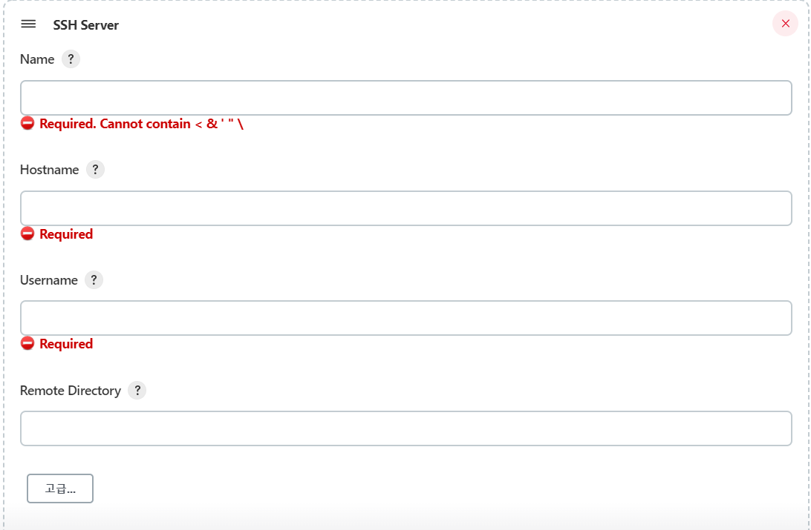

# 설치법
## centos version 설치법

1. 자바 설치
```
sudo yum install -y java-1.8.0-openjdk-devel.x86_64

readlink -f /usr/bin/javac   //which javac검색시 나오는 위치 등록

//환경변수 추가
sudo vi /etc/profile
//마지막줄에 추가 export JAVA_HOME=/usr/lib/jvm/java-1.8.0-openjdk-1.8.0.292.b10-1.el7_9.x86_64
//변경사항 저장
source /etc/profile
```

2. wget, git, docker 설치
```
sudo yum install wget
sudo yum install git
sudo yum install docker
//배포서버 docker 권한 변경: jenkins에서 동작시킬 수 있게
sudo chmod 666 /var/run/docker.sock
```


3. jenkins 설치
```
sudo wget -O /etc/yum.repos.d/jenkins.repo https://pkg.jenkins.io/redhat-stable/jenkins.repo
sudo rpm --import https://pkg.jenkins.io/redhat-stable/jenkins.io.key

sudo yum install jenkins
sudo systemctl start jenkins
```


4. admin 만들기

외부ip주소:8080 접속


초기 비밀번호 확인
sudo cat /var/lib/jenkins/secrets/initialAdminPassword

추천 plugin 설치

admin 계정은 만들지 않으면 기본으로
아이디 admin 비밀번호는 sudo cat /var/lib/jenkins/secrets/initialAdminPassword에서 나오는 문자

5. ssh plugin 추가 설치


	
Publish Over SSHVersion 설치

설치 후 재시작

6. ssh 키등록
```
//jenkins 서버 키 생성
ssh-keygen -t rsa -f ~/.ssh/id_rsa
//passphrase는 빈칸이여도 상관 없다
//id_rsa와 id_rsa.pub이 생성된다
```

```
//배포 서버에 jenkins 서버 공개키 등록
sudo vi ~/.ssh/authorized_keys
//id_rsa 내용 복붙

```

jenkins관리 > 시스템 설정


passphase: key생성시 입력한 passphase
key: jeknins server에 id_rsa.pub 내용 복붙

고급을 눌러 ssh server 등록


name: 아무 이름
hostname: 배포 서버에 내부 ip
username: 배포 서버에 username
    - whtjddn75
remote directory: 배포 서버에 '~' 절대 경로 위치
    - /home/whtjddn75/

test connections시 success 띄면 성공
    - userauth fail: passphase가 잘못된 오류
    - auth fail: 배포 서버 authorized_keys파일에 공개키가 잘 못 됨

# 아이템 등록
Feestyle project 생성
빌드 후 조치 > Build: Send files or execute commands over SSH


nohup docker run -p 8080:80 huiseung75/spring-boot-docker > /dev/null 2>&1 &


도커 이미지 생성
docker build --build-arg JAR_FILE=build/libs/*.jar -t huiseung75/spring-boot-docker .

도커 실행
docker run -p 8080:8080 huiseung75/spring-boot-docker

도커 허브에 올리기
docker push huiseung75/spring-boot-docker


------------------------------------

자바 설치
```
sudo apt install openjdk-8-jdk
```


저장소 키와 레포지토리 추가, apt 업데이트 
```
wget -q -O - https://pkg.jenkins.io/debian/jenkins.io.key | sudo apt-key add -

echo deb http://pkg.jenkins.io/debian-stable binary/ | sudo tee /etc/apt/sources.list.d/jenkins.list

sudo apt update
```

jenkins 설치
```
sudo apt install jenkins
```

사용 port 변경
```
sudo vi /etc/default/jenkins

//63번째 줄
HTTP_PORT=8080 //9000으로 변경

sudo service jenkins restart //변경사항 적용
```


jenkins 시작
```
sudo systemctl status jenkins
```

사이트 접속
방화벽 설정 후
http://외부인스턴스ip주소:포트번호


ssh 새로 켜 비밀번호 확인
```
sudo cat /var/lib/jenkins/secrets/initialAdminPassword
```

비밀번호 붙여넣기 후 로그인
추천 plugin 설치
계정 생성

플러그인 관리에서 Publish Over SSH 설치
    - jenkins 인스턴스가 배포서버에 ssh로 접속해 배포 명령어 실행

jenkins 공개키 생성


